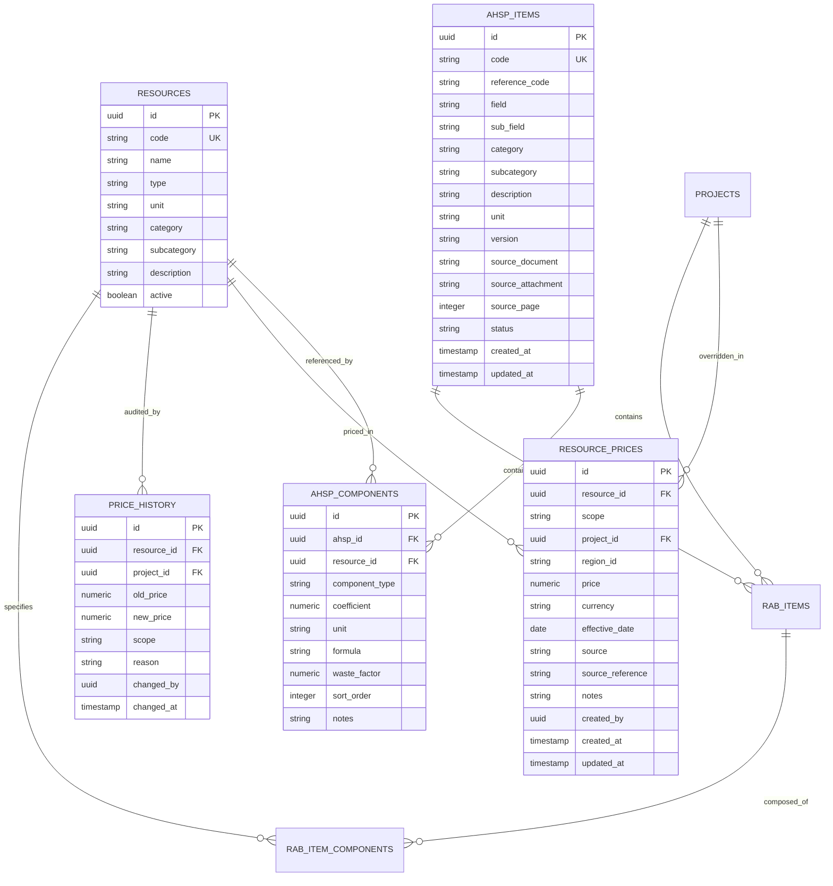
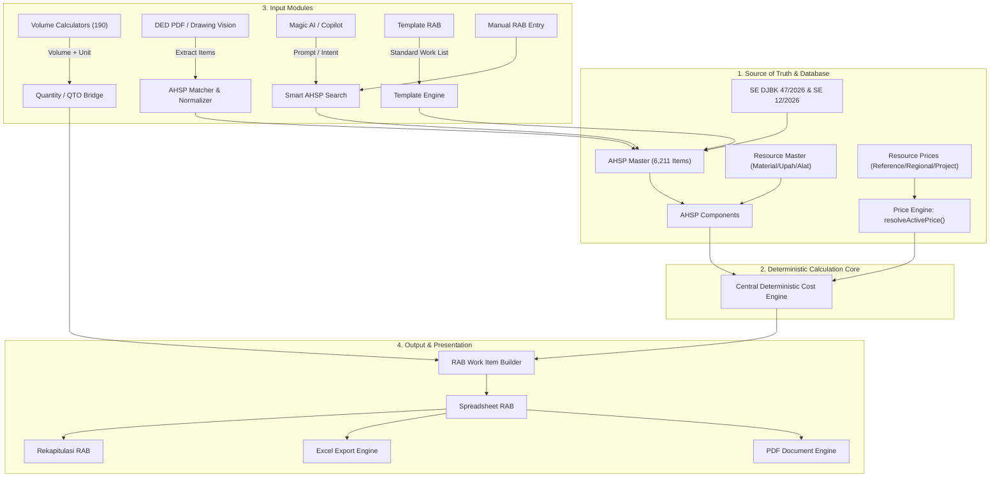

# EZRAB — ARCHITECTURE AUDIT & TECHNICAL ROADMAP
## AHSP 2026 + Resource & Price Engine + RAB + QTO + Volume Calculation + Template RAB + Magic AI + Project Management

**Document Code:** `EZRAB_AHSP_PRICE_ARCHITECTURE_AUDIT.md`  
**Phase:** 0 — Pre-Implementation Comprehensive Audit  
**Author:** Senior Full-Stack Architect + Construction Estimation System Engineer  
**Date:** 28 September 2026  
**Status:** COMPLETE / ACTIONABLE  

---

## 1. EXECUTIVE SUMMARY & AUDIT MANDATE

EZRAB is evolving from a multi-feature civil engineering suite into an integrated **Enterprise Construction Estimation Engine**. The core mandate is to ensure an unbroken, deterministic pipeline connecting:

$$\text{OFFICIAL AHSP 2026} \longrightarrow \text{AHSP COMPONENTS} \longrightarrow \text{RESOURCE MASTER} \longrightarrow \text{PRICE ENGINE} \longrightarrow \text{RAB ENGINE} \longrightarrow \text{PROJECT}$$

### Absolute Invariants:
1. **AHSP 2026 is the Standard of Analysis:** Coefficients and work methods conform strictly to official regulations (**SE DJBK No. 47/SE/Dk/2026** and **SE 12/SE/Db/2026**).
2. **Resource Master is the Single Source for Materials, Labor, and Equipment:** No ad-hoc, free-floating text items in calculations.
3. **Price Engine Dictates Active Valuation:** Prices are never hard-coded inside React components, AHSP formulas, or Volume Calculators.
4. **Volume/QTO Governs Physical Quantities:** Calculators generate geometry, dimensions, and quantities; pricing is resolved strictly downstream through the Price Engine.
5. **RAB Engine Computes Real-Time Costs:** Real-time cascading recalculations flow from Resource Price $\to$ AHSP Unit Price $\to$ Work Item Subtotal $\to$ Project RAB $\to$ Financial Reports & Exports.
6. **Template RAB Accelerates Creation Without Data Forking:** Templates store structured work items and AHSP references, resolving active prices dynamically from the project price context.
7. **Magic AI & Vision DED Assist Discovery and Mapping Without Hallucination:** AI never invents official AHSP codes, official coefficients, or official base prices. If confidence is below threshold, it flags `REVIEW_REQUIRED` and solicits user validation.
8. **Immutability & Project Isolation:** Updating reference datasets or global prices never mutates historical or locked projects. Every project maintains an isolated price context, AHSP version lock, and an audit trail.

---

## 2. EXISTING ARCHITECTURE AUDIT

An exhaustive inspection of the codebase reveals substantial high-value modules already developed across the application. The audit identifies the following components:

### 2.1 AHSP Catalog & Registry (`src/data/nationalCostDatabase/`)
- **Official Datasets Available:**
  - `binaMargaAHSP2026Official.ts` (3.38 MB, 2026 official Bina Marga items)
  - `ciptaKaryaAHSPDataset.ts` (6.44 MB, Cipta Karya building construction)
  - `sdaAHSPDataset.ts` (1.69 MB, Sumber Daya Air: bendung, irigasi, tanggul)
  - `smkkDataset.ts` (103 KB, SMKK / K3 construction safety mandatory items)
  - `officialHSD2026.ts` (97 KB, 231 HSD base items based on SE 12/SE/Db/2026)
- **Engine:** `masterRegistry.ts` (`CostDatabaseEngine`) exposes search, filter by domain (`SUMBER_DAYA_AIR`, `BINA_MARGA`, `CIPTA_KARYA`, `SMKK`), code autocomplete, and project snapshot creation (`createProjectSnapshot`).
- **UI:** `AhspExplorerView.tsx` (66 KB) provides full faceted search, domain filtering, component breakdown modal, and "Tambah ke RAB" action.

### 2.2 Pricing Engine (`src/engine/pricing/`)
- **Hierarchy:** `projectPriceEngine.ts` implements strict isolation between Reference Price, Project Price, and Estimator Override.
- **Resolver:** `priceResolver.ts` & `advancedPriceResolutionEngine.ts` implement tiered resolution:
  $$\text{Tier 1: Project Custom / Override} \longrightarrow \text{Tier 2: Project Price} \longrightarrow \text{Tier 3: Regional Price} \longrightarrow \text{Tier 4: National Reference}$$
- **Telemetry:** `fabricatedPriceTelemetry.ts` tracks any unmapped fallback or unverified price assignment.

### 2.3 Cost Calculation Engine (`src/engine/cost/`)
- **Deterministic Core:** `centralDeterministicCostEngine.ts` executes component calculations using `SafeDecimalEngine`:
  $$\text{Labor Cost} = \sum (\text{coeff} \times \text{labor price})$$
  $$\text{Material Cost} = \sum (\text{coeff} \times \text{material price})$$
  $$\text{Equipment Cost} = \sum (\text{coeff} \times \text{equipment price})$$
  $$\text{Direct Cost} = \text{Labor} + \text{Material} + \text{Equipment}$$
  $$\text{Overhead \& Profit} = \text{Direct Cost} \times (\% O\&P)$$
  $$\text{Unit Price} = \text{Direct Cost} + O\&P$$
  $$\text{Work Item Total} = \text{Volume} \times \text{Unit Price}$$

### 2.4 Resource & Material Database (`src/components/materials/`)
- **UI:** `MaterialDatabaseView.tsx` (111 KB) contains tabs for `MATERIALS`, `LABOR`, `EQUIPMENT`, `PROJECT_PRICE`, `BRANDS`, `SUPPLIERS`, `REGIONS`.
- **Modals:** `ProjectPriceModal.tsx`, `LaborTableView.tsx`, `EquipmentTableView.tsx`, `AddMaterialWizardModal.tsx`, `SpreadsheetSyncModal.tsx`.

### 2.5 Volume Calculation & QTO (`src/components/qto/`, `src/engine/constructionCalculators/`)
- **Calculators:** 24 Master Standar SNI/CAD calculators + 30 Residential Pack calculators + 97 Civil Expansion calculators (Road, Drainage, Bridge, Irrigation, River, Weir, Embung, Dam, Water Structure). Total: 190 calculators.
- **QTO Rekap:** `QtoRekapVolumeView.tsx` bridges calculation runs to QTO items.

### 2.6 Template RAB (`src/services/rabTemplateService.ts`, `src/components/templates/`)
- Catalogs standard house types (Type 36, 45, 70, 90, 120, Ruko, Villa) and generates structured work items.

### 2.7 Magic AI & Copilot (`src/services/ai/`, `src/ded-rab-v2/`)
- **Copilot Tool Registry:** `AIToolRegistry.ts` enforces 3-tier permissions (`information`, `suggestion`, `action` with preview proposals).
- **Vision & DED Reader:** `dedVisionReader.ts`, `constructionNormalizer.ts`, and `ahspMatcher.ts` extract drawings and match them to AHSP with confidence scores.

### 2.8 Export Engine (`src/export/`)
- `excelExportEngine.ts` (88 KB) and `pdfExporter.ts` (33 KB) generate professional BOQ, rekapitulasi, and AHSP breakdown sheets.

### 2.9 Supabase Foundation (`supabase/migrations/`)
- Existing tables: `projects`, `rab_documents`, `rab_versions`, `rab_items`, `rab_item_components` with UUID primary keys and RLS policies.

---

## 3. IDENTIFIED ARCHITECTURAL PROBLEMS & GAPS

| ID | Domain | Problem Description | Severity | Risk |
|---|---|---|---|---|
| **GAP-01** | **Data Fragmentation** | AHSP datasets exist as large in-memory TypeScript files (~13MB total) and client `localStorage`. Supabase has `rab_items` and `rab_item_components`, but lacks unified relational tables for `ahsp_items`, `ahsp_components`, `resources`, `resource_prices`, and `price_history`. | **CRITICAL** | Heavy client initial load, risk of out-of-sync multi-device state, and inability to run server-side SQL queries across 6,211 items. |
| **GAP-02** | **Direct Static Price Imports** | Several UI components still import fallback prices from `indonesianPrices.ts` (`MASTER_PRICE_ITEMS`) rather than exclusively querying the central `PriceResolver`. | **HIGH** | Inconsistent price updates; changing a price in the Project Price table does not automatically propagate to components relying on static arrays. |
| **GAP-03** | **Menu Navigation Naming** | The sidebar currently has separate links (`Material & Harga`, `Upah`, `Alat`, `AHSP`), but does not have a consolidated, prominent top-level menu named **"Harga & Sumber Daya"** with `[ Material ]`, `[ Upah ]`, `[ Alat ]` tab switching as requested in the master spec. | **MEDIUM** | User workflow friction; estimators must hop between different menu entries to manage project price contexts. |
| **GAP-04** | **Bulk Price Adjustment Persistence** | Bulk markup/markdown (e.g. +5% material adjustment) is supported in UI calculations, but lacks atomic transaction logging in a dedicated `price_history` table with before/after audit tracking. | **HIGH** | Estimator decisions cannot be traced or audited retrospectively across project revisions. |
| **GAP-05** | **Volume $\to$ AHSP Flow Bridge** | Volume Calculators calculate exact volume and units, but the direct modal button **"[ Pilih AHSP ]"** inside the Volume Calculator workbench to immediately link the output volume to an AHSP and generate an authoritative RAB item is not yet unified into a 1-click modal workflow. | **MEDIUM** | Requires user to navigate manually between QTO and RAB Spreadsheet. |
| **GAP-06** | **AHSP Version Locking** | Projects currently store `ahsp_version` as a string (`'2026'`), but lack an automated version diff engine that compares Old vs New when upgrading an AHSP version with side-by-side component diff preview. | **MEDIUM** | Unintended coefficient mutations when regulations update. |

---

## 4. REUSABLE ASSETS & MODULE REUSE MATRIX

To adhere to the core rule of not rewriting existing code unnecessarily, the following assets are fully reused:

```
[ REUSE 100% ]
├── src/data/nationalCostDatabase/
│   ├── binaMargaAHSP2026Official.ts (Official SE 47/2026)
│   ├── ciptaKaryaAHSPDataset.ts (Official SE 47/2026)
│   ├── sdaAHSPDataset.ts (Official SE 47/2026)
│   ├── smkkDataset.ts (Official Permen PUPR 10/2021)
│   └── officialHSD2026.ts (Official HSD 2026)
├── src/engine/pricing/
│   ├── projectPriceEngine.ts (Isolation & override mechanics)
│   ├── resolver/priceResolver.ts (Tiered lookup logic)
│   └── normalization/priceNormalization.ts (String & code sanitization)
├── src/engine/cost/
│   ├── centralDeterministicCostEngine.ts (Deterministic math)
│   └── SafeDecimalEngine.ts (Floating point drift prevention)
├── src/components/ahsp/
│   └── AhspExplorerView.tsx (Faceted search, preview & detail components)
├── src/components/materials/
│   ├── MaterialDatabaseView.tsx (Material table, inspector, modals)
│   ├── ProjectPriceModal.tsx (Project override modal)
│   ├── LaborTableView.tsx (Upah table)
│   └── EquipmentTableView.tsx (Alat table)
├── src/ded-rab-v2/
│   ├── interpretation/constructionNormalizer.ts (Synonym & keyword parser)
│   └── ahsp/ahspMatcher.ts (Semantic matching hierarchy)
└── src/export/
    ├── excelExportEngine.ts (Formula-preserving Excel workbook generation)
    └── pdfExporter.ts (Official BOQ & RAB print generation)
```

---

## 5. DATABASE ARCHITECTURE & MIGRATION PLAN

### 5.1 Relational Schema Specification



### 5.2 SQL Migration: `20260928_ahsp_resource_price_engine.sql`
A backward-compatible Supabase migration will be executed:
- Preflight validation ensuring existing UUID columns and schemas are intact.
- Creation of `public.ahsp_items`, `public.ahsp_components`, `public.resources`, `public.resource_prices`, and `public.price_history`.
- Safe column addition to `public.rab_items`: `ahsp_id`, `price_context_id`, `calculation_trace`.
- Row Level Security (RLS) policies enforcing read access for workspace members and write restrictions based on user roles (`Super Admin`, `Estimator`).
- Seed migration mapping the 231 HSD master resources and official SE 47/2026 items.

---

## 6. PRICE RESOLUTION & CENTRAL ENGINE HARMONIZATION

### 6.1 Unified `resolveActivePrice()` Contract
Every calculation across RAB, QTO, Volume, Template, Magic AI, and Reports must invoke a single resolution signature:

```typescript
export interface ActivePriceResolution {
  resourceId: string;
  resourceCode: string;
  resourceName: string;
  unit: string;
  activePrice: number;
  referencePrice: number;
  regionalPrice?: number;
  projectPrice?: number;
  customPrice?: number;
  activeScope: 'PROJECT_CUSTOM' | 'PROJECT' | 'REGIONAL' | 'REFERENCE';
  effectiveDate: string;
  source: string;
  isOverridden: boolean;
  notes?: string;
}

export function resolveActivePrice(
  resourceIdOrCode: string,
  projectId?: string,
  regionId?: string
): ActivePriceResolution;
```

### 6.2 Price Priority Hierarchy (Strict Order of Precedence)
```
1. PROJECT_CUSTOM  (User manually set price on specific project work item)
       ↓ (if none)
2. PROJECT         (Project price list agreed with supplier for this project)
       ↓ (if none)
3. REGIONAL        (Regional multiplier/price list for the project province/kabupaten)
       ↓ (if none)
4. REFERENCE       (Official national base price SE 12/SE/Db/2026)
```

### 6.3 Decimal & Rounding Policy
1. **Coefficients:** Preserved up to 4 decimal places without premature rounding.
2. **Component Cost:** `coefficient * activePrice` evaluated with `Decimal.js` / `SafeDecimalEngine` at 2 decimal places.
3. **AHSP Unit Price:** Direct summation of component costs + explicit configurable Overhead & Profit (O&P):
   $$\text{AHSP Unit Price} = \text{round}_{\text{nearest integer}}(\text{Direct Cost} \times (1 + \text{OverheadRate}))$$
4. **Total Work Item:**
   $$\text{Total Amount} = \text{round}_{\text{nearest integer}}(\text{Volume} \times \text{AHSP Unit Price})$$

---

## 7. USER INTERFACE & NAVIGATION ENHANCEMENT

### 7.1 Dedicated Navigation Menu: "Harga & Sumber Daya"
- Located in the primary sidebar under **DATA MASTER & REFERENSI**.
- Three primary tabs:
  1. **`[ Material ]`**: Filtered catalog of construction materials (Semen, Pasir, Baja, Besi, Cat, dll.).
  2. **`[ Upah ]`**: Filtered catalog of labor rates (Pekerja, Tukang, Kepala Tukang, Mandor).
  3. **`[ Alat ]`**: Filtered catalog of equipment rental & operation rates (Excavator, Dump Truck, Tandem Roller, Concrete Mixer, dll.).
- Color & visual palette strictly adheres to EZRAB Design Language:
  - Deep Navy (`#0F172A`)
  - Electric Blue (`#2563EB`)
  - Blue Slate Surface (`#F8FAFC`, `#EFF6FF`)
  - Subtle Gold Accents (`#F59E0B`)
  - Zero orange dominance

### 7.2 Resource Table Columns
- **Kode**: e.g., `MAT-001`, `UPH-002`, `ALT-005`
- **Nama**: e.g., `Semen Portland Type I (50 kg)`
- **Satuan**: `kg`, `OH`, `jam-sewa`, `m3`
- **Harga Referensi**: Base national reference price (e.g., `Rp1.600`)
- **Harga Aktif**: Current resolved price for current project context (e.g., `Rp1.750`)
- **Sumber**: Tag indicating provenance (`Katalog Nasional`, `Supplier Proyek`, `Custom`)
- **Tanggal**: Last updated / effective date
- **Status**: Status badge (`● Standar`, `● Custom Proyek`, `● Override`)
- **Action**: `[ Edit Harga ]`, `[ Riwayat ]`, `[ Bandingkan ]`

### 7.3 Edit Price Modal & Bulk Adjustment Workflow
- **Single Edit Modal**: Allows estimators to set a Project-Specific Price or Estimator Override without mutating the national reference database.
- **Bulk Adjustment Modal**: Enables multi-select adjustments:
  - *"Naikkan harga sebesar X%"*
  - *"Turunkan harga sebesar X%"*
  - *"Terapkan harga regional untuk Provinsi X"*
  - *"Export template Excel"* / *"Import update harga dari Excel"*
  - *"Reset ke Harga Referensi Nasional"*
- **Automatic Invalidation & Recalculation Flow**:
  $$\text{Save New Price} \longrightarrow \text{Invalidate In-Memory Cache} \longrightarrow \text{Recalculate Project RAB} \longrightarrow \text{Update Spreadsheet \& Rekapitulasi}$$

---

## 8. INTEGRATION WITH SYSTEM MODULES



### 8.1 Volume Calculator $\to$ AHSP Bridge
- Inside `QtoCalculatorView.tsx`, upon computing volume (e.g. `12.50 m³`), user can click **"[ Pilih AHSP & Masukkan ke RAB ]"**.
- Opens Smart AHSP Search modal pre-filtered to the calculator's domain and unit.
- User selects matching AHSP $\to$ Volume + AHSP + Active Prices $\to$ Deterministic Work Item $\to$ Added to project RAB with verification badge `CALCULATED_VC`.

### 8.2 Template RAB $\to$ Price Context Bridge
- Templates define work items and AHSP code references only.
- Applying a template queries `resolveActivePrice(resourceId, projectId, regionId)`.
- Eliminates stale or hardcoded template prices; every applied project template inherits the project's actual regional and supplier prices.

### 8.3 Magic AI Integration
- AI tools (`search_ahsp`, `get_ahsp_detail`, `resolve_active_price`, `create_rab_item`) registered in `AIToolRegistry`.
- Read-only tools (`information`) execute immediately.
- Mutating tools (`action`) generate an `AIActionProposal` with complete cost preview and require explicit user approval before touching project state.
- Strictly forbidden from inventing AHSP codes or coefficients.

---

## 9. STEP-BY-STEP IMPLEMENTATION PHASES

```
PHASE 0: ARCHITECTURE AUDIT & SPECIFICATION (CURRENT)
         ├── Deliverable: EZRAB_AHSP_PRICE_ARCHITECTURE_AUDIT.md
         └── Behavior: Zero code changes, non-destructive inspection.

PHASE 1: RELATIONAL DATABASE & SUPABASE PERSISTENCE
         ├── DDL migration: ahsp_items, ahsp_components, resources, resource_prices, price_history
         ├── Populate master seed data (HSD 2026 & SE 47/2026 official datasets)
         └── RLS authorization policies and automated preflight checks.

PHASE 2: UNIFIED PRICE RESOLUTION & RECALCULATION ENGINE
         ├── Centralize resolveActivePrice() across all project modules
         ├── Implement decimal-safe arithmetic & rounding policy
         └── Project isolation guarantee (Project A never leaks into Project B).

PHASE 3: RESOURCE MANAGEMENT UI ("HARGA & SUMBER DAYA")
         ├── Consolidated sidebar navigation & responsive workstation layout
         ├── Material, Upah, and Alat tabs with live Active vs Reference price indicators
         ├── Edit Price Modal with project-scope overrides
         └── Bulk Adjustment & Excel Import/Export modal with validation preview.

PHASE 4: SMART AHSP SELECTOR & ANALYSIS DETAIL MODAL
         ├── High-speed debounced search across code, description, and synonyms
         ├── Real-time coefficient, resource breakdown, and unit price viewer
         └── 1-click "Tambah ke RAB" action with volume input.

PHASE 5: RAB SPREADSHEET & REAL-TIME RECALCULATION INTEGRATION
         ├── Connect resource price changes directly to RAB work items
         ├── Automatic subtotal, O&P, PPN, and summary re-computation
         └── Version snapshot locking to safeguard completed/historical projects.

PHASE 6: VOLUME CALCULATOR & QTO WORKBENCH BRIDGE
         ├── Integrate 1-click "[ Pilih AHSP ]" workflow into QtoCalculatorView
         └── Preserve volume formula provenance in the resulting RAB item.

PHASE 7: TEMPLATE RAB DYNAMIC PRICE RESOLUTION
         ├── Decouple house type templates from hardcoded values
         └── Resolve live prices from active project price context upon template instantiation.

PHASE 8: MAGIC AI & DED VISION GOVERNANCE
         ├── Register safe AHSP and Price discovery tools in AIToolRegistry
         ├── Enforce strict confidence thresholding (flag REVIEW_REQUIRED on ambiguous matches)
         └── Require proposal approval before mutating project RAB items.

PHASE 9: EXCEL & PDF EXPORT HARMONIZATION
         ├── Ensure exported workbooks preserve mathematical formulas
         └── Embed AHSP version, regulation references, and price context in PDF documentation.

PHASE 10: AUTOMATED REGRESSION & ACCEPTANCE VALIDATION
         ├── Execute full test suite (75 existing test suites + 12 new acceptance tests)
         └── Final release verification report.
```

---

## 10. AUTOMATED TESTING PLAN (12 TEST SUITES)

The implementation must validate against the 12 core tests specified in the master prompt:

1. **`testAhspReferencePriceCalculation`**: AHSP coefficient $\times$ reference price produces exact official unit price.
2. **`testAhspCustomPriceCalculation`**: AHSP coefficient $\times$ custom price produces exact updated unit price.
3. **`testProjectPriceOverridePrecedence`**: Project custom price strictly takes precedence over regional and national reference prices.
4. **`testMaterialPriceRecalculation`**: Modifying a material price in the project context automatically recalculates all dependent RAB work items.
5. **`testLaborPriceRecalculation`**: Modifying a labor rate (e.g. Tukang Batu) automatically updates all relevant masonry and structural AHSP unit prices in the RAB.
6. **`testEquipmentPriceRecalculation`**: Modifying equipment rental rates cascades to earthwork, paving, and asphalt RAB items.
7. **`testQtoToRabIntegration`**: Generating a quantity takeoff item and linking an AHSP creates an authoritative RAB item with full provenance.
8. **`testVolumeCalculatorToRabIntegration`**: Executing any of the 190 Volume Calculators and choosing an AHSP adds the exact volume and calculated cost to the active project RAB.
9. **`testTemplateRabDynamicPricing`**: Instantiating a House Type 36 template in two different regions resolves different total RAB amounts matching the respective regional price contexts.
10. **`testMagicAiAhspDiscovery`**: Querying Magic AI for a work item returns official AHSP candidates without fabricating codes or coefficients.
11. **`testAhspVersionLocking`**: Updating reference database from 2025 to 2026 leaves historical projects on version 2025 intact unless an explicit upgrade comparison is approved by the user.
12. **`testProjectIsolationAndSecurity`**: Estimators in Project A cannot mutate or inspect custom prices belonging to Project B; unauthorized users cannot modify global reference data.

---

## 11. RISK REGISTER & FAIL-CLOSED CONTROLS

| Risk | Likelihood | Impact | Mitigation Strategy |
|---|---|---|---|
| **Regulatory Ambiguity / Data Conflict** | Low | High | Never invent coefficients. If official dataset contains a missing value, mark `INCOMPLETE_OFFICIAL` and flag for manual estimator input. |
| **Performance Degradation with 6,211 Items** | Medium | High | Implement indexed search, pagination, category segmentation, and debounced client queries. Never dump full 6,211 items into a raw un-virtualized DOM. |
| **Accidental Overwrite of Historical Projects** | Low | Critical | Store immutable JSON snapshots (`ahsp_snapshot`) on every `rab_item`. Changes to global databases only affect projects that opt into upgrade. |
| **Floating-Point Financial Drift** | High | High | Strict usage of `SafeDecimalEngine` and `Decimal.js` across all unit cost multiplications and summations. |
| **AI Hallucination in Pricing or Codes** | Medium | Critical | AI tools operate in read-only mode for information retrieval, and require structured user approval modals for any proposed RAB mutations. |

---

## 12. CONCLUSION & READINESS FOR PHASE 1

This audit confirms that the EZRAB repository possesses world-class foundational building blocks. By executing the phased migration without breaking existing functionality, EZRAB will achieve its goal as the definitive, deterministic, and AI-accelerated Construction Estimation Engine for Indonesian construction engineering.

**Phase 0 Audit Complete. Ready to proceed to Phase 1 (Database Migration & Seed Foundation).**
