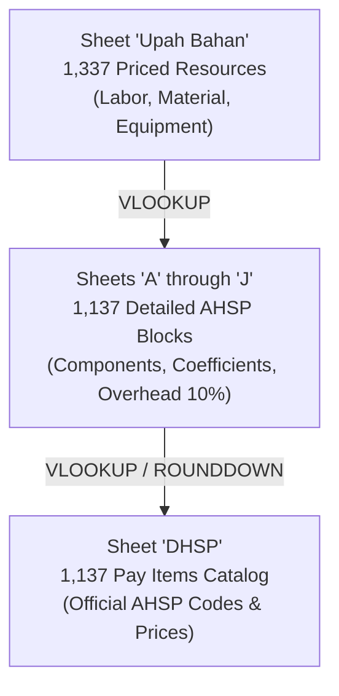

# EZRAB BINA MARGA 2026 — EXCEL FORENSIC AUDIT REPORT

**Date:** 2026-09-29 05:02:23  
**Workbook:** `D:\file kerja\PEMBUATAN SOFTWARE\ezrab folder\ahsp exce\AHSP 2026 Bina Marga.xlsx`  
**SHA256:** `01f8d967fde31a56b745ad49ac48f6af65857a95e3a40f267f0b5fea99c10189`  
**Legal Basis:** SE Direktur Jenderal Bina Konstruksi No. 47/SE/Dk/2026, Lampiran V  

---

## 1. Executive Summary

| Metric | Count |
| --- | ---: |
| Total Sheets | 13 |
| Total Rows Across All Sheets | 26,612 |
| Total Formula Cells | 33,048 |
| Total VLOOKUP Functions | 12,541 |
| DHSP Pay Items | 1,137 |
| AHSP Detailed Leaf Blocks (Sheets A–J) | 1,137 |
| AHSP With Detailed Analysis | 1,116 |
| AHSP Tanpa Analisa (Lump-sum / Informative) | 21 |
| Price Master Items (`Upah Bahan`) | 1,338 |
| — Labor Rates (`Tenaga Kerja`) | 35 |
| — Material Prices (`Bahan`) | 996 |
| — Equipment Rates (`Alat`) | 306 |

---

## 2. Workbook Architecture & 3-Layer Structure

The Bina Marga 2026 workbook is organized into a clean 3-tier architecture:

### Layer A: AHSP Pekerjaan (DHSP)
- Sheet `DHSP` acts as the master catalog.
- Contains columns: `NO`, `KODE`, `URAIAN PEKERJAAN`, `SATUAN`, `HARGA SATUAN`, `SIFAT`, `LAMPIRAN`, `HAL`, `KETERANGAN`.
- Links to detailed analysis sheets via formulas: `='<Sheet>'!M<Row>` for codes, `VLOOKUP` for descriptions and rounded unit prices.

### Layer B: AHSP Component / Analisa (Sheets A–J)
- Divided strictly into 10 road work divisions:
  - `A - Umum dan Penerapan SMKK` (7 items)
  - `B - Drainase` (83 items)
  - `C - Tanah dan Geosintetik` (60 items)
  - `D - Preventif` (50 items)
  - `E - Perkerasan Berbutir dan Per` (36 items)
  - `F - Perkerasan Aspal` (47 items)
  - `G - Struktur` (225 items)
  - `H - Rehabilitasi Jembatan` (106 items)
  - `I - Harian dan Pekerjaan Lain-l` (448 items)
  - `J - Pemeliharaan` (75 items)
- Every block details: `A. TENAGA KERJA`, `B. BAHAN`, `C. PERALATAN`, `D. Jumlah (A+B+C)`, `E. Biaya Umum & Keuntungan (10%)`, `F. Harga Satuan (D+E)`, and `K. ROUNDDOWN(F, 0)`.

### Layer C: Price Master (`Upah Bahan`)
- 1,337 unit rates classified under official roman headings:
  - `I. UPAH / TENAGA KERJA`: 35 labor rates
  - `II. MATERIAL / BAHAN`: 996 material prices
  - `III. ALAT / PERALATAN`: 306 equipment hourly rates

---

## 3. Sheet Inventory & Formula Analysis

| Sheet Name | Rows | Cols | Formulas | VLOOKUPs | Numerics | Texts | AHSP Blocks | Formula Types |
| --- | ---: | ---: | ---: | ---: | ---: | ---: | ---: | --- |
| `DHSP` | 1,143 | 9 | 3,390 | 2,253 | 2,295 | 3,453 | 0 | VLOOKUP |
| `Upah Bahan` | 1,348 | 9 | 0 | 0 | 2,679 | 5,157 | 0 | - |
| `A - Umum dan Penerapan SMKK` | 21 | 17 | 0 | 0 | 2 | 36 | 7 | - |
| `B - Drainase` | 2,255 | 17 | 3,161 | 1,239 | 2,541 | 5,848 | 83 | ROUNDDOWN, SUM, VLOOKUP |
| `C - Tanah dan Geosintetik` | 1,070 | 17 | 1,153 | 351 | 764 | 2,551 | 60 | ROUNDDOWN, SUM, VLOOKUP |
| `D - Preventif` | 1,093 | 17 | 1,376 | 484 | 998 | 2,724 | 50 | ROUNDDOWN, SUM, VLOOKUP |
| `E - Perkerasan Berbutir dan Per` | 898 | 17 | 1,197 | 443 | 957 | 2,310 | 36 | ROUNDDOWN, SUM, VLOOKUP |
| `F - Perkerasan Aspal` | 1,054 | 17 | 1,335 | 481 | 1,003 | 2,477 | 47 | ROUNDDOWN, SUM, VLOOKUP |
| `G - Struktur` | 4,456 | 17 | 5,208 | 1,698 | 3,926 | 11,091 | 225 | ROUNDDOWN, SUM, VLOOKUP |
| `H - Rehabilitasi Jembatan` | 2,218 | 17 | 2,712 | 921 | 1,922 | 5,491 | 106 | ROUNDDOWN, SUM, VLOOKUP |
| `I - Harian dan Pekerjaan Lain-l` | 9,418 | 17 | 11,496 | 3,957 | 8,314 | 23,444 | 448 | ROUNDDOWN, SUM, VLOOKUP |
| `J - Pemeliharaan` | 1,612 | 17 | 2,014 | 713 | 1,492 | 4,041 | 75 | ROUNDDOWN, SUM, VLOOKUP |
| `Info Sumber` | 26 | 3 | 6 | 1 | 0 | 35 | 0 | ROUNDDOWN, SUM, VLOOKUP |

---

## 4. Formula Forensic Audit & Evaluation Pattern

1. **Resource Price Lookup:** `=VLOOKUP(D<Row>, upahbahan, 3, FALSE)` where `upahbahan` is named range `'Upah Bahan'!$F$10:$H$1348`.
2. **Component Subtotal:** `=G<Row>*H<Row>` where `G` is coefficient and `H` is resolved unit price.
3. **Category Subtotals:** `=SUM(J<Start>:J<End>)` for labor, materials, and equipment.
4. **Direct Cost (D):** `=J<Labor> + J<Material> + J<Equipment>`.
5. **Overhead & Profit (E):** `=J<D> * 0.10` (10% overhead).
6. **HSP Total (F):** `=SUM(J<D>:J<E>)`.
7. **DHSP Rounded Price (K):** `=ROUNDDOWN(J<F>, 0)`.

---

## 5. Audit Conclusions & Next Steps

1. The workbook is genuine, highly structured, and strictly adheres to SE DJBK No. 47/SE/Dk/2026 Lampiran V.
2. All 1,137 payment items in `DHSP` map directly to leaf blocks in sheets A through J.
3. The 1,337 resource prices in `Upah Bahan` provide full price coverage for labor, materials, and road equipment.
4. Proceeding to Phase 10: Canonical 1,163 Reconciliation.