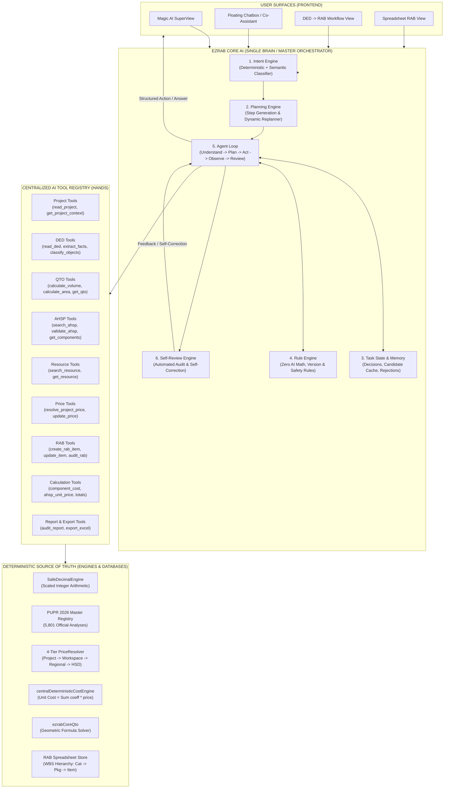

# EZRAB CORE AI — MASTER ARCHITECTURE BLUEPRINT
## Unified Single-Brain Construction Estimating & Orchestration Architecture

**Document Version:** 2.0.0-CORE  
**Date:** 2026-09-30  
**Target:** `http://localhost:3000`  
**System Designation:** EZRAB Core AI Master Orchestrator

---

## 1. High-Level System Architecture



---

## 2. The 17 Architectural Layers

| Layer | Component Name | Role & Responsibility | Implementation File |
| :--- | :--- | :--- | :--- |
| **A** | **Model Gateway** | Model-agnostic abstraction (`AIModelProvider`) over Gemini, Atria, Inception, zrouter | `src/services/aiProviderRouter.ts` |
| **B** | **Project Context** | Fail-closed tenant isolation, authoritative project & workspace context | `src/services/unifiedProjectContext.ts` |
| **C** | **Knowledge Repository** | 5-tier stratified knowledge (`OFFICIAL`, `SYSTEM`, `DOMAIN`, `PROJECT`, `USER`) | `src/services/ai/core/knowledgeRepository.ts` |
| **D** | **Construction Vocabulary**| Indonesian construction terminology, abbreviations, synonyms, unit aliases | `src/services/ai/core/constructionVocabulary.ts` |
| **E** | **Intent Engine** | Categorizes requests into 15+ actionable domain intents | `src/services/ai/core/intentEngine.ts` |
| **F** | **Planning Engine** | Decomposes complex user goals into verifiable execution steps (`PlanStep[]`) | `src/services/ai/core/planningEngine.ts` |
| **G** | **Rule Engine** | Safety gates: AI cannot invent AHSP, prices, quantities; fail-closed mutations | `src/services/ai/core/ruleEngine.ts` |
| **H** | **RAG Engine** | Semantic retrieval of engineering guidelines, methods, and specs (not official data) | `src/services/ai/core/ragEngine.ts` |
| **I** | **Live Database Context** | Real connection to 5,801 official PUPR analyses, HSD 2026, and project databases | `data/nationalCostDatabase/masterRegistry.ts` |
| **J** | **Tool Registry** | Central catalog of all 10 tool groups with 3-tier permission matrix | `src/services/ai/tools/aiToolRegistry.ts` |
| **K** | **Function Calling** | Strict tool contracts (`AIToolDefinition`) with input/output validation | `src/services/ai/tools/aiToolTypes.ts` |
| **L** | **Agent Loop** | Recursive execution loop with step guards, retry budgets, and observation logging | `src/services/ai/core/agentLoop.ts` |
| **M** | **Task State & Memory** | Persistent task state, candidate tracking, and rejection memory | `src/services/ai/core/taskState.ts` |
| **N** | **Validation** | 13 pre-flight gates verifying item readiness before RAB entry | `src/ded-rab-v2/validation/dedRabValidationGate.ts` |
| **O** | **Self-Review** | Automated post-execution audit with self-correcting retry | `src/services/ai/core/selfReviewEngine.ts` |
| **P** | **Evaluation** | 15 Golden Tasks automated evaluation suite | `src/test/ezrabCoreAiEvaluation.test.ts` |
| **Q** | **Audit Log** | Immutable trail of actions, approvals, tool calls, and provenance | `src/services/ai/actions/aiActionAudit.ts` |

---

## 3. Data Flow & Execution Sequence

```mermaid
sequenceDiagram
  autonumber
  actor User as Estimator / Engineer
  participant Core as EZRAB Core AI (Master Agent)
  participant Intent as Intent Engine
  participant Plan as Planning Engine
  participant Loop as Agent Loop
  participant Tools as AI Tool Registry
  participant Engines as Deterministic Engines
  participant Review as Self-Review Engine

  User->>Core: "Buatkan RAB dari DED rumah 2 lantai ini"
  Core->>Intent: Classify intent
  Intent-->>Core: Intent: CREATE_RAB_FROM_DED
  Core->>Plan: Build execution plan
  Plan-->>Core: 10-Step Execution Plan
  Core->>Loop: Execute Agent Loop with Plan

  loop For Each Plan Step
    Loop->>Tools: Call tool (e.g. read_ded_document)
    Tools->>Engines: Execute deterministic logic
    Engines-->>Tools: Structured output + Provenance
    Tools-->>Loop: Tool Execution Result
    Loop->>Loop: Validate observation & check Rule Engine
    alt Tool needs alternative or retry
      Loop->>Plan: Dynamically update remaining steps
    end
  end

  Loop->>Review: Run automated self-review (audit_rab)
  Review->>Engines: Audit missing QTO, AHSP, prices, units
  Engines-->>Review: Audit diagnostics
  Review-->>Loop: Self-review report (Ready items vs Needs Review)

  Loop-->>Core: Finalized Task Result
  Core-->>User: Structured Progress Report & Direct Spreadsheet RAB Navigation
```

---

## 4. The 10 Tool Groups & Canonical Contracts

1. **PROJECT TOOLS:**
   - `read_project`: Retrieves authoritative project metadata and settings.
   - `update_project`: Mutates project settings with user confirmation.
   - `get_project_context`: Returns unified domain context across RAB, DED, schedule, and documents.
2. **DED TOOLS:**
   - `read_ded_document`: Loads drawing metadata, page counts, scale, and resolution.
   - `analyze_ded_document`: Analyzes complete drawing set via Intermediate Model.
   - `analyze_ded_page`: Analyzes specific drawing page.
   - `extract_ded_facts`: Extracts raw texts, dimensions, symbols (`DedFactModel`).
   - `classify_ded_objects`: Classifies facts into architectural objects, filtering rooms and notes.
   - `find_drawing_references`: Resolves cross-page schedule tags (`P1`, `P2`, `J1`, `K1`).
3. **QTO TOOLS:**
   - `calculate_volume`: Computes 3D volumes (trapezoidal, rectangular, cylindrical) via `SafeDecimalEngine`.
   - `calculate_area`: Computes 2D net areas with opening deductions.
   - `calculate_length`: Computes linear lengths.
   - `calculate_count`: Counts discrete items.
   - `get_qto`: Retrieves calculated QTO for a work item.
   - `validate_quantity`: Asserts quantity is numeric, positive, and non-null.
4. **AHSP TOOLS:**
   - `search_ahsp`: Queries official PUPR 2026 dataset; rejects `AI-CUSTOM`.
   - `get_ahsp`: Retrieves detailed AHSP specification and labor/material breakdown.
   - `validate_ahsp`: Deterministically validates code existence, unit match, and spec match.
   - `get_ahsp_components`: Returns the coefficient list of resources.
   - `compare_ahsp_candidates`: Compares multiple candidate codes for ambiguity resolution.
5. **RESOURCE TOOLS:**
   - `search_resource`: Searches national master resource catalog (material, labor, equipment).
   - `get_resource`: Retrieves canonical resource attributes and standard unit.
   - `list_resources`: Lists resources for a specific work domain.
6. **PRICE TOOLS:**
   - `get_resource_price`: Fetches base resource price from regional/national database.
   - `resolve_project_price`: Resolves price through the 4-tier hierarchy (Project $\rightarrow$ Workspace $\rightarrow$ Regional $\rightarrow$ HSD).
   - `get_price_history`: Audits price changes and provenance.
   - `update_project_price`: Sets project-level price override (Action proposal).
7. **RAB TOOLS:**
   - `create_rab_section`: Creates WBS category or work package.
   - `create_rab_item`: Proposes new RAB item with preview.
   - `update_rab_item`: Modifies item quantity or price with approval.
   - `get_rab`: Retrieves full hierarchical RAB grid.
   - `delete_rab_item`: Removes item (requires confirmation).
   - `audit_rab`: Audits items for missing prices, quantities, or unverified AHSP.
8. **CALCULATION TOOLS:**
   - `calculate_component_cost`: Computes coefficient $\times$ resource price via SafeDecimal.
   - `calculate_ahsp_unit_price`: Computes $\sum (\text{coeff} \times \text{price})$.
   - `calculate_rab_total`: Computes $\text{Volume} \times \text{Unit Price}$ and category subtotals.
9. **REPORT TOOLS:**
   - `generate_rab_summary`: Generates executive cost summary.
   - `generate_missing_data_report`: Generates list of unresolved items with exact missing parameters.
   - `generate_audit_report`: Produces formal RAB audit documentation.
10. **EXPORT TOOLS:**
    - `export_excel`: Exports official RAB spreadsheet format.
    - `export_pdf`: Generates print-ready executive estimate report.

---

## 5. Absolute Invariants & Golden Rules

1. **AI Cannot Invent AHSP:** AI must search the database. Any invented or `AI-CUSTOM` code is rejected.
2. **AI Cannot Invent Prices:** Unit prices must be resolved through the 4-tier Price Engine.
3. **AI Cannot Invent Quantities:** Quantities must derive from geometric formulas or schedules. Missing parameters return `null` and `MISSING_DATA`—never `0` or `1`.
4. **Deterministic Mathematics:** Every sum and product must execute through `SafeDecimalEngine`.
5. **Project Isolation:** Tenant context is strictly verified server-side (`ProjectIsolationError`).
6. **Fail-Closed Gate:** Better 0 valid items in the official RAB than 67 hallucinated items.
