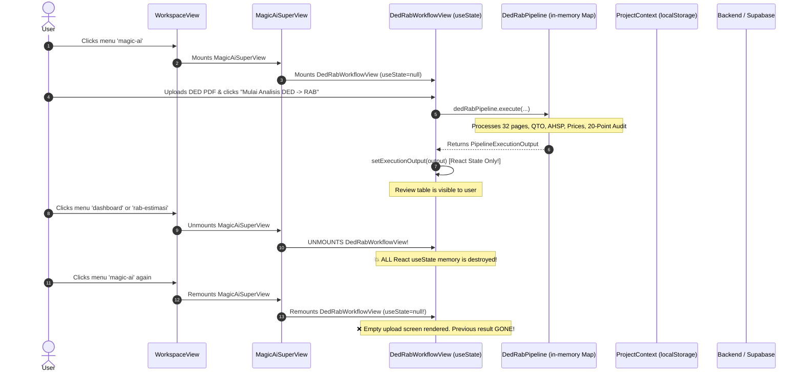
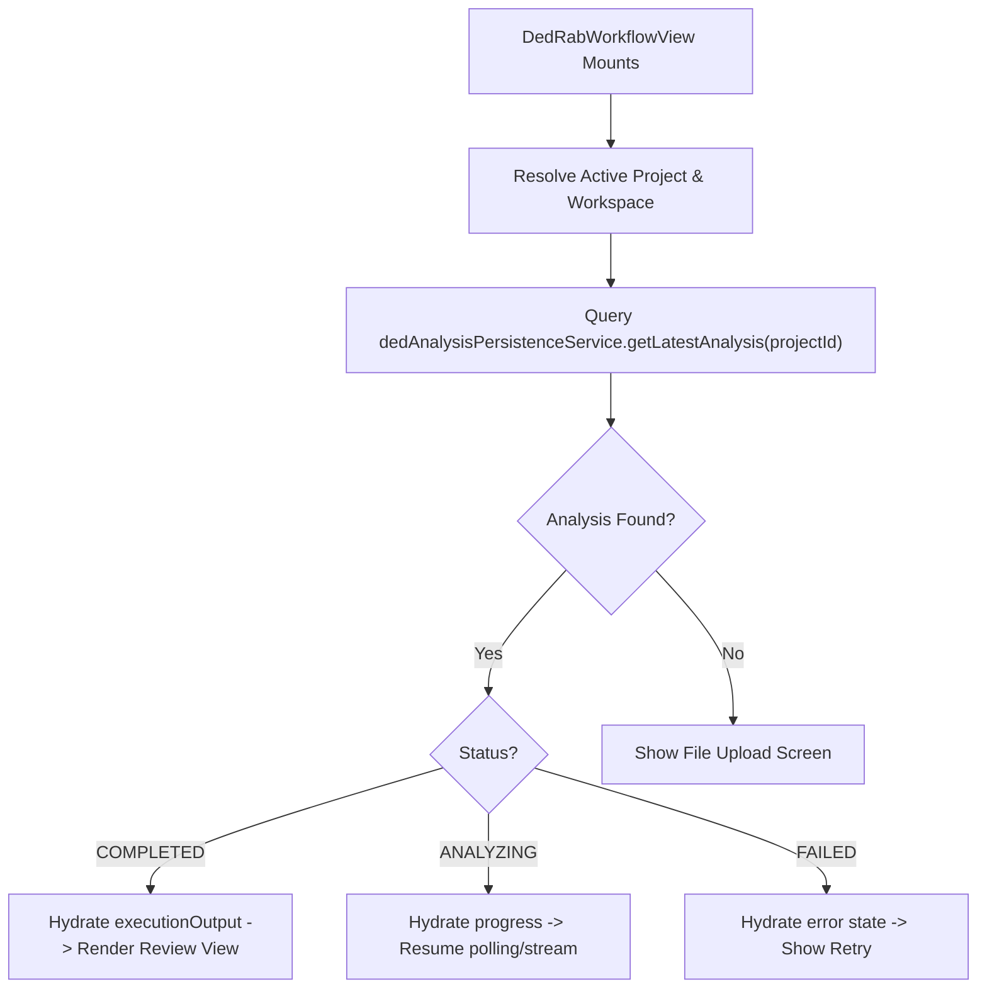

# EZRAB DED $\to$ RAB PERSISTENT ANALYSIS: FORENSIC REPORT
**Author:** Antigravity AI Forensic Engine  
**Target:** DED $\to$ RAB Analysis Session & Result Persistence  
**Date:** 2026-10-02  
**Status:** FORENSIC AUDIT COMPLETED

---

## 1. Executive Forensic Summary

### The Reported Defect
After EZRAB DED $\to$ RAB successfully completes analysis (extracting 35 canonical work items from 32 blueprint pages, calculating opening deductions, matching PUPR 2026 AHSP, and resolving prices), the generated result completely disappears whenever the user:
1. Navigates away from EZRAB AI (e.g. to Dashboard, Proyek, or Spreadsheet RAB).
2. Returns to EZRAB AI / DED $\to$ RAB.
3. Refreshes the browser (`F5`).
4. Switches projects and switches back.
5. Closes and re-opens the browser window.

Instead of seeing the completed 35-item review table, the user is greeted by an **empty upload box** asking them to re-upload the DED file from scratch.

---

## 2. Current State Flow & Data Lifespan



---

## 3. Root Cause Analysis: Why the Result Disappears

| Step | Location | Root Cause Mechanism | Severity |
| :---: | :--- | :--- | :---: |
| **RC-1** | `DedRabWorkflowView.tsx` (L110) | **Ephemeral React Component State:** `const [executionOutput, setExecutionOutput] = useState<PipelineExecutionOutput | null>(null);`. The completed result is held strictly in local React component state. When the component unmounts, memory is garbage-collected. | **CRITICAL** |
| **RC-2** | `WorkspaceView.tsx` (L452-470) | **Unmount on Navigation:** When the user clicks any other navigation menu (`dashboard`, `proyek`, `rab-estimasi`), `MagicAiSuperView` and `DedRabWorkflowView` are completely unmounted from the DOM tree. | **CRITICAL** |
| **RC-3** | `DedRabWorkflowView.tsx` (Mount) | **Zero Hydration on Mount:** There is no `useEffect` or initialization logic on mount to check if an existing analysis exists for `currentProject.id`. It blindly initializes to `null`. | **CRITICAL** |
| **RC-4** | `DedRabPipeline.ts` (L114) | **Volatile Browser JS Memory:** `private activeResults: Map<string, PipelineExecutionOutput> = new Map();` stores results in a JavaScript `Map` inside the browser's bundle. On browser refresh (`F5`), the browser execution context is reloaded and the Map is reset to empty. | **CRITICAL** |
| **RC-5** | Server & Database Layer | **No Dedicated DED Analysis Table:** While Supabase has `projects`, `rab_documents`, and `rab_items`, there is no `ded_analyses` persistence table or API endpoint (`/api/projects/:projectId/ded-analyses`) to store the complete multimodal analysis snapshot. | **CRITICAL** |
| **RC-6** | `ProjectContext.tsx` | **Disconnected Canonical RAB:** Generated DED $\to$ RAB items are only written to `ProjectContext` if the user explicitly clicks `handleCommitOfficialRab`. If the user leaves before or after, the analysis state itself is not tied to the project. | **HIGH** |

---

## 4. Existing Architecture & Database Entities Audit

### Existing Supabase Tables (`supabase/migrations/20260913_durable_project_rab_foundation.sql`):
1. `public.projects`:
   - `id (uuid / text)`, `legacy_id`, `workspace_id`, `name`, `client_name`, `location`, `status`, `created_by`, `created_at`, `updated_at`.
2. `public.rab_documents`:
   - `id`, `project_id`, `workspace_id`, `legacy_id`, `name`, `created_by`, `created_at`.
3. `public.rab_versions`:
   - `id`, `rab_document_id`, `project_id`, `workspace_id`, `version_number`, `status`.
4. `public.rab_items`:
   - `id`, `project_id`, `workspace_id`, `rab_document_id`, `code`, `description`, `volume`, `unit`, `unit_price`, `amount`, `ahsp_code`.
5. `server/database/dbAdapter.ts`:
   - Fallback in-memory/durable store containing `projects`, `rabItems`, `documents` (`DbAiDocument`), `conversations`, `auditLogs`.

### What Is Missing:
A durable table and API service for **`ded_analyses`**:
```sql
CREATE TABLE IF NOT EXISTS public.ded_analyses (
  id text PRIMARY KEY,
  workspace_id text NOT NULL,
  project_id text NOT NULL,
  ded_document_id text NOT NULL,
  status text NOT NULL, -- DRAFT, ANALYZING, REVIEWING, COMPLETED, PARTIAL, FAILED
  current_stage text,
  progress integer DEFAULT 0,
  stage_message text,
  pages_total integer DEFAULT 0,
  pages_processed integer DEFAULT 0,
  inventory jsonb,
  work_items jsonb,
  evidences jsonb,
  review_summary jsonb,
  self_review jsonb,
  execution_output jsonb,
  error text,
  version text DEFAULT '2.0',
  created_at timestamptz NOT NULL DEFAULT now(),
  updated_at timestamptz NOT NULL DEFAULT now()
);
```

---

## 5. Architectural Fix Design

### 5.1 Canonical Identifiers
Every DED $\to$ RAB analysis must be strictly identified by:
- `workspace_id`: Resolved workspace (e.g. `ws-default-ezrab`).
- `project_id`: Active project (e.g. `PRJ-RUMAH-2LT-01`).
- `ded_document_id`: Deterministic hash of blueprint file (e.g. `doc-60d5967e402af77f`).
- `analysis_id`: Unique analysis identifier (e.g. `DED-RAB-PRJ-RUMAH-2LT-01-17726...`).

### 5.2 Analysis Lifecycle State Machine
```
[DRAFT] 
   │
   ▼ (Upload & start analysis)
[ANALYZING] (Milestones: INGESTED -> RENDERING -> EXTRACTING -> QTO -> AHSP -> PRICE)
   │
   ├───────────► [PARTIAL / FAILED] (Saved incrementally; can retry/resume)
   ▼
[REVIEWING] (Self-Review 20-Point Audit passed)
   │
   ▼ (Atomic Commit: Persist AI Result + Update Project RAB Dataset)
[COMPLETED]
```

### 5.3 Hydration Protocol (Never Reset on Mount)


### 5.4 Dual-Tier Resilience (Server + Local Recovery Cache)
1. **Tier 1 (Authoritative):** Server API & Supabase database (`/api/projects/:projectId/ded-analyses`).
2. **Tier 2 (Recovery Cache):** Project-scoped `localStorage` (`ezrab_ded_analysis_store_v2`) to ensure immediate zero-latency hydration even during offline or momentary server disconnects.

---

## 6. Implementation Action Plan

1. **Database / Server Layer:**
   - Define `DurableDedAnalysis` interface.
   - Implement `ded_analyses` endpoints in `server/api/projectRabRoutes.ts`:
     - `GET /api/projects/:projectId/ded-analyses` (list / get latest)
     - `POST /api/projects/:projectId/ded-analyses` (create / update analysis)
     - `GET /api/projects/:projectId/ded-analyses/:analysisId`
     - `PATCH /api/projects/:projectId/ded-analyses/:analysisId`
   - Implement repository methods in `supabaseProjectRabRepository.ts` and `dbAdapter.ts`.
2. **Client Persistence Service (`src/services/dedAnalysisPersistenceService.ts`):**
   - Project-scoped save, getLatest, updateMilestone, and listAnalyses.
   - Atomic completion method: persists complete AI analysis + syncs RAB items to project dataset.
3. **Pipeline Integration (`src/ded-rab-v2/pipeline/dedRabPipeline.ts`):**
   - Save milestones incrementally during execution.
   - Atomically persist full result upon completion before returning output.
4. **Component Hydration (`src/components/document/DedRabWorkflowView.tsx`):**
   - Mount hydration: fetch and restore latest analysis for `currentProject.id`.
   - Prevent default empty-state overwrite.
   - Add "Analisis Baru" action so user can start a fresh analysis while preserving history.
5. **Spreadsheet RAB Synchronization:**
   - Ensure completed analysis items are synced into `ProjectContext` so Spreadsheet RAB immediately displays them.
6. **Automated Verification:**
   - Route switching test (navigate away $\to$ return $\to$ result intact).
   - Browser refresh test (simulate reload $\to$ result intact).
   - Project switching test (Project A $\to$ Project B $\to$ Project A preserves Project A's analysis without leakage).
