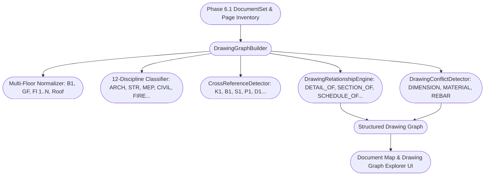

# PHASE 6.2 IMPLEMENTATION REPORT: PAGE & DRAWING INTELLIGENCE

**Project:** EZRAB Construction Estimator Core  
**Phase:** 6.2 — Page & Drawing Intelligence  
**Status:** COMPLETED & VERIFIED (48/48 Scenarios Passing, 100% Type Safe)  
**Author:** Senior AI Architect + Construction Estimating System Engineer  

---

## 1. Executive Summary

Phase 6.2 elevates EZRAB's Document Intelligence from the multi-page document inventory (Phase 6.1) into a structured **Drawing Relationship Graph**.

### Core Invariant Enforced:
$$\mathbf{Page \neq Entity \quad | \quad Page \neq Work\ Item \quad | \quad Page \neq RAB}$$

A single physical construction element (e.g. Column `K1` on Floor 2) can appear across multiple drawings (e.g. *Floor Plan S-102*, *Column Detail S-201*, *Bar Bending Schedule S-501*). Phase 6.2 models these connections as **evidence pointers** without prematurely fabricating or aggregating work items or prices.

---

## 2. Architecture & Data Flow



---

## 3. Implemented Components

### 3.1 Domain Types (`src/domain/document/drawingGraphTypes.ts`)
- **12 Drawing Disciplines**: `ARCHITECTURAL`, `STRUCTURAL`, `MECHANICAL`, `ELECTRICAL`, `PLUMBING`, `FIRE`, `LANDSCAPE`, `CIVIL`, `ROAD`, `BRIDGE`, `WATER`, `OTHER`.
- **11 Drawing Relationship Types**: `PRIMARY`, `DETAIL_OF`, `SECTION_OF`, `ELEVATION_OF`, `SCHEDULE_OF`, `SPECIFICATION_OF`, `REFERENCE_OF`, `CALCULATION_OF`, `RELATED_TO`, `SUPERSEDES`, `DUPLICATES`.
- **4 Conflict Statuses**: `CONSISTENT`, `CONFLICT`, `REVISION_RESOLVED`, `NEEDS_REVIEW`.
- **Cross-Reference Categories**: `COLUMN`, `BEAM`, `SLAB`, `FOUNDATION`, `DOOR`, `WINDOW`, `WALL`, `ROOM`, `FIXTURE`, `REBAR`, `OTHER`.

### 3.2 Cross-Reference Detector (`server/services/crossReferenceDetector.ts`)
- Discovers structural, architectural, and MEP entity identifiers (`K1`, `K2`, `B1`, `S1`, `P1`, `D1`, `J1`, `PL1`, etc.).
- Extracts contextual engineering parameters:
  - Dimensions (e.g., `30x30 cm`, `25x40 cm`, `15/20`)
  - Thickness (e.g., `t=12cm`)
  - Concrete quality (e.g., `fc' 25 MPa`, `K-250`)
  - Rebar reinforcement (e.g., `8 D16`, `D13-150`)
  - Material specifications (e.g., `Kayu Kamper`, `Kusen Aluminium 4"`)
- **Strict Floor Awareness**: Kolom `K1` on Floor 1 is cataloged separately from Kolom `K1` on Floor 2.

### 3.3 Drawing Relationship Engine (`server/services/drawingRelationshipEngine.ts`)
- Automatically links drawings:
  - `DETAIL_OF`: Detail structural & architectural drawings tied to master floor plans.
  - `SECTION_OF`: Building cross-sections tied to corresponding floor plans.
  - `ELEVATION_OF`: Exterior elevation views tied to plans.
  - `SCHEDULE_OF`: Door/window and rebar schedules tied to floor layouts.
  - `SPECIFICATION_OF`: Technical specs tied to drawings.
  - `SUPERSEDES`: Active revisions replacing older revisions.
  - `DUPLICATES`: Redundant/copy sheets linked to canonical drawings.

### 3.4 Conflict Detection Engine (`server/services/drawingConflictDetector.ts`)
- Scans drawings on the same floor/building for engineering discrepancies (e.g. Plan states `K1 = 25x25 cm` vs Detail states `K1 = 30x30 cm`).
- **No silent resolution**: Discrepancies are flagged with status `CONFLICT` or `NEEDS_REVIEW` and require explicit human-in-the-loop audit notes.

### 3.5 Drawing Intelligence Service (`server/services/drawingIntelligenceService.ts`)
- Central coordinator managing `DrawingGraph` generation, multi-document synthesis (`DED_Architectural.pdf`, `DED_Structural.pdf`, `DED_MEP.pdf`, `Spec.pdf`, `BOQ.xlsx`), and tenant scoping.

### 3.6 Interactive UI Explorer (`src/components/document/DrawingGraphExplorerView.tsx`)
- Tree navigation: `Building` $\rightarrow$ `Floor` $\rightarrow$ `Discipline` $\rightarrow$ `Drawing` $\rightarrow$ `Pages`.
- Tabbed detail pane:
  1. *Overview & Pages*: Physical page inventory alignment.
  2. *Drawing Relationships*: Graph connections (`PRIMARY`, `DETAIL_OF`, `SCHEDULE_OF`, `SECTION_OF`, etc.).
  3. *Cross-References & Evidence*: Entity identifiers with extracted parameters and floor tags.
  4. *Conflicts & Quality Audit*: Discrepancy detector with human audit resolution buttons.
- Integrated seamlessly into `DocumentReviewWorkspaceModal.tsx`.

---

## 4. Verification & Testing

### 4.1 Phase 6.2 Test Suite
```bash
npx tsx server/test/phase6_2_pageDrawingIntelligence.test.ts
```
| Sub-Test | Description | Result |
|---|---|:---:|
| **TEST 01** | Multi-Floor Recognition & Normalization (Basement, Ground, Fl 1..N, Roof) | **PASS** |
| **TEST 02** | Same Identifier on Different Floors (K1 Fl 1 vs K1 Fl 2 Isolation) | **PASS** |
| **TEST 03** | Multi-Document Package Ingestion (Arch, Struct, MEP, Specs, BOQ) | **PASS** |
| **TEST 04** | Plan + Detail Relationship Detection (`DETAIL_OF`) | **PASS** |
| **TEST 05** | Schedule + Plan Relationship Detection (`SCHEDULE_OF`) | **PASS** |
| **TEST 06** | Section + Plan Relationship Detection (`SECTION_OF`) | **PASS** |
| **TEST 07** | Duplicate Drawing Detection (`DUPLICATES`) | **PASS** |
| **TEST 08** | Revision Hierarchy & Superseding Resolution (`SUPERSEDES` / `REVISION_RESOLVED`) | **PASS** |
| **TEST 09** | Discrepancy Conflict Detection (Plan vs Detail Mismatch) | **PASS** |
| **TEST 10** | Multi-Document Context Synthesis & Tenant Isolation Guarantee | **PASS** |

### 4.2 Master Test Suite
```bash
npx tsx server/test/runAllVerificationTests.ts
============================================================
TOTAL SCENARIOS RUN: 48 | PASSED: 48 | FAILED: 0
============================================================
```

### 4.3 TypeScript Compilation & Production Build
- `npx tsc --noEmit` $\rightarrow$ **Clean (0 errors)**
- `npm run build` $\rightarrow$ **Clean (Built in 26.81s)**
- `npm run ai:doctor` $\rightarrow$ **All Health Checks PASSED**
