# SETTINGS INFORMATION ARCHITECTURE — EZRAB

## 1. Executive Summary
Dokumen ini mendefinisikan Information Architecture (IA) baru untuk sistem Pengaturan EZRAB.
Arsitektur baru ini memecahkan masalah layout datar dan kekacauan konfigurasi dengan menerapkan **3 Level Konfigurasi** (Account, Workspace, Project) serta **10 Kategori Pengaturan Tematik**, sekaligus sepenuhnya menaati larangan mengekspos konfigurasi model AI ke UI pengguna.

---

## 2. Tiga Level Konfigurasi

```mermaid
graph TD
    A["⚙️ SISTEM PENGATURAN EZRAB"] --> L1["LEVEL 1: ACCOUNT (Pengguna)"]
    A --> L2["LEVEL 2: WORKSPACE (Perusahaan & Tim)"]
    A --> L3["LEVEL 3: PROJECT (Khusus Proyek Aktif)"]

    L1 --> L1_1["Profil Pengguna"]
    L1 --> L1_2["Preferensi Tampilan & Bahasa"]
    L1 --> L1_3["Notifikasi"]
    L1 --> L1_4["Keamanan & Login"]

    L2 --> L2_1["Profil Perusahaan & NPWP"]
    L2 --> L2_2["Tim, Anggota & Undangan"]
    L2 --> L2_3["Role & Hak Akses (RBAC)"]
    L2 --> L2_4["Branding & Kop Standar"]
    L2 --> L2_5["Paket Langganan & Billing"]
    L2 --> L2_6["Master Data Defaults"]

    L3 --> L3_1["Informasi & Metadata Proyek"]
    L3 --> L3_2["Harga Proyek / Override"]
    L3 --> L3_3["Overhead, Profit, Pajak Proyek"]
    L3 --> L3_4["Presisi & Waste Factor Proyek"]
    L3 --> L3_5["Nomor Dokumen & Penandatangan"]
    L3 --> L3_6["Kalender & Hari Kerja Proyek"]
    L3 --> L3_7["Cost Code & Budget Baseline"]
```

---

## 3. Struktur 10 Kategori Target

### 1. 👤 AKUN (`account`)
* **Profil**: Nama lengkap, email, nomor kontak, jabatan/keahlian, foto avatar.
* **Preferensi**: Bahasa sistem (Bahasa Indonesia / English), format tanggal (`DD/MM/YYYY`), tema warna (Light mode standard).
* **Notifikasi**: Preferensi notifikasi aktivitas proyek, revisi RAB, persetujuan direksi, notifikasi keamanan.
* **Keamanan & Login**: Ubah kata sandi, status autentikasi 2FA, sesi login aktif.

### 2. 🏢 WORKSPACE (`workspace`)
* **Perusahaan**: Nama perusahaan/kantor, NPWP, alamat kantor, email resmi, telepon kantor.
* **Tim & Anggota**: Daftar anggota workspace, status akun (Active/Invited), penambahan anggota baru.
* **Role & Permission**: Matriks izin akses (`SUPER_ADMIN`, `ESTIMATOR`, `DIREKSI`, `CLIENT`, `EDITOR`).
* **Branding**: Logo perusahaan, warna identitas, kop surat standar workspace.
* **Paket & Billing**: Status langganan (Professional Estimator), masa aktif, kuota proyek, faktur langganan.

### 3. 📚 MASTER DATA (`master-data`)
* **Master Harga**: Tautan dan konfigurasi harga acuan nasional & regional (38 provinsi).
* **Master AHSP**: Standar analisa acuan (Permen PUPR 2026, Permen PUPR 2022, dsb).
* **Material**: Konfigurasi tier material (Economy, Standard, Premium), kategori material.
* **Tenaga Kerja**: Standar jam kerja per hari (7 jam OH), koefisien mandor/tukang.
* **Peralatan**: Standar sewa alat per jam/hari, konsumsi BBM, include/exclude operator.
* **Satuan**: Daftar satuan resmi (m, m², m³, kg, ton, zak, bh, titik, ls).
* **Kategori Pekerjaan**: Standar klasifikasi pekerjaan (Struktur, Arsitektur, MEP, dsb).

### 4. 💰 ESTIMATOR (`estimator`)
* **Pengaturan RAB**: Format tampilan RAB, struktur penomoran WBS, breakdown biaya.
* **Harga Proyek**: Integrasi cepat ke daftar override harga proyek aktif.
* **Markup**: Persentase markup direksi, visibilitas markup (hidden from client/editor).
* **Overhead**: Persentase overhead default (5% - 15%).
* **Profit**: Persentase margin keuntungan kontraktor pelaksana.
* **Pajak**: Tarif PPN (11% atau 12%), PPh konstruksi (Final 1.75% / 2.65%).
* **Pembulatan**: Aturan pembulatan (Pembulatan ke ribuan, ratusan, atau 2 desimal tepat).

### 5. 📐 DED & VOLUME (`ded-volume`)
* **Satuan Perhitungan**: Satuan panjang (m), luas (m²), volume (m³), berat (kg).
* **Presisi Perhitungan**: Jumlah desimal volume (2 desimal), panjang (2 desimal).
* **Waste Factor**: Faktor susut/kehilangan material standar (besi beton 5%, semen 3%, bata 5%).
* **Mapping Pekerjaan**: Aturan pemetaan elemen CAD/PDF ke item pekerjaan AHSP.

### 6. 📄 DOKUMEN (`documents`)
* **Template**: Pilihan template dokumen tender resmi (Surat Penawaran, BOQ, Rekapitulasi).
* **Penomoran**: Format nomor dokumen proyek (e.g. `{PROJECT_NO}/RAB/{YEAR}`).
* **Kop / Branding**: Header surat resmi, logo pada lembar ekspor.
* **Tanda Tangan**: Nama penandatangan (Direktur, Lead Estimator, Pejabat Pembuat Komitmen).
* **Export**: Format ekspor PDF (A4/F4, Potrait/Landscape, Watermark) dan Spreadsheet (XLSX).

### 7. 📅 SCHEDULE & PROGRESS (`schedule`)
* **Kalender Kerja**: Kalender proyek, penetapan hari libur nasional Indonesia.
* **Hari Kerja**: Jumlah hari kerja per minggu (5 hari / 6 hari kerja).
* **Progress**: Interval pemantauan progres fisik (Mingguan / Bulanan).
* **Kurva-S**: Parameter bobot kumulatif dan toleransi deviasi jadwal.

### 8. 💵 COST (`cost`)
* **Cost Code**: Standar kode akun biaya proyek (Direct Material, Direct Labor, Equipment, Subcon).
* **Budget**: Baseline anggaran biaya yang disetujui (Approved Cost Baseline).
* **Actual Cost**: Konfigurasi pencatatan pengeluaran riil vs rencana anggaran.
* **Cashflow**: Parameter termin pembayaran dan arus kas proyek.

### 9. 🔌 INTEGRASI (`integrations`)
* **Storage**: Konfigurasi penyimpanan lokal dan cloud (Google Cloud / AWS).
* **API**: Akses integrasi webhook & API sistem internal.
* **Import / Export**: Pengaturan migrasi data dari Excel, CSV, dan backup sistem.
* **Integrasi Eksternal**: Tautan integrasi spreadsheet sync dan alat eksternal.

### 10. ⚙️ SISTEM (`system`)
* **Backup**: Pencadangan database dan arsip snapshot proyek secara berkala.
* **Audit Log**: Jejak audit komprehensif seluruh modifikasi data konfigurasi.
* **Data Management**: Pembersihan cache, verifikasi integritas relasi data.
* **Advanced**: Parameter diagnostik dan pemulihan sistem.

---

## 4. Migration Mapping: Current → Target

| Tab Saat Ini | Status / Aksi | Kategori Target | Penjelasan |
|---|---|---|---|
| `profile` | **MOVE** | 👤 Akun > Profil | Konfigurasi akun personal pengguna |
| `general` | **SPLIT** | 👤 Akun > Preferensi & 📐 DED > Satuan | Bahasa & tanggal ke Akun; satuan ke DED & Volume |
| `workspace` | **MOVE** | 🏢 Workspace > Perusahaan | Profil kantor, NPWP, alamat |
| `users` | **MOVE** | 🏢 Workspace > Tim & Anggota | Manajemen anggota & peran |
| `notifications`| **MOVE** | 👤 Akun > Notifikasi | Preferensi pemberitahuan |
| `ai` | **REMOVE FROM USER NAVIGATION** | **INTERNAL ONLY** | Sesuai aturan wajib: AI adalah infrastruktur backend, user tidak boleh melihat model/provider |
| `calculation` | **MOVE** | 📐 DED & Volume > Presisi | Presisi desimal dan aturan pembulatan perhitungan |
| `rab` | **SPLIT & ENHANCE** | 💰 Estimator & 📚 Master Data | Standar AHSP ke Master Data; Overhead & PPN ke Estimator |
| `export` | **MOVE** | 📄 Dokumen > Export | Konfigurasi kertas, orientasi, logo ekspor |
| `security` | **MOVE** | 👤 Akun > Keamanan & Login | Ganti password, 2FA |
| `subscription`| **MOVE** | 🏢 Workspace > Paket & Billing | Paket langganan & kuota workspace |
| `help` | **PRESERVE** | ⚙️ Sistem > Bantuan & Panduan | Panduan penggunaan dan FAQ |
| *New: Project Settings* | **NEW ARCHITECTURE** | Level 3: Project Scope | Khusus mengonfigurasi proyek yang sedang dibuka |

---

## 5. Hidden AI Architecture Boundary
Sesuai aturan mutlak Master Prompt:
* **Tidak ada menu AI**: Tidak ada "AI Settings", "Model Selection", "API Key AI", "Gemini/OpenAI/DeepSeek Settings".
* **Layer Abstraksi Internal**:
  * Request chat umum → Internal general reasoning model
  * Ekstraksi denah/DED → Internal vision model
  * Pemetaan AHSP & Analisis RAB → Internal estimation reasoning engine
  * Pembuatan teks dokumen → Internal structured writing engine
* **Interaksi Pengguna**: Hanya melalui aksi fungsional ("Analisis dengan AI", "Bantu susun RAB", "Periksa dengan AI"), tanpa pernah melihat detail model/provider.
