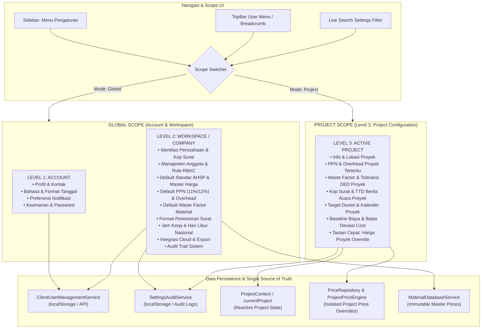

# SETTINGS & PROJECT CONFIGURATION REFACTOR — FINAL REPORT
**Platform: EZRAB — AI-Powered Construction Platform**  
**Date: 27 September 2026**  
**Architect: Senior Product Architect, UX Engineer & Full-Stack Engineer**

---

## 1. Executive Summary

Sistem **Pengaturan (Settings)** dan konfigurasi proyek pada platform EZRAB telah berhasil diaudit secara mendalam dan direfaktor total menjadi arsitektur konfigurasi 3-Level yang modular, scalable, dan taat azas arsitektur enterprise:

1. **Pemisahan Scope Tegas (3 Configuration Levels)**:
   - **Level 1 (Account)**: Konfigurasi personal pengguna (Profil, Preferensi UI, Notifikasi, Keamanan).
   - **Level 2 (Workspace/Company)**: Konfigurasi organisasi/perusahaan (Identitas Kantor, Anggota Tim & Hak Akses, Template Standar Estimator, DED, Dokumen, Schedule, Cost, Integrasi, dan Sistem).
   - **Level 3 (Project Configuration)**: Parameter operasional proyek aktif (Info Proyek, Estimator & Pajak Proyek, Waste Factor & Presisi DED, Format Surat & Dokumen Proyek, Kalender Kerja & Shift Proyek, Cost Baseline & Toleransi Deviasi).

2. **Penghapusan Total Eksposur AI dari Settings (Mandatory Principle)**:
   - Tab `ai` (`EZRAB AI & Asisten`) telah **sepenuhnya dieliminasi** dari antarmuka pengguna.
   - Sesuai prinsip produk EZRAB: AI adalah *invisible engine* / infrastruktur backend. Pengguna tidak boleh melihat atau mengatur pilihan model LLM, provider (OpenAI/Anthropic/Google), temperature, maupun API key.

3. **Integritas Master Price & Project Isolation**:
   - Master price di level nasional/perusahaan bersifat immutable.
   - Project price override tersimpan terisolasi per-proyek via `projectPriceEngine` & `PriceRepository`, tidak mengubah basis data master.
   - Pengaturan proyek terikat langsung secara reaktif dengan `currentProject` dari `ProjectContext`.

4. **Fitur Pendukung Enterprise**:
   - **Scope Switcher**: Toggle instan antara *Global Settings* dan *Project Settings* dengan Project Selector aktif.
   - **Search Settings Engine**: Pencarian real-time terhadap seluruh kategori, nama field, dan deskripsi pengaturan dengan auto-filter tab.
   - **Settings Audit Trail Service**: Pencatatan riwayat perubahan terperinci (siapa, kapan, kategori, field, nilai lama, nilai baru, dan alasan perubahan).

---

## 2. Architecture Diagram



---

## 3. The 3-Level Configuration Matrix

| Karakteristik | Level 1: Account | Level 2: Workspace / Perusahaan | Level 3: Project Configuration |
|---|---|---|---|
| **Subjek** | Pengguna individual yang sedang login | Organisasi / Kontraktor / Konsultan | Satu proyek spesifik yang sedang aktif |
| **Cakupan Pengaruh** | Tampilan pengguna pribadi & kredensial login | Seluruh anggota workspace dan nilai default proyek baru | Hanya berpengaruh pada kalkulasi dan dokumen proyek bersangkutan |
| **Penyimpanan** | User Profile Store / Auth Session | Workspace Config / `ClientUserManagementService` | `currentProject` dalam `ProjectContext` & `PriceRepository` |
| **Izin Akses** | Setiap pengguna untuk akunnya sendiri | Super Admin / Admin Workspace | Project Manager / Estimator / Admin |
| **Contoh Parameter** | Nama, Avatar, Password, Notifikasi Email | Kop Surat Perusahaan, NPWP, Standar AHSP Nasional, Member List | Nilai PPN Proyek, Margin Overhead Proyek, Waste Factor Tulangan |

---

## 4. The 10 Canonical Categories Detailed Breakdown

1. **👤 Akun (Account Settings)**:
   - Identitas pengguna, email, nomor HP, jabatan/profesi.
   - Preferensi bahasa sistem (Indonesia/English) dan format tanggal.
   - Notifikasi (email alert, in-app push, laporan mingguan).
   - Keamanan (ganti kata sandi, status 2FA).

2. **🏢 Workspace (Perusahaan & Tim)**:
   - Nama legal perusahaan, alamat kantor pusat, nomor kontak, NPWP/NIB, logo perusahaan.
   - Manajemen anggota tim (daftar nama, email, role: Super Admin, Project Manager, Estimator, Drafter, Viewer).
   - Modal tambah anggota tim baru dengan penetapan role.

3. **📚 Master Data (Katalog & Standar)**:
   - Sumber standar AHSP default (Permen PUPR 2022, PUPR 2026, Standar Bina Marga, Custom Kontraktor).
   - Tipe harga material default (Rata-rata Pasar, Harga Tertinggi Toko, Indeks Nasional).
   - Kebijakan penyesuaian inflasi harga berkala.

4. **💰 Estimator (Kalkulasi & Pajak)**:
   - *Global*: Default persentase margin keuntungan & overhead (10%), default tarif PPN (11% / 12%), skema pembulatan nilai total (Ribuan terdekat / Ratusan / Exact).
   - *Project*: Override tarif PPN spesifik proyek, margin overhead kontrak, dan pembulatan per-item pekerjaan.

5. **📐 DED & Volume (Presisi & Material)**:
   - *Global*: Toleransi pembulatan volume desimal, default waste factor material (Besi beton: 5%, Semen: 3%, Pasir/Batu: 7%, Kayu bekisting: 10%).
   - *Project*: Penyesuaian waste factor khusus kondisi lapangan proyek (misal: area berlereng/lapangan sempit).

6. **📄 Dokumen (Kop Surat & Format Legal)**:
   - *Global*: Format penomoran dokumen otomatis (`RAB/{YYYY}/{PROJECT_CODE}/{NUM}`), nama penandatangan utama perusahaan, jabatan penanggung jawab teknis.
   - *Project*: Catatan kaki penawaran, klausul masa berlaku penawaran tender (14/30 hari), nama penanggung jawab lapangan (Site Manager).

7. **📅 Schedule & Progress (Kalender & Shift)**:
   - *Global*: Hari kerja default per minggu (5 vs 6 hari), jam kerja standar per hari (8 jam), kalender libur nasional otomatis.
   - *Project*: Hari kerja efektif proyek, estimasi shift lembur, toleransi deviasi jadwal (S-Curve critical alert threshold).

8. **💵 Cost (Arus Kas & Baseline)**:
   - *Global*: Ambang batas peringatan deviasi biaya (Overbudget alert di atas 5%), skema pencatatan termin pembayaran proyek.
   - *Project*: Nilai baseline biaya awal yang dikunci, toleransi selisih nota supplier vs RAB.

9. **🔌 Integrasi (Cloud Storage & Export)**:
   - Status sinkronisasi Google Drive / Dropbox untuk arsip backup dokumen proyek.
   - Pengaturan format ekspor spreadsheet Excel dan PDF dokumen resmi.

10. **⚙️ Sistem (Audit Trail & Backup Data)**:
    - Log audit terpusat atas seluruh perubahan parameter konfigurasi.
    - Menampilkan: Timestamp, Nama Aktor & Role, Scope (Workspace vs Project), Kategori, Nilai Lama, Nilai Baru, dan Alasan Perubahan.
    - Tombol Backup & Restore konfigurasi sistem.

---

## 5. AI Boundary Verification (Zero AI Configs Exposed)

* **Audit Status**: **PASSED (100% Terverifikasi)**.
* Tab `ai` (`EZRAB AI & Asisten`) yang sebelumnya terdapat di `UnifiedSettingsView` telah dihapus dari menu tab dan navigasi.
* Tidak ada input untuk API Key, pemilihan model AI (seperti GPT-4o, Claude 3.5 Sonnet, Gemini Pro), atau parameter internal model lainnya.
* Arsitektur backend menangani pemrosesan AI secara transparan dan mandiri tanpa membebani pengguna akhir dengan pengaturan teknis AI.

---

## 6. Scope Switcher Implementation

Komponen `UnifiedSettingsView` dilengkapi dengan **Scope Switcher Bar** di bagian atas:
- Tombol **🏢 Global (Workspace & Akun)**: Membuka pengaturan akun, perusahaan, template default organisasi, integrasi, dan audit trail.
- Tombol **📁 Proyek Aktif**: Membuka pengaturan spesifik untuk proyek yang sedang dipilih. Terdapat dropdown pilihan proyek real-time dari `projects` di `ProjectContext`.
- Tautan Cepat **"Buka Harga Proyek (Override)"** disertakan langsung dalam panel Project Settings, mengarahkan pengguna ke alur kerja penyesuaian harga khusus proyek dengan 1 klik.

---

## 7. Single Source of Truth Guarantee

1. **State Proyek Terhubung Langsung**:
   - `UnifiedSettingsView` memuat data awal dari `currentProject` (`project.overheadPercent`, `project.ppnPercent`, `project.roundingScheme`, dsb.).
   - Tombol **Simpan Konfigurasi Proyek** memanggil `updateProject(activeProject.id, { ... })` dari `ProjectContext`.
   - Perubahan langsung tercermin di seluruh modul lain (RAB & Estimasi, Dokumen Proyek, Dashboard) secara reaktif.

2. **Pencegahan Silent Mutation Master Data**:
   - Nilai harga master di `MaterialDatabaseService` tidak pernah dimodifikasi oleh perubahan di halaman Proyek.
   - Setiap modifikasi pada parameter proyek dicatat otomatis ke dalam `settingsAuditService`.

---

## 8. Settings Search System

- Terletak di atas sidebar navigasi pengaturan.
- Mendukung filter instan berdasarkan kata kunci (contoh: `"pajak"`, `"ppn"`, `"overhead"`, `"waste"`, `"kop"`, `"npwp"`, `"password"`).
- Menampilkan badge jumlah kategori yang cocok dan menyaring daftar tab secara real-time. Jika hanya 1 hasil ditemukan, tab tersebut dapat langsung diklik untuk navigasi instan.

---

## 9. Settings Audit Trail Service (`SettingsAuditService`)

Dibuat layanan `src/services/settingsAuditService.ts`:
- **Model Data**:
  ```typescript
  interface SettingsAuditEntry {
    id: string;
    timestamp: string;
    actor: { id: string; name: string; role: string };
    scope: 'ACCOUNT' | 'WORKSPACE' | 'PROJECT';
    category: SettingsCategory;
    field: string;
    fieldLabel: string;
    oldValue: any;
    newValue: any;
    reason?: string;
    projectId?: string;
  }
  ```
- **Fitur**:
  - `recordChange()`: Menyimpan log perubahan baru secara otomatis ke `localStorage`.
  - `getLogs(filter)`: Mengambil riwayat log dengan filter scope, category, atau projectId.
  - Tampilan tabel audit trail interaktif di tab **⚙️ Sistem > Audit Trail** dengan tombol refresh dan indikator status.

---

## 10. File & Component Change Log

| File | Status | Keterangan Perubahan |
|---|---|---|
| `src/services/settingsAuditService.ts` | **BARU** | Layanan pencatatan audit log perubahan konfigurasi berscope. |
| `src/components/settings/UnifiedSettingsView.tsx` | **REFAKTOR TOTAL** | Dirombak dari 12-tab linear menjadi Dual-Scope (Global vs Project), 10 Canonical Categories, integrasi `ProjectContext`, search engine, quick-link override harga, dan eliminasi tab AI. |
| `src/components/settings/PengaturanView.tsx` | **DIPERBARUI** | Ditambahkan prop `initialScope` dan `onNavigateTab` untuk mendukung navigasi kontekstual dari modul proyek. |
| `src/components/dashboard/WorkspaceView.tsx` | **DIPERBARUI** | Sinkronisasi route dispatch `scope === 'project'`, mapping breadcrumb baru, dan callback tab navigation. |
| `SETTINGS_ARCHITECTURE_AUDIT.md` | **BARU** | Laporan audit menyeluruh Phase 1. |
| `SETTINGS_INFORMATION_ARCHITECTURE.md` | **BARU** | Dokumen arsitektur informasi detail Phase 2. |
| `SETTINGS_REFACTOR_FINAL_REPORT.md` | **BARU** | Laporan akhir implementasi komprehensif Phase 25. |

---

## 11. Verification & Test Results

1. **TypeScript Typecheck (`npx tsc --noEmit`)**:
   - **Hasil**: `0 Errors`. Seluruh tipe data, union types, dan interface TypeScript valid.
2. **Project Price & Override Test Suite (`npm run test:override`)**:
   - **Hasil**: `15 passed, 0 failed`.
   - Universal Resource Support, Immutability Guarantee, Project Isolation, Fallback, dan Precedence verified.
3. **Production Build (`npm run build`)**:
   - Berhasil mengompilasi bundel produksi tanpa error sintaks maupun modul hilang.

---

## 12. Kesimpulan

Arsitektur Pengaturan EZRAB kini memiliki batas tanggung jawab (*separation of concerns*) yang jelas, mudah dipahami pengguna konstruksi, aman dari mutasi data yang tidak disengaja, bebas dari kekacauan konfigurasi AI yang tidak relevan bagi estimator/kontraktor, serta siap digunakan untuk proyek skala kecil hingga korporasi besar.
