# EZRAB AI CORE — Repository Audit Report (Fase 0)

> **Status:** AUDIT COMPLETED  
> **Tanggal Audit:** 14 September 2026  
> **Auditor:** Principal Software & AI Systems Architect  
> **Target Sistem:** EZRAB AI CORE (Pusat Kecerdasan RAB & Estimasi Konstruksi)

---

## 1. Ringkasan Repository

Repository **EZRAB** (`ezrab-v2`) adalah platform estimasi biaya konstruksi dan penyusunan Rencana Anggaran Biaya (RAB) berbasis AI untuk para profesional konstruksi (Estimator, Kontraktor, Konsultan QS, Arsitek, Insinyur Sipil, dan Direksi Proyek).

Repository ini terdiri dari 3 subsistem utama yang saling terintegrasi:
1. **Frontend Web Application (`/src`)**: Single Page Application berbasis React 19 + TypeScript + Vite, dengan antarmuka spreadsheet interaktif, Copilot Chatbox, Magic AI Modal, QTO viewer, AHSP explorer, dan Kurva S visualizer.
2. **Backend API Gateway & AI Orchestration Server (`/server`)**: Server Node.js/TypeScript yang mengelola routing API, autentikasi berbasis session token Supabase, isolasi multi-tenant workspace/proyek, tool execution registry, context builder, database adapter, dan auto-answer engine.
3. **Local AI Core (`/EZRAB-LOCAL-AI`)**: Microservice berbasis Python 3.12 + FastAPI yang mengintegrasikan LLM lokal (Ollama / Qwen), memori percakapan berbasis vektor/kata kunci, serta pipeline ekstraksi & ingesti PDF / DED.

---

## 2. Stack Teknologi

| Layer | Teknologi | Detail / Versi |
|---|---|---|
| **Frontend Framework** | React 19, TypeScript 5.7, Vite 6.2 | Modul SPA modern dengan fast refresh |
| **Styling & UI** | Tailwind CSS, Lucide React (1.16), Framer Motion (12.38), GSAP (3.14) | Desain blueprint konstruksi presisi, responsif |
| **Calculation Engine** | Decimal.js (10.6.0) | Perhitungan RAB floating-point berpresisi tinggi deterministik |
| **Dokumen & Ekspor** | ExcelJS (4.4.0), jsPDF (4.2.1), jsPDF-AutoTable (5.0.8), XLSX | Ekspor/impor spreadsheet RAB & laporan resmi |
| **Backend Gateway** | Node.js (v20+), HTTP Server / TypeScript | Gateway stateless dengan isolasi tenant |
| **Database & Auth** | Supabase (PostgreSQL 15+ dengan Row Level Security) | RLS, auth schema, multi-tenant workspace & project membership |
| **Local AI Service** | Python 3.12, FastAPI, Pydantic v2, HTTPX | FastAPI microservice pada port 8000 |
| **LLM & Inference** | Ollama (`qwen3:8b`), OpenAI-Compatible API (`gpt-4o`, OpenRouter, Local vLLM) | Multi-provider architecture dengan dynamic fallback |
| **Test Framework** | ESBuild test runner (`scripts/run-calculation-foundation-tests.mjs`) | Node native runner untuk unit, integrasi & master acceptance test suite |

---

## 3. Struktur Modul

```
ezrab site web/
├── src/                               # Frontend Source Code (React 19 + TypeScript)
│   ├── calculations/                  # Mesin hitung matematis (decimalEngine.ts)
│   ├── components/                    # Komponen UI
│   │   ├── copilot/                   # EzrabCoAssistantChatbox, EstimatingCopilotPanel, FullView
│   │   ├── estimator/                 # Spreadsheet RAB, Magic AI Copilot Modal, QuickRail
│   │   ├── ahsp/                      # AhspExplorerView & selector
│   │   ├── dashboard/                 # EzrabAiDashboardView, WorkspaceView
│   │   └── common/                    # AiChangePreviewModal, ThemeModal, Logo
│   ├── context/                       # React Context (Auth, Theme, Workspace)
│   ├── services/                      # Frontend API Services
│   │   ├── aiApiClient.ts             # Client resmi untuk API Gateway (/api/ai)
│   │   ├── aiProviderEngine.ts        # Normalizer respons AI & provider switch
│   │   ├── aiProjectContext.ts        # Builder payload konteks proyek sisi klien
│   │   └── supabaseClient.ts          # Client Supabase browser (anon key only)
│   └── types/                         # Interface TypeScript aplikasi & domain
│
├── server/                            # Backend Gateway & AI Orchestrator (Node.js)
│   ├── index.ts                       # Server HTTP entrypoint (Port 3001)
│   ├── api/                           # Endpoint Handlers
│   │   ├── aiRoutes.ts                # Route /api/ai/* (chat, stream, actions, KB, health)
│   │   └── projectRabRoutes.ts        # Route /api/projects & /api/rab
│   ├── auth/                          # Core Autentikasi & Otorisasi
│   │   ├── authFoundation.ts          # Transitional fail-closed auth foundation
│   │   ├── contracts.ts               # Interface IdentityResolver & ProjectMembershipRepository
│   │   └── supabaseIdentityResolver.ts # Verifikasi Bearer token via supabase.auth.getUser()
│   ├── middleware/                    # Middleware Keamanan
│   │   ├── authMiddleware.ts          # Token extraction & role resolution
│   │   └── isolationGuard.ts          # Validasi isolasi workspace & project ID
│   ├── orchestrator/                  # AI Orchestrator Core
│   │   ├── aiOrchestrator.ts          # Pipeline multi-turn orchestration & action interceptor
│   │   ├── intentClassifier.ts        # Klasifikasi intensi & short-circuit sapaan
│   │   ├── contextBuilder.ts          # Dynamic project context assembly & redaction
│   │   └── personalityEngine.ts       # Evaluasi tone (serius/humor) & security check
│   ├── providers/                     # Model Provider Adapter
│   │   ├── aiProvider.ts              # Interface provider LLM
│   │   ├── mockProvider.ts            # Mock deterministic offline provider
│   │   ├── openaiProvider.ts          # OpenAI & OpenRouter compatible provider
│   │   └── providerFactory.ts         # Runtime provider selector
│   ├── repositories/                  # Repositori Database
│   │   └── supabaseProjectRabRepository.ts # Repositori proyek & RAB
│   ├── services/                      # Business Logic & Data Services
│   │   ├── autoAnswerEngine.ts        # Mesin pencarian & jawaban otomatis dataset 9.999 Q&A
│   │   ├── knowledgeDatasetImporter.ts # Importer & validator dataset JSONL/CSV
│   │   ├── messageNormalizer.ts       # Normalisasi teks, koreksi typo, synonym matching
│   │   ├── commandEngine.ts           # Mesin preview & eksekusi perintah spreadsheet RAB
│   │   ├── calculationService.ts      # Service audit & kalkulasi matematis
│   │   ├── projectDataService.ts      # Service data proyek
│   │   ├── rabDataService.ts          # Service data RAB
│   │   ├── ahspDataService.ts         # Service data AHSP standar PUPR
│   │   ├── progressDataService.ts     # Service data progres & Kurva S
│   │   ├── reportDataService.ts       # Service generator laporan proyek
│   │   └── extendedDataServices.ts    # WBS, QTO, Price, DED, Time Schedule, Subscription
│   ├── tools/                         # Function Calling Tool Registry
│   │   └── toolRegistry.ts            # 97 tools backend terdaftar lengkap dengan schema & RBAC
│   ├── database/                      # Adapter Database & Schema
│   │   ├── dbAdapter.ts               # Adapter in-memory & persistensi Supabase
│   │   └── migrations/                # Schema migration SQL
│   └── test/                          # Comprehensive Test Suites (16 test files)
│
├── EZRAB-LOCAL-AI/                    # Python Local AI Core (FastAPI)
│   ├── main.py                        # FastAPI Application & Gateway (Port 8000)
│   ├── ai/                            # Modul AI Python
│   │   ├── orchestrator/              # Python Router & Intent Classifier
│   │   ├── providers/                 # OllamaProvider & OpenAI provider
│   │   ├── knowledge.py               # Local knowledge router
│   │   └── knowledge_ingestion.py     # PDF & DED text/table extractor
│   ├── memory/                        # Vector & Keyword Memory Manager
│   │   └── manager.py                 # SQLite/JSON memory storage
│   └── knowledge/                     # Koleksi dokumen knowledge base lokal
│
├── supabase/                          # Supabase Local & Cloud Configuration
│   ├── config.toml                    # Konfigurasi Supabase CLI
│   └── migrations/                    # Database Migrations resmi
│       ├── 20260913_auth_membership_foundation.sql
│       └── 20260913_durable_project_rab_foundation.sql
│
└── docs/                              # Dokumentasi Teknis & Arsitektur
```

---

## 4. Database yang Ditemukan

Database utama yang digunakan adalah **PostgreSQL** via **Supabase** dengan Row Level Security (RLS) terpasang. Ditemukan tabel-tabel berikut:

### A. Tabel Autentikasi & Keanggotaan
- `public.profiles`: Profil pengguna (berelasi dengan `auth.users(id)`), menyimpan `display_name`, `created_at`, `updated_at`.
- `public.workspaces`: Multi-tenant workspace container.
- `public.workspace_members`: Pemetaan `user_id` ke `workspace_id` dengan role (`SUPER_ADMIN`, `ESTIMATOR`, `DIREKSI`, `CLIENT`, `EDITOR`).
- `public.projects`: Data proyek konstruksi berelasi ke `workspace_id`.
- `public.project_members`: Pemetaan hak akses user ke proyek spesifik dalam workspace.
- `public.audit_logs`: Pencatatan jejak audit backend (event code, request ID, actor, timestamp).

### B. Tabel RAB & Komponen Biaya
- `public.rab_documents`: Dokumen RAB utama proyek.
- `public.rab_versions`: Versi RAB (`DRAFT`, `REVIEW`, `APPROVED`).
- `public.rab_items`: Rincian baris pekerjaan RAB (uraian, volume, satuan, harga satuan, AHSP snapshot).
- `public.rab_item_components`: Komposisi breakdown AHSP per item (Material, Upah, Alat, Subtotal, Koefisien).

### C. Tabel Knowledge Base & AI Core
- `public.ai_knowledge_documents`: Metadata dokumen sumber knowledge repository.
- `public.ai_knowledge_entries`: Item Q&A knowledge base (9.999 universal dataset + official QAs) dengan normalized question, keywords, synonyms, tone, dan category.
- `public.ai_answer_logs`: Log interaksi AI (pertanyaan, jawaban, intent, selected source, response mode, execution latency, matched entry).
- `public.ai_answer_feedback`: Feedback rating dari pengguna (`thumbs_up`, `thumbs_down`, comment).
- `public.ai_dataset_imports`: Riwayat import batch dataset (checksum SHA-256, status, valid records, duration).

---

## 5. Authentication & Authorization yang Ditemukan

### A. Mekanisme Sesi
- **Penyedia Autentikasi:** Supabase Auth (`@supabase/supabase-js`).
- **Verifikasi Token:** Backend membaca header `Authorization: Bearer <token>` dan memvalidasi keaslian session langsung ke Supabase Auth melalui `supabase.auth.getUser(token)`.
- **Aturan Fail-Closed:** Identitas `userId` dan `role` **TIDAK PERNAH** dipercayai dari header frontend (`x-user-id`, `x-user-role`). Header klien tersebut hanya diizinkan saat mode legacy development (`EZRAB_AUTH_MODE=legacy-development`), sedangkan pada mode `trusted` (produksi) akan ditolak jika tidak ada valid Bearer token.
- **Resolusi Hak Akses Proyek:** Setiap query data proyek diperiksa melalui `SupabaseProjectMembershipRepository.resolveProjectAccess(userId, projectId)`. Jika user bukan anggota workspace atau bukan anggota proyek, backend mengembalikan `403 FORBIDDEN` atau `404 PROJECT_NOT_FOUND`.

---

## 6. Role dan Permission Matrix yang Ditemukan

| Role | Izin Utama | Kemampuan AI | Batasan Keamanan |
|---|---|---|---|
| **SUPER_ADMIN** | Full Access | Chat, Audit, Import Knowledge, Re-index, Manage Team, Delete Project | Memerlukan konfirmasi interaktif untuk aksi destruktif |
| **ESTIMATOR** | Read / Write RAB & QTO | Chat, Calculate RAB, Preview/Execute Spreadsheet Commands, Search AHSP | Tidak dapat menghapus proyek permanen atau mengelola subscription billing |
| **DIREKSI** | Read / Audit / Review | Chat, Audit RAB, Cek Kurva S, Lihat Laporan, Approval | Tidak dapat menambah/mengedit baris item RAB secara langsung |
| **CLIENT** | Read Only (Summary) | Chat umum, Tanya status proyek, Lihat ringkasan eksekutif | Tidak dapat memanggil tool modifikasi data (Spreadsheet Command di-block) |
| **EDITOR** | Edit RAB | Chat, Edit baris RAB, Tambah QTO | Terikat pada project membership yang ditugaskan |

---

## 7. AI Provider yang Ditemukan

1. **Internal Node Adapter (`server/providers/`)**:
   - `MockProvider`: Provider deterministik offline untuk unit testing and characterization.
   - `OpenAIProvider`: Kompatibel dengan OpenAI (`gpt-4o`), OpenRouter, DeepSeek, atau OpenAI-compatible inference server.
   - `ProviderFactory`: Membaca environment variable `AI_PROVIDER` (`mock` | `openai` | `auto`).
2. **Python Local AI Provider (`EZRAB-LOCAL-AI/`)**:
   - `OllamaProvider`: Terhubung langsung ke daemon Ollama lokal (`http://127.0.0.1:11434`) dengan model default `qwen3:8b`.
   - `AiCoreBridge` (`server/services/aiCoreBridge.ts`): Bridge internal HTTP dari Node Gateway ke Python AI Core dengan service token authentication (`x-ezrab-service-token`).
3. **Auto Answer Engine (`server/services/autoAnswerEngine.ts`)**:
   - Mesin pencarian in-memory berkecepatan sub-millisecond untuk 9.999 entri dataset Q&A dengan multi-tier search (Exact hash O(1), Token Inverted Index dengan stopword filter, dan Levenshtein Fuzzy Typo Matching).

---

## 8. Chatbox & Antarmuka AI yang Ditemukan

- **`EzrabCoAssistantChatbox.tsx`**: Widget chatbox floating di pojok kanan bawah dengan typing indicator, quick action tags, copy-to-clipboard, dan collapsible drawer.
- **`EstimatingCopilotPanel.tsx`**: Panel copilot sidebar yang terpasang langsung di samping spreadsheet RAB untuk asisten penulisan volume dan pemilihan analisa harga.
- **`MagicAICopilotModal.tsx`**: Modal interaktif Magic AI untuk analisis prompt instruksi massal (misal: "Buatkan RAB rumah 2 lantai tipe 70").
- **`AiChangePreviewModal.tsx`**: Dialog interaktif 2 tahap (Two-Stage Confirmation) untuk mempratinjau perubahan baris spreadsheet sebelum dieksekusi ke database.

---

## 9. Upload dan File Processing yang Ditemukan

1. **Excel & Spreadsheet Importer (`IntelligentExcelImportModal.tsx`, `xlsx`, `exceljs`)**:
   - Mampu membaca file `.xlsx` dan `.csv` RAB eksisting.
   - Memetakan kolom uraian, volume, satuan, dan harga ke schema internal EZRAB.
2. **Knowledge Dataset Importer (`knowledgeDatasetImporter.ts`)**:
   - Membaca dan memvalidasi file JSONL/CSV 9.999 Q&A.
   - Memeriksa kelengkapan field (`question`, `answer`, `category`, `intent`), melakukan normalisasi teks, dan menghitung SHA-256 checksum.
3. **PDF Ingestion Pipeline (`EZRAB-LOCAL-AI/ai/knowledge_ingestion.py`)**:
   - Ekstraksi teks dari PDF reguler (seperti Lampiran AHSP Bina Marga No. 47 Tahun 2026).
   - Chunking berdasarkan heading bab/sub-bab dan indexing ke `pdf_index.json`.

---

## 10. Analisis Risiko Keamanan & Penanggulangan

| Nomor | Potensi Risiko Keamanan | Status Saat Ini | Mekanisme Penanggulangan |
|---|---|---|---|
| **1** | Eksposur API Key di Frontend | **AMAN** | API key (`OPENAI_API_KEY`, `SUPABASE_SECRET_KEY`) hanya ada di backend Node/Python. Frontend hanya memegang publishable key. |
| **2** | Spoofing Identitas via Header Klien | **AMAN** | Di mode `trusted`, backend mengabaikan header `x-user-id` dan `x-user-role`, hanya membaca identitas terverifikasi dari Supabase JWT. |
| **3** | Prompt Injection & Jailbreak | **AMAN** | `PersonalityEngine` & `IntentClassifier` mendeteksi intensi berbahaya (`SECRET_DISCLOSURE`, `ROLE_ESCALATION`, `DATA_DESTRUCTION`) dan langsung mengembalikan Safe Refusal tanpa eksekusi model. |
| **4** | Akses Lintas Organisasi (Tenant Leak) | **AMAN** | `IsolationGuard` dan `SupabaseProjectMembershipRepository` memvalidasi relasi `workspace_id` dan `project_id` di setiap request. |
| **5** | Eksekusi Aksi Destruktif Tidak Sengaja | **AMAN** | Tool Registry menerapkan flag `requiresConfirmation: true`. Aksi `add_rab_item`, `delete_rab_item`, `update_progress` menghasilkan `ActionProposal` yang memerlukan persetujuan eksplisit user. |
| **6** | Halusinasi Angka & Biaya RAB | **AMAN** | Angka total, subtotal, dan volume tidak digenerate oleh LLM, melainkan dihitung secara deterministik oleh `CalculationService` dan `DecimalEngine`. |

---

## 11. Konflik Potensial

1. **Port & Service Coupling**:
   - Backend Node berjalan pada port `3001`, Local AI Core Python pada port `8000`, dan Ollama pada port `11434`.
   - Jika service Python atau Ollama belum aktif, Node Gateway harus mampu fallback secara graceful ke AutoAnswerEngine internal atau OpenAI cloud provider tanpa crash.
2. **Model Qwen Tool Calling Compatibility**:
   - Model `qwen3:8b` via Ollama terkadang menghasilkan format argumen JSON yang berbeda dengan standar OpenAI function calling.
   - Diperlukan parser output robust pada Model Adapter untuk menjamin kelancaran parsing structured tool call.

---

## 12. Komponen yang Dapat Digunakan Kembali (Reusable)

1. `server/orchestrator/intentClassifier.ts`: Engine klasifikasi intensi dengan 30+ kategori konstruksi & general chat.
2. `server/services/autoAnswerEngine.ts`: In-memory inverted index yang sangat cepat untuk pencarian ribuan pertanyaan-jawaban.
3. `server/services/messageNormalizer.ts`: Normalizer bahasa Indonesia dengan penanganan typo, singkatan teknis, dan stemming.
4. `server/tools/toolRegistry.ts`: 97 definisi fungsi backend yang sudah siap dengan schema, izin RBAC, dan metadata.
5. `server/services/commandEngine.ts`: Sistem Undo/Redo dan Preview Command untuk modifikasi spreadsheet RAB.
6. `src/services/aiApiClient.ts`: Client frontend yang sudah dilengkapi normalizer respons, sanitasi kebocoran rahasia, dan error code friendly.

---

## 13. Komponen yang Perlu Diperbaiki / Ditingkatkan

1. **RAG Retrieval pgvector**:
   - Saat ini pencarian knowledge base berbasis in-memory inverted index dan teks. Perlu dihubungkan dengan pgvector di Supabase untuk semantic vector search hybrid jika embedding provider aktif.
2. **Model Adapter Abstraction Layer (Fase 2)**:
   - Standarisasi interface multi-model (`generateText`, `generateStreamingText`, `generateEmbedding`, `supportsVision`, `supportsToolCalling`) dengan capability detection.
3. **DED & Vision Processing Pipeline (Fase 17)**:
   - Pipeline terstruktur untuk analisis dokumen gambar denah/DED dan konfirmasi hasil ekstraksi sebelum masuk ke calculation engine.
4. **Admin Knowledge Management Interface (Fase 20)**:
   - Antarmuka manajemen knowledge base untuk kurasi, approval, draft, publish, dan re-index dataset secara visual.

---

## 14. Blocker

- **Tidak ada blocker kritis** yang menghalangi kelanjutan ke Fase 1.
- Seluruh 25 master acceptance test suite di repository telah terbukti berjalan dan **LULUS 100%**.
- Struktur autentikasi fail-closed, isolasi multi-tenant, dan database migration telah siap dan stabil.

---

## 15. Rencana Implementasi Bertahap

```mermaid
flowchart TD
    F0[Fase 0: Audit Repository - SELESAI] --> F1[Fase 1: Desain Arsitektur EZRAB AI Core]
    F1 --> F2[Fase 2: Model Adapter Abstraction]
    F2 --> F3[Fase 3: Core Identity & System Behavior]
    F3 --> F4[Fase 4: Knowledge Repository & Scalable Schema]
    F4 --> F5[Fase 5: Knowledge Ingestion Pipeline]
    F5 --> F6[Fase 6: Vocabulary Engine Bahasa & Istilah]
    F6 --> F7[Fase 7: Intent Engine & Hybrid Classification]
    F7 --> F8[Fase 8: Rules & Policy Engine]
    F8 --> F9[Fase 9: Hybrid RAG Engine]
    F9 --> F10[Fase 10: Context Builder & Budgeting]
    F10 --> F11[Fase 11: Live Database Access Layer]
    F11 --> F12[Fase 12: Tool Registry & Verification]
    F12 --> F13[Fase 13: Secure Two-Stage Function Calling]
    F13 --> F14[Fase 14: Unified AI Orchestrator]
    F14 --> F15[Fase 15: Answer Validator & Grounding]
    F15 --> F16[Fase 16: RAB & Calculation Engine Integration]
    F16 --> F17[Fase 17: DED, PDF & Vision Pipeline]
    F17 --> F18[Fase 18: Role, Subscription & Credit Enforcement]
    F18 --> F19[Fase 19: Database Migration & Indexing]
    F19 --> F20[Fase 20: Admin Knowledge Management UI]
    F20 --> F21[Fase 21: Import Dataset 9.999 Q&A]
    F21 --> F22[Fase 22: Evaluation Engine & Benchmarking]
    F22 --> F23[Fase 23: Observability, Audit & Structured Logging]
    F23 --> F24[Fase 24: Standardized API Endpoints]
    F24 --> F25[Fase 25: Chatbox & UI Integration]
    F25 --> F26[Fase 26: Comprehensive Security Testing]
    F26 --> F27[Fase 27: Performance, Cache & Scalability]
    F27 --> F28[Fase 28: End-to-End Test & Acceptance Gate]
    F28 --> F29[Fase 29: Kompilasi Dokumentasi Lengkap]
    F29 --> F30[Fase 30: Output Final & Serah Terima]
```



---

## 16. Daftar File yang Akan Dibuat

1. `docs/ai-core/00-repository-audit.md` (Dokumen ini)
2. `docs/ai-core/01-architecture.md`
3. `docs/ai-core/02-model-provider.md`
4. `docs/ai-core/03-knowledge-repository.md`
5. `docs/ai-core/04-ingestion-pipeline.md`
6. `docs/ai-core/05-vocabulary-and-intent.md`
7. `docs/ai-core/06-rag-engine.md`
8. `docs/ai-core/07-live-data-context.md`
9. `docs/ai-core/08-tool-calling.md`
10. `docs/ai-core/09-security-model.md`
11. `docs/ai-core/10-evaluation.md`
12. `docs/ai-core/11-deployment.md`
13. `docs/ai-core/12-troubleshooting.md`
14. Modul arsitektur terstruktur baru di `server/ai-core/` (Adapter, Vocabulary, RAG, Ingestion, Evaluasi) dengan tetap menjaga backward compatibility terhadap modul yang sudah berjalan.

---

## 17. Daftar File yang Akan Dimodifikasi (Non-Destruktif)

1. `server/providers/providerFactory.ts` & `openaiProvider.ts` (penambahan capability detection & interface model adapter standar)
2. `server/api/aiRoutes.ts` (registrasi endpoint baru evaluasi & manajemen knowledge)
3. `server/orchestrator/aiOrchestrator.ts` (integrasi Answer Validator & Grounding Guard)
4. `server/services/autoAnswerEngine.ts` (peningkatan hybrid vector + fulltext integration)
5. `server/tools/toolRegistry.ts` (penyelarasan schema 100% dengan database live layer)

---

## 18. Audit Environment Variables

| Nama Variable | Fungsi | Wajib? | Lingkungan | Tindakan Keamanan |
|---|---|---|---|---|
| `AI_PROVIDER` | Menentukan provider AI (`mock`, `openai`, `auto`, `ollama`) | Ya | Backend | Tetap di backend |
| `OPENAI_API_KEY` | Kunci autentikasi API OpenAI/OpenRouter | Kondisional | Backend | Rahasia; jangan pernah kirim ke frontend |
| `OPENAI_BASE_URL` | Endpoint kustom LLM (vLLM, OpenRouter, Azure) | Tidak | Backend | Backend only |
| `OPENAI_MODEL` | Identifier model LLM (e.g. `gpt-4o`, `qwen/qwen-2.5-72b-instruct`) | Tidak | Backend | Backend only |
| `PORT` | Port server Node.js HTTP Gateway (default: 3001) | Ya | Backend | Backend only |
| `EZRAB_AI_CORE_URL` | URL internal microservice FastAPI Python (default: `http://127.0.0.1:8000`) | Tidak | Backend | Internal network only |
| `EZRAB_AI_CORE_SERVICE_TOKEN` | Token proteksi shared secret antara Node dan FastAPI | Kondisional | Backend | Rahasia; backend only |
| `EZRAB_OLLAMA_URL` | URL daemon Ollama lokal (default: `http://127.0.0.1:11434`) | Tidak | Backend / AI Core | Internal network only |
| `EZRAB_AUTH_MODE` | Mode autentikasi (`legacy-development` atau `trusted`) | Ya | Backend | Set `trusted` di production |
| `DEFAULT_WORKSPACE_ID` | Fallback workspace ID default | Tidak | Backend | Backend only |
| `SUPABASE_URL` | Endpoint database Supabase | Ya | Backend & Frontend | Aman dibaca publik |
| `SUPABASE_PUBLISHABLE_KEY` | Kunci anon/publishable Supabase | Ya | Backend & Frontend | Aman untuk browser |
| `SUPABASE_SECRET_KEY` | Kunci service role Supabase bypass RLS | Ya | Backend | **SANGAT RAHASIA**; hanya di server |
