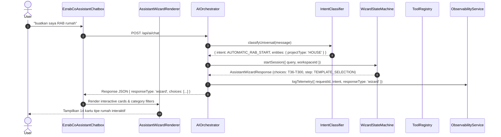

# EZRAB CoAssistant Priority 1 — Implementation Report
**Core Reliability, Universal Intent, Interactive Wizard, Tools, Validation, dan Security**

## 1. Ringkasan Eksekutif
Implementasi Priority 1 difokuskan pada penguatan fundamental AI CoAssistant agar tidak hanya membalas pesan teks umum, melainkan memiliki pemahaman intensi universal (22 intensi operasional & chat), kemampuan menjalankan alur wizard interaktif yang responsif dengan pilihan dinamis dari backend/shared schema, sistem eksekusi alat (tool registry) yang aman dan berjenjang (READ, ANALYZE, MUTATE) dengan dukungan dry-run/preview dan role authorization, serta audit observabilitas dengan penyamaran data sensitif.

---

## 2. Masalah Awal & Akar Masalah

| Masalah Awal | Gejala | Akar Masalah | Solusi Terpasang |
|---|---|---|---|
| **Pilihan Wizard Kosong** | Wizard tidak menampilkan kartu pilihan tipe rumah saat user meminta RAB | Filter query mengembalikan array kosong karena query tidak ter-parse dengan normalisasi; property mismatch antara template resolver dan client renderer | Canonical catalog `HouseTypeCatalog` dibuat lengkap T36–T300, normalisasi query regex multi-format, renderer mendukung parsing aman |
| **Response AI Tertimpa / Mismatch** | Intent `AUTOMATIC_RAB_START` tertimpa oleh jawaban dataset 9,999 pertanyaan umum | Intent priority ranking menempatkan pencarian generic dataset sebelum evaluasi aksi operasional | Prioritasi tingkat pertama diberikan kepada intent operasional eksplisit sebelum auto-answer dataset |
| **Penyusunan RAB Palsu / Unvalidated** | Template yang belum siap langsung mengeluarkan angka sembarangan | Tidak ada mekanisme gating kesiapan template (`readinessStatus`) | Template T54–T300 diatur dengan status `COMING_SOON` / `PARAMETRIC_TEMPLATE_REQUIRED` dan disabled dengan penjelasan engineering |
| **Mutasi Tanpa Preview / Re-auth** | Aksi create/update dapat dieksekusi langsung tanpa izin peran bertingkat | Tidak ada pemisahan kategori tool READ/ANALYZE/MUTATE dan siklus proposal konfirmasi | Tool registry terstruktur dengan `category`, `allowedRoles`, `riskLevel`, `dryRunSupported`, dan two-step confirmation flow |
| **Kebocoran Identitas & Token** | Log raw payload berpotensi mencatat token API atau user ID mentah | Logging console tidak memiliki sanitasi regex | `ObservabilityService` dengan masking otomatis (`usr_***_1234`) dan redaction secret (`[REDACTED_SECRET]`) |

---

## 3. Komponen Arsitektur yang Dibangun & Diubah

### A. Universal Intent Engine (`server/orchestrator/intentClassifier.ts`)
- **22 Universal Intents**: `GENERAL_CHAT`, `EZRAB_FAQ`, `AUTOMATIC_RAB_START`, `RAB_ANALYSIS`, `QTO_REQUEST`, `VOLUME_CALCULATION`, `AHSP_LOOKUP`, `MATERIAL_PRICE_LOOKUP`, `WAGE_PRICE_LOOKUP`, `DED_ANALYSIS`, `PROJECT_LOOKUP`, `SCHEDULE_GENERATION`, `CURVE_S_GENERATION`, `WBS_GENERATION`, `REPORT_GENERATION`, `EXCEL_EXPORT`, `PDF_EXPORT`, `NAVIGATION_COMMAND`, `TOOL_ACTION_REQUEST`, `FILE_ANALYSIS`, `CLARIFICATION_REQUIRED`, `UNKNOWN`.
- **Entity Extraction**: Jenis proyek (House, Building, Road, Water, Civil), Tipe rumah (T36 s/d T300), Luas bangunan, Jumlah lantai, Panjang, Lebar, Tebal, Material, Satuan, Lokasi.
- **Standar Output**:
```json
{
  "intent": "AUTOMATIC_RAB_START",
  "confidence": 0.99,
  "entities": { "projectType": "HOUSE", "houseType": "T36", "buildingArea": 36 },
  "missingParameters": [],
  "activeWorkflow": null,
  "requiresClarification": false
}
```

### B. Interactive RAB Wizard & House Catalog (`src/data/houseTypeCatalog.ts` & `server/services/wizardStateMachine.ts`)
- Katalog lengkap 14 tipe rumah (Type 36 1FL, Type 36 2FL, Type 45, Type 54, Type 60, Type 70, Type 90, Type 100, Type 120, Type 150, Type 180, Type 200, Type 250, Type 300, Custom).
- Direct routing untuk jalan aspal (`ASPHALT-ROAD-LIGHT`), paving (`PAVING-BLOCK-STANDARD`), jalan beton (`RIGID-CONCRETE-ROAD`), saluran drainase (`DRAIN-OPEN-UDITCH`).
- Pertanyaan adaptif bertahap berasal dari schema backend, bukan hardcoded JSX.

### C. UI Renderer Wizard (`src/components/copilot/AssistantWizardRenderer.tsx`)
- Pencarian kartu real-time (`search`).
- Filter kategori pills (`Semua`, `Kecil`, `Menengah`, `Besar`, `Custom`).
- Filter jumlah lantai (1 Lantai, 2 Lantai, 3+ Lantai).
- Gating kartu disabled dengan tooltip dan status badge (`Coming Soon`, `Template Tersedia`).
- Diagnostic error reporting yang jelas saat state tidak valid.

### D. Structured Tool Registry & Security Engine (`server/tools/toolRegistry.ts`)
- Pemisahan 3 kategori utama:
  - **READ**: `getProject`, `getRab`, `getRabItems`, `getAhsp`, `getMaterialPrices`, `getWagePrices`, `getSchedule`, `getCurveS`, `getProjectReports`
  - **ANALYZE**: `calculateVolume`, `analyzeRab`, `compareRab`, `validateRab`, `detectAnomalies`, `calculateMaterialNeeds`
  - **MUTATE**: `createProject`, `createRab`, `addRabItem`, `updateRabItem`, `createSchedule`, `createWbs`, `generateReport`, `exportExcel`, `exportPdf`
- Dukungan pemanggilan camelCase dan snake_case.
- Verifikasi otorisasi berbasis peran (Role Authorization) dan pembatasan isolasi multi-tenant (Tenant Isolation).
- Eksekusi aman `executeSafe` dengan mode `isDryRun: true` untuk simulasi dampak tanpa menyentuh database.

### E. Observability & Telemetry Service (`server/services/observabilityService.ts`)
- Logging terstruktur: `requestId`, `conversationId`, `userId` (masked), `workspaceId`, `projectId`, `intent`, `confidence`, `workflow`, `selectedTool`, `latencyMs`, `finalResponseType`.
- Zero-leak sanitization untuk passwords, API keys, session tokens, OTP, dan connection strings.

---

## 4. Alur Request-Response Lengkap

