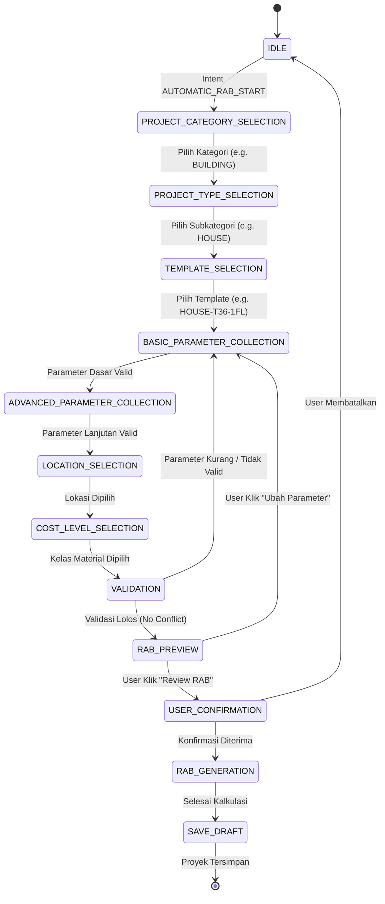

# EZRAB — STATE MACHINE PERCAKAPAN WIZARD (CONVERSATION STATE MACHINE)
**Dokumen:** `docs/interactive-rab-wizard/01-conversation-state-machine.md`  
**Modul:** Interactive Automatic RAB Wizard  
**Tanggal:** 2026-09-15  

---

## 1. DIAGRAM STATUS (STATE TRANSITION DIAGRAM)



---

## 2. DEFINISI STATUS & PAYLOAD BACKEND

Setiap state disimpan di backend dengan struktur:

```typescript
export type WizardStep =
  | 'IDLE'
  | 'PROJECT_CATEGORY_SELECTION'
  | 'PROJECT_TYPE_SELECTION'
  | 'TEMPLATE_SELECTION'
  | 'BASIC_PARAMETER_COLLECTION'
  | 'ADVANCED_PARAMETER_COLLECTION'
  | 'CALCULATION_METHOD_SELECTION'
  | 'LOCATION_SELECTION'
  | 'COST_LEVEL_SELECTION'
  | 'VALIDATION'
  | 'RAB_PREVIEW'
  | 'USER_CONFIRMATION'
  | 'RAB_GENERATION'
  | 'ENGINEERING_REVIEW_REQUIRED'
  | 'SAVE_DRAFT'
  | 'CANCELLED';

export interface WizardSessionState {
  sessionId: string;
  workspaceId: string;
  userId: string;
  conversationId: string;
  currentStep: WizardStep;
  category?: string;
  projectType?: string;
  templateId?: string;
  collectedParameters: Record<string, any>;
  previewRabData?: any;
  status: 'ACTIVE' | 'COMPLETED' | 'CANCELLED' | 'ENGINEERING_REVIEW';
  createdAt: string;
  updatedAt: string;
}
```

---

## 3. ATURAN TRANSISI
1. **No Leap-Frogging:** User tidak dapat langsung melompat ke `RAB_GENERATION` tanpa melewati `VALIDATION` dan `USER_CONFIRMATION`.
2. **Deterministic Re-calculation:** Perubahan parameter pada tahap preview otomatis membatalkan preview lama dan mengembalikan status ke `VALIDATION`.
3. **Engineering Guard:** Proyek dengan kompleksitas tinggi (seperti *Bendungan / DAM*) otomatis masuk ke `ENGINEERING_REVIEW_REQUIRED`.
