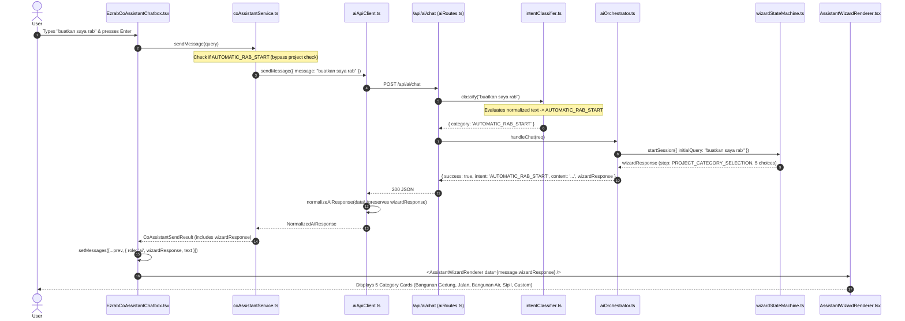

# EZRAB — Interactive Automatic RAB Entry Point Runtime Audit
**Document ID:** `11-entry-point-runtime-audit.md`  
**Date:** 2026-09-15  
**Component:** CoAssistant Chatbox, Intent Classifier, AI Orchestrator, Wizard State Machine, AI Client & Wizard Renderer

---

## 1. Executive Summary & Root Cause Analysis

When a user in CoAssistant inputs phrases such as:
- *"buatkan saya rab"*
- *"buatkan RAB"*
- *"saya mau membuat RAB"*
- *"buatkan RAB rumah"*
- *"buatkan RAB bangunan"*
- *"buatkan estimasi biaya"*

The system was returning a generic static text response:
> *"Saya siap membantu kebutuhan estimasi dan manajemen proyek konstruksi Anda di EZRAB..."*

instead of opening the interactive project category selection wizard with the prompt:
> *"Siap, saya bantu membuat RAB. Pilih jenis proyek yang ingin Anda hitung."*

### Root Causes Identified in Source Code Trace:

1. **Strict and Incomplete Pattern Matching in Intent Classifier (`server/orchestrator/intentClassifier.ts`)**:
   - The regex / substring check `isTemplateRab` checked `q.includes('buatkan rab') || q.includes('buat rab')`. When a user typed *"buatkan saya rab"*, the word *"saya"* separated *"buatkan"* and *"rab"*, causing the check to evaluate to `false`.
   - Variations like *"saya mau membuat rab"*, *"buatkan estimasi biaya"*, *"mulai membuat rab"*, *"r.a.b"*, *"buatkan saya raaab"* failed to match `isTemplateRab`.
   - Consequently, the classifier fell through to Knowledge Base auto-answers, `BASIC_HELP` (`q.includes('bagaimana membuat')`), `GENERAL_QUESTION`, or `GENERAL_CHAT`.

2. **Knowledge Base Auto-Answer Engine & Fallback Override (`server/orchestrator/aiOrchestrator.ts`)**:
   - Because the query was classified as `GENERAL_CHAT` or unhandled, `aiOrchestrator` checked `autoAnswerEngine` and when confidence was low or no match occurred, it fell back to line 182 / 211:
     `responseText = 'Saya siap membantu kebutuhan estimasi dan manajemen proyek konstruksi Anda di EZRAB.';`
   - This exact string matches the bug description provided by the user.

3. **Inadequate Default Routing in State Machine (`server/services/wizardStateMachine.ts`)**:
   - `WizardStateMachine.startSession()` checked `isCategoryQuery = q === 'buatkan rab' || q === 'buat rab' ...`. Queries like *"buatkan saya rab"* failed this equality check and defaulted to `TEMPLATE_SELECTION` (House Type 36) instead of `PROJECT_CATEGORY_SELECTION`.
   - `TemplateResolver.getCategoryChoices()` only contained 2 categories (`cat_house`, `cat_road`), omitting `WATER_RESOURCES`, `CIVIL_STRUCTURE`, and `CUSTOM_PROJECT`.

4. **Project Context Gate Blocking in Frontend (`src/services/coAssistantService.ts`)**:
   - `coAssistantService.ts` line 106 contained:
     `if (!request.currentProject && !isConversational)` -> returned `"Belum ada proyek aktif. Pilih proyek terlebih dahulu..."`.
     Because `"buatkan saya rab"` was not classified under `isConversational`, opening the chatbox on dashboard without a project selected directly blocked the user before reaching the backend.

5. **Chatbox Message State & Wizard Rendering Hookup (`src/components/copilot/EzrabCoAssistantChatbox.tsx`)**:
   - Normalization and response propagation in chatbox needed explicit validation for `response.wizardResponse` and `AUTOMATIC_RAB_START` handling to guarantee that whenever a wizard response is present, `<AssistantWizardRenderer />` is rendered immediately without getting dropped.

---

## 2. End-to-End Runtime Pipeline Trace

---

## 3. Action Plan & Required Fixes

| No | Component | Target Fix |
|---|---|---|
| 1 | `server/orchestrator/intentClassifier.ts` | Add advanced Indonesian regex & token normalization for `AUTOMATIC_RAB_START` with highest priority over generic intents. |
| 2 | `server/services/templateResolver.ts` | Define 5 standard project categories and sub-category choice arrays (Building, Road, Water with `ENGINEERING_REVIEW_REQUIRED`, Civil, Custom). |
| 3 | `server/services/wizardStateMachine.ts` | Update `startSession()` and `answerStep()` to handle general requests vs specific shortcuts properly. |
| 4 | `server/orchestrator/aiOrchestrator.ts` | Ensure `AUTOMATIC_RAB_START` cleanly returns `wizardResponse` and exact prompt message without falling into fallback text. |
| 5 | `server/api/aiRoutes.ts` | Allow `AUTOMATIC_RAB_START` to execute even when no active project ID is supplied. |
| 6 | `src/services/coAssistantService.ts` | Prevent blocking `AUTOMATIC_RAB_START` queries when `currentProject` is null. |
| 7 | `src/services/aiApiClient.ts` | Preserve `wizardResponse`, `intent`, and session ID during normalization. |
| 8 | `src/components/copilot/EzrabCoAssistantChatbox.tsx` | Ensure `wizardResponse` is saved to message state, add development debug logging, and handle missing response fallback gracefully. |
| 9 | `src/components/copilot/AssistantWizardRenderer.tsx` | Ensure category choice cards render cleanly with click handling dispatching `/api/assistant/wizard/:id/answer`. |
| 10 | Tests | Add automated unit tests covering all target query variations and state transitions. |
