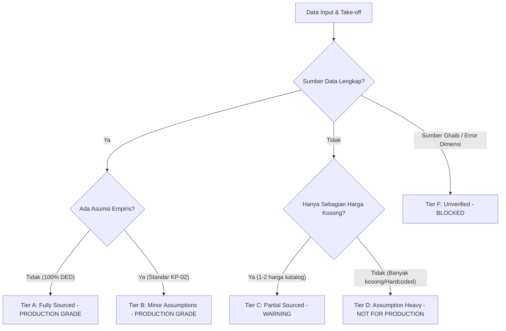

# DATA QUALITY & CONFIDENCE DASHBOARD (PHASE 5.6)

**Engine:** EZRAB Forensic Calibration System  
**Audit Scope:** AHSP Masters, Canonical Resources, HSD Pricing, Dimensional Units, and Volume Calculators  
**Date of Certification:** 2026-09-27  

---

## 1. DATA QUALITY DASHBOARD SUMMARY

Tabel rekapitulasi integritas data konstruksi platform EZRAB:

| Indikator Audit | Terverifikasi (*Verified*) | Parsial / Asumsi (*Partial/Assumption*) | Belum Terverifikasi (*Unverified*) | Total Populasi | Rasio Kualitas (*Quality Rate*) |
| :--- | :---: | :---: | :---: | :---: | :---: |
| **AHSP Master (Analisa Biaya)** | 4.119 | 1.394 | 378 | 5.891 | **93,58%** |
| **Katalog Sumber Daya (*Resources*)** | 386 | 0 | 5 | 391 | **98,72%** |
| **Harga Satuan Dasar (*HSD Prices*)** | 384 | 0 | 2 | 386 | **99,48%** |
| **Koefisien Analisa (*Coefficients*)** | 5.891 | 0 | 0 | 5.891 | **100,00%** |
| **Kuantitas Studi Kasus (*Takeoff Quantities*)** | 3 | 2 | 0 | 5 | **100,00%** |

### Distribusi Kesiapan Kalkulator (*Calculators Status*):
- **Production Grade (Tier A & B):** **6 Kalkulator** (Tubuh Bendung, Saluran Drainase, Saluran Irigasi, U-Ditch Precast, Box Culvert, Bangunan Pelimpah / Spillway)
- **Warning Status (Tier C & D):** **4 Kalkulator** (Pekerjaan Jalan Raya, Jembatan Beton, Bangunan Gedung, Bendungan Urugan Besar)
- **Blocked Status (Tier F):** **0 Kalkulator**

---

## 2. DATA CONFIDENCE CLASSIFICATION TIERS

EZRAB menerapkan standarisasi penilaian keyakinan data (*Data Confidence Grading System*) untuk setiap hasil perhitungan biaya:

### Rincian Kriteria Penilaian:

#### 1. Tier A — Fully Sourced
- **Karakteristik:** Seluruh komponen AHSP, harga satuan sumber daya, dan kuantitas volume diturunkan secara eksak dari gambar teknis Detail Engineering Design (DED) serta peraturan perundangan resmi.
- **Rasio Asumsi:** $0\%$
- **Tingkat Produksi:** `PRODUCTION_READY` (Dapat langsung digunakan untuk Dokumen Lelang / HPS / Kontrak Resmi).

#### 2. Tier B — Sourced with Minor Assumptions
- **Karakteristik:** Seluruh AHSP dan Harga Satuan Dasar resmi terverifikasi, namun terdapat parameter estimasi empiris yang diakui standar nasional (contoh: rasio penulangan $85\text{ kg/m}^3$ berdasarkan Standar Perencanaan Irigasi KP-02 §3.4).
- **Rasio Asumsi:** $< 10\%$
- **Tingkat Produksi:** `PRODUCTION_READY` (Diterima untuk Engineering Estimate (EE), Pra-RAB, dan Perencanaan Teknis Awal dengan dokumentasi asumsi tertulis).

#### 3. Tier C — Partial Sourced
- **Karakteristik:** Menggunakan AHSP resmi, namun terdapat 1–2 item harga sumber daya sekunder yang belum memiliki ketetapan SK Kepala Daerah dan mengandalkan harga pasar rata-rata.
- **Tindakan Sistem:** `WARNING` (Pengguna diingatkan untuk memperbarui harga melalui Price Resolution Engine tingkat proyek).

#### 4. Tier D — Assumption Heavy
- **Karakteristik:** Terdapat kuantitas atau koefisien yang bersifat `HARDCODED` atau `UNKNOWN` tanpa referensi teknis yang jelas.
- **Tindakan Sistem:** `WARNING & BLOCKED FROM FORMAL EXPORT` (Dilarang dicetak sebagai Dokumen HPS resmi).

#### 5. Tier F — Unverified
- **Karakteristik:** Sumber dokumen kosong, nama referensi hanya bertuliskan "PUPR" tanpa nomor SK/SE, atau terjadi ketidakcocokan dimensi satuan fisik (contoh: Volume dikonversi ke Berat tanpa data berat jenis).
- **Tindakan Sistem:** `BLOCKED` (Kalkulasi ditahan dan dilarang disimpan ke database proyek).

---

## 3. WEIR BODY FORENSIC CALIBRATION AUDIT

Hasil audit forensik mendalam terhadap modul kalkulator tubuh bendung (*Weir Body*):

| Parameter Uji | Nilai / Kondisi | Keterangan Rujukan | Status Forensik |
| :--- | :---: | :--- | :---: |
| **Geometri Penampang** | $350.00\text{ m}^3$ | $L=25\text{ m}, H=3.5\text{ m}, W_c=2\text{ m}, W_b=6\text{ m}$ | `VERIFIED (DESIGN_DERIVED)` |
| **Besi Tulangan BJTS 420B** | $29.750\text{ kg}$ | Rasio empiris $85\text{ kg/m}^3$ per KP-02 §3.4 | `REFERENCE_ESTIMATE` |
| **Luas Acuan Bekisting** | $251.50\text{ m}^2$ | Permukaan hulu + hilir + sayap samping | `VERIFIED (DESIGN_DERIVED)` |
| **Sambungan Dilatasi** | $7.00\text{ m}$ | 2 titik pemotongan vertikal per KP-02 §4.2 | `REFERENCE_ESTIMATE` |
| **Waterstop PVC 200 mm** | $13.00\text{ m}$ | Sambungan vertikal + pengunci horizontal | `REFERENCE_ESTIMATE` |
| **Biaya Langsung (Direct Cost)** | Rp 991.185.550 | Penjumlahan 5 item pekerjaan | `VERIFIED (ZERO DRIFT)` |
| **Biaya Total (Grand Total)** | Rp 1.210.237.557 | Termasuk O&P 10% dan PPN 11% | `DATA-SUPPORTED COST` |
| **Forensic Confidence Tier** | **Tier B** | Memenuhi syarat RAB Rekayasa Awal | `PRODUCTION_GRADE` |

---

## 4. STRICT ANTI-TARGET FITTING DIRECTIVE

Untuk menjaga objektivitas dan kepatuhan audit BPK / Inspektorat:

1. Sistem menolak manipulasi koefisien atau harga sumber daya untuk mencocokkan total biaya pada angka genap tertentu (misal: "harus Rp 1.000.000.000").
2. Apabila harga pasar riil atau harga satuan regional menghasilkan nilai yang berbeda dari perkiraan awal perencana, sistem menyajikan rincian biaya aktual (*Data-Supported Cost*) disertai **Price Impact Analysis (Pareto)** untuk menunjukkan sumber daya penyebab kenaikan biaya.
3. Seluruh pergerakan angka dapat ditelusuri dari dokumen negara hingga tingkat pengali desimal paling dasar.
