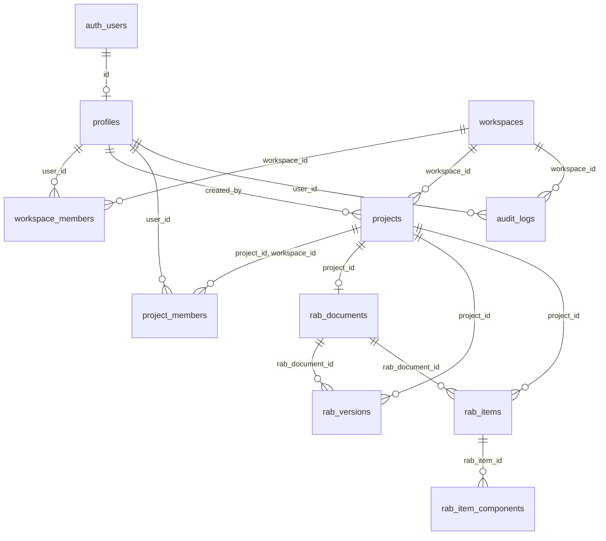

# EZRAB — PRICING ENGINE FORENSIC AUDIT (PHASE 0)

**Status:** AUDIT SELESAI — TIDAK ADA KODE PRODUKSI YANG DIUBAH
**Tanggal:** 2026-09-27
**Ruang lingkup:** seluruh rantai `Geometry → QTO → Work Item → AHSP → Price → Cost → UI`
**Baseline teknis:** `npx tsc --noEmit` → exit code **0** (kompilasi bersih, sebelum dan sesudah audit)

**Script bukti (read-only, baru dibuat untuk audit ini):**

| Script | Fungsi |
|---|---|
| `scripts/forensicPricingTrace.ts` | Membuktikan asal angka Rp 17.500.000 pada Weir Body |
| `scripts/forensicPricingSweep.ts` | Menjalankan seluruh 194 calculator → `docs/_audit/pricing-sweep.json` |
| `scripts/forensicDataCensus.ts` | Sensus populasi AHSP & harga |
| `scripts/forensicAhspPriceConsistency.ts` | Menguji konsistensi `unitPrice` vs jumlah komponen AHSP |
| `scripts/genCalculatorInventory.ts` | Menghasilkan `docs/_audit/calculator-inventory.md` |

Tidak ada satu pun file produksi yang diubah. Phase 1 **tidak** diimplementasikan.

---

## 1. Executive Summary

Masalah EZRAB bukan "harga terlalu murah". Masalahnya adalah **lima sistem harga paralel yang saling bertentangan**, dan **sistem yang paling benar justru hanya dipakai oleh unit test**.

### 1.1 Angka kunci hasil audit

| Temuan | Angka | Bukti |
|---|---|---|
| Calculator terdaftar di `CoreCalculatorRegistry` | **194** | sweep |
| Calculator yang punya `defaultAhspCode` | **0 / 194** | sweep |
| Calculator yang punya `defaultUnitPrice` | **0 / 194** | sweep |
| Calculator yang harganya diputuskan konstanta hardcoded di UI | **106 / 194 (54,6%)** | sweep |
| Calculator yang harganya diputuskan dari kata kunci judul ("borongan") | **88 / 194 (45,4%)** | sweep |
| Calculator yang menampilkan Rp 0 lewat jalur QTO | **0 / 194** | sweep |
| Pemakaian konstanta `50000` (Rp 50.000) sebagai harga | **94 calculator** | sweep |
| Record harga di seluruh aplikasi | **155** (82 material / 36 labor / 37 alat) | census |
| Record harga yang punya `effectiveDate` | **0 / 155** | census |
| Record harga yang punya `province` atau `city` | **0 / 155** | census |
| Nilai `location` yang berbeda di database harga | **1** — semuanya `"Jabodetabek"` | census |
| Item AHSP resmi | **5.891** (SDA 1.554, Cipta Karya 3.131, Bina Marga 1.144, SMKK 62) | census |
| Item AHSP yang `unitPrice`-nya ≠ jumlah komponennya | **1.943 / 5.891 (33,0%)** | consistency probe |
| Rasio median `unitPrice ÷ jumlah komponen` pada item yang tidak konsisten | **7,54×** | consistency probe |
| Rasio maksimum (paling ekstrem) | **1.569,83×** | consistency probe |
| Item AHSP yang ditandai `VERIFIED` oleh repository | **5.930 / 5.930 (100%)** | census |
| Tabel database terkait harga/AHSP | **0** | migration audit |

### 1.2 Lima sistem harga paralel

| # | Sistem | File inti | Status | Perilaku saat data hilang |
|---|---|---|---|---|
| A | **UI QTO pricing** | `src/components/qto/QtoCalculatorView.tsx` | **AKTIF — dipakai** | Mengarang harga (Rp 50.000 / Rp 45.000 / 15 konstanta borongan) |
| B | **Authoritative AHSP Bridge + Deterministic RAB Draft** | `server/services/authoritativeAhspPriceBridge.ts`, `deterministicRabDraftEngine.ts` | **AKTIF — dipakai** | Mengarang Rp 1.150.000, lalu melabelinya `PRICE_VERIFIED` / `OFFICIAL_REGIONAL_DB` / confidence 0,95 |
| C | **Project Price Engine** | `src/engine/pricing/projectPriceEngine.ts` | **AKTIF — dipakai** | Mengarang Rp 74.000/sak, melabelinya `EZRAB Material Master Database 2026` |
| D | **AHSP Calculation Engine** | `src/engine/ahspCalculationEngine.ts` | **AKTIF — dipakai** | `unitPrice = 0` dengan label sumber `"Estimasi Standar"` |
| E | **Parametric Volume Engine** | `src/engine/parametricVolumeEngine/parametricVolumeEngine.ts` | **AKTIF — dipakai** | Mengarang Rp 150.000 × `multiplier`, default region `'DKI Jakarta'` |
| — | **Calculator Core Pricing (BENAR)** | `src/engine/calculatorCore/adapters/rabAdapter.ts` → `costCompositionEngine.ts` → `priceResolver.ts` → `ahspRepository.ts` | **HANYA DIPAKAI TEST** | Fail-closed: `AHSP_NOT_FOUND` / `PRICE_NOT_FOUND`, tidak pernah mengarang |

Sistem harga A–E tidak berbagi kode, tidak berbagi konfigurasi, dan tidak berbagi definisi "harga hilang". Sistem yang benar (baris terakhir) tidak pernah dipanggil dari produksi — hanya dari `src/test/ahspPricingCost.test.ts` dan `src/test/coreCalculatorEngine.test.ts`.

### 1.3 Kesimpulan

> Rantai `Quantity → Work Item → AHSP → Price → Region → Cost Breakdown` **belum terpusat**. Setiap permukaan UI memiliki mesin harganya sendiri, dan setiap mesin memiliki nilai fallback hardcoded yang berbeda. Akibatnya sistem tidak pernah menampilkan "harga tidak tersedia" — ia selalu menampilkan angka, dan angka itu karangan.

Perbaikan tidak boleh dimulai dari UI atau dari menambal Rp 50.000/74.000/150.000/1.150.000. Perbaikan harus dimulai dari **menghapus sumber harga karangan**, lalu **mengalihkan seluruh permukaan UI ke satu resolver fail-closed** yang sudah ada tetapi belum tersambung.

---

## 2. Existing Architecture

### 2.1 Lapisan yang ada saat ini

```
INPUT
  ├─ Calculator params (194 calculator, deterministik)
  ├─ Template params (templateEngine)
  └─ Dokumen DED (ded-rab-v2, AI-assisted)

GEOMETRY / QUANTITY
  ├─ src/engine/calculatorCore/**            (194 calculator, 12 pack)
  │    ├─ residential/ (30)  road/ (39)  civil/ (97)
  │    │    civil = drainage, bridge, irrigation, river, weir, embung, dam,
  │    │            waterStructure  → total 97
  │    └─ adapters/legacyCalculatorAdapter.ts  (19 legacy calculator)
  ├─ src/engine/constructionCalculators/registry.ts  (19 legacy spec)
  ├─ src/engine/parametricVolumeEngine/
  └─ src/engine/templateEngine/QuantityEngine.ts

WORK ITEM
  └─ ✗ TIDAK ADA registry work-item terpusat.
       Mapping ke AHSP dilakukan ad-hoc di setiap permukaan UI.

AHSP
  ├─ src/data/nationalCostDatabase/masterRegistry.ts → ALL_OFFICIAL_AHSP_ITEMS (5.891)
  ├─ src/data/indonesianAHSP.ts → MASTER_AHSP_DATABASE (39, versi 2022)
  ├─ src/engine/ahsp/repository/ahspRepository.ts    (in-memory, 5.930 definisi)
  └─ src/engine/ahsp/resolver/ahspResolver.ts

PRICE
  ├─ src/data/indonesianPrices.ts → MASTER_PRICE_ITEMS (155) + getPriceDatabase() (155)
  ├─ src/data/regionalCostFactors.ts
  ├─ src/engine/pricing/repository/priceRepository.ts
  ├─ src/engine/pricing/resolver/priceResolver.ts
  └─ src/engine/pricing/projectPriceEngine.ts

COST
  ├─ src/engine/cost/composition/costCompositionEngine.ts   (BENAR, tidak tersambung)
  ├─ src/engine/unifiedProjectEngine.ts                     (2 fungsi summary berbeda)
  ├─ src/engine/rabCostAuditEngine.ts
  ├─ src/engine/formulaEngine.ts
  └─ src/engine/versionAndScenarioEngine.ts

PERSISTENCE
  ├─ Supabase: profiles, workspaces, workspace_members, projects,
  │            project_members, audit_logs, rab_documents, rab_versions,
  │            rab_items, rab_item_components
  └─ localStorage: 'yfarch_custom_ahsp_v2026' (AHSP custom pengguna)
```

### 2.2 Cacat arsitektur utama

1. **Tidak ada Work Item Registry.** 194 calculator tidak memiliki pemetaan eksplisit ke kode AHSP (`defaultAhspCode = 0/194`). Master prompt §3 mensyaratkan satu calculator bisa memetakan ke banyak work item — struktur itu tidak ada.
2. **Tidak ada Price Database ber-region.** 155 record, semuanya `location = "Jabodetabek"`. Tidak ada provinsi, kabupaten/kota, atau tahun.
3. **Tidak ada tabel `ahsp_master`, `price_master`, `regions`, `work_items`, `cost_breakdowns`.** Harga dan AHSP hidup sebagai array TypeScript statis di bundle frontend.
4. **Sistem yang benar tidak tersambung.** `RabAdapter` + `CostCompositionEngine` + `AHSPResolver` + fail-closed status sudah dibangun sempurna, tetapi hanya dipanggil dari test.
5. **Adapter legacy membuang data harga.** `LegacyCalculatorAdapter.adapt()` membangun `CalculatorDefinition` baru dan **tidak menyalin** `spec.defaultAhspCode`, `spec.defaultAhspName`, `spec.defaultUnitPrice`. 24 harga legacy di `constructionCalculators/registry.ts` menjadi data mati.

### 2.3 Bukti bahwa engine benar hanya dipakai test

```
=== who imports RabAdapter ===
src/engine/calculatorCore/index.ts:26      (barrel export)
src/test/ahspPricingCost.test.ts:17
src/test/coreCalculatorEngine.test.ts:20

=== who imports CostCompositionEngine ===
src/engine/calculatorCore/adapters/rabAdapter.ts:11
src/test/ahspPricingCost.test.ts:16
```

Tidak ada file di `src/components/**` maupun `server/services/**` yang mengimpornya.

---

## 3. Calculator Inventory

Sumber: `docs/_audit/calculator-inventory.md` dan `docs/_audit/pricing-sweep.json`.
Metode: menjalankan setiap calculator dengan nilai `defaultValue` parameternya, lalu mereplikasi logika `QtoCalculatorView.priceBreakdown` baris per baris.

### 3.1 Ringkasan klasifikasi (194 calculator)

| Klasifikasi | Jumlah | % | Arti |
|---|---|---|---|
| `BORONGAN_FALLBACK` | 88 | 45,4% | Harga satuan ditentukan dari **kata kunci pada judul calculator** |
| `HARDCODED_FALLBACK` | 106 | 54,6% | Minimal satu komponen dihargai dari konstanta hardcoded di UI |
| `ZERO_PRICE` | 0 | 0,0% | — |
| `PRICE_DB_MATCH` | 0 | 0,0% | — |

**Interpretasi:** tidak ada satu pun calculator yang harganya berasal murni dari database harga. Seluruh 194 calculator menghasilkan harga dari konstanta yang ditulis di dalam file UI.

### 3.2 Distribusi konstanta "borongan" (88 calculator)

| `fallbackUnitPrice` | Jumlah calculator | Contoh |
|---|---|---|
| Rp 150.000 | 21 | `residential.sanitair`, `road.chainage`, `drainage.ditch` |
| Rp 85.000 | 15 | `drainage.excavation`, `weir.excavation`, `road.cut` |
| Rp 1.200.000 | 13 | `residential.pembesian`, `residential.bekisting`, `residential.beton` |
| Rp 185.000 | 11 | `road.alignment`, `road.embankment`, `road.cross_section` |
| Rp 145.000 | 9 | `residential.dinding`, `building.fence` |
| Rp 250.000 | 9 | `residential.atap_baja_ringan`, `residential.penutup_atap` |
| Rp 120.000 | 3 | `residential.urugan_tanah`, `road.fill` |
| Rp 135.000 | 2 | `residential.plafon`, `residential.pengecatan` |
| Rp 220.000 | 2 | `residential.penutup_lantai`, `residential.penutup_dinding` |
| Rp 3.500.000 | 1 | `residential.pintu_jendela` |
| Rp 350.000 | 1 | `residential.instalasi_listrik_basic` |
| Rp 65.000 | 1 | `residential.plester_acian` |

Harga ditentukan oleh urutan `if/else` yang mencocokkan kata pada judul calculator. Konsekuensinya dapat diprediksi dan salah:

| Calculator | Kuantitas | Unit | Harga terpilih | Alasan pemilihan | Total | Masalah |
|---|---|---|---|---|---|---|
| `residential.pembesian` | 74,58 | **kg** | Rp 1.200.000 | kata `"beton"` menang lebih dulu | **Rp 89.496.000** | harga beton per m³ dipakai untuk berat besi per kg |
| `residential.penutup_dinding` | 18,27 | m² | Rp 220.000 | kata `"lantai"` tertangkap | Rp 4.019.400 | pekerjaan dinding dihargai harga lantai |
| `residential.pengecatan` | 290 | m² | Rp 135.000 | kata `"plafon"` menang atas `"pengecatan"` | Rp 39.150.000 | urutan cabang mengalahkan makna |
| `road.stationing` | 41 | titik | Rp 185.000 | kata `"jalan"` | Rp 7.585.000 | pekerjaan survey dihargai perkerasan |
| `bridge.geometry` | — | m² | Rp 145.000 | kata `"pondasi"`/`"pasangan"` | — | **calculator geometri murni ikut dihargai** |

### 3.3 Inventaris domain Weir / Dam / Embung / Water Structure (32 calculator)

**Seluruh 32 calculator di domain ini memiliki `AHSP code = none`.**

| Calculator | Unit | Qty (default) | Harga per unit (karangan) | Total | Sumber harga |
|---|---|---|---|---|---|
| `weir.body` | m³ | 350 | Rp 50.000 | Rp 17.500.000 | `FALLBACK_50000` |
| `weir.spillway` | m² | 112,5 | Rp 12.500 | Rp 1.406.250 | `FALLBACK_50000` |
| `weir.apron` | m³ | 200 | Rp 50.000 | Rp 10.000.000 | `FALLBACK_50000` |
| `weir.stilling_basin` | m³ | 316 | Rp 50.000 | Rp 15.800.000 | `FALLBACK_50000` |
| `weir.wing_wall` | m³ | 192 | Rp 50.000 | Rp 9.600.000 | `FALLBACK_50000` |
| `weir.gate` | unit | 2 | Rp 50.000 | Rp 100.000 | `FALLBACK_50000` |
| `weir.excavation` | m³ | 2.100 | Rp 85.000 | Rp 178.500.000 | BORONGAN (kata "galian") |
| `weir.backfill` | m³ | 250 | Rp 50.000 | Rp 12.500.000 | `FALLBACK_50000` |
| `weir.concrete` | m³ | 90 | Rp 50.000 | Rp 4.500.000 | `FALLBACK_50000` |
| `weir.formwork` | m² | 105 | Rp 50.000 | Rp 5.250.000 | `FALLBACK_50000` |
| `embung.reservoir` | m³ | 27.098,73 | Rp 150.000 | Rp 4.064.809.500 | BORONGAN default |
| `embung.embankment` | m³ | 18.393,75 | Rp 50.000 | Rp 919.687.500 | `FALLBACK_50000` |
| `embung.excavation` | m³ | 24.819,707 | Rp 85.000 | Rp 2.109.675.095 | BORONGAN (kata "galian") |
| `embung.fill` | m³ | 3.000 | Rp 50.000 | Rp 150.000.000 | `FALLBACK_50000` |
| `embung.core` | m³ | 2.700 | **Rp 120** | **Rp 324.000** | `includes('Air')` |
| `embung.filter` | m³ | 400 | Rp 50.000 | Rp 20.000.000 | `FALLBACK_50000` |
| `embung.drainage` | m³ | 240 | Rp 50.000 | Rp 12.000.000 | `FALLBACK_50000` |
| `embung.spillway` | m³ | 31,5 | Rp 50.000 | Rp 1.575.000 | `FALLBACK_50000` |
| `embung.protection` | m² | 9.350 | Rp 50.000 | Rp 467.500.000 | `FALLBACK_50000` |
| `dam.body` | m³ | 1.314.140,625 | Rp 150.000 | **Rp 197.121.093.750** | BORONGAN default |
| `dam.embankment` | m³ | 780.000 | Rp 50.000 | Rp 39.000.000.000 | `FALLBACK_50000` |
| `dam.excavation` | m³ | 135.000 | Rp 85.000 | Rp 11.475.000.000 | BORONGAN (kata "galian") |
| `dam.fill` | m³ | 85.000 | Rp 50.000 | Rp 4.250.000.000 | `FALLBACK_50000` |
| `dam.core` | m³ | 154.406,25 | **Rp 120** | Rp 18.528.750 | `includes('Air')` |
| `dam.filter` | m³ | 30.375 | Rp 50.000 | Rp 1.518.750.000 | `FALLBACK_50000` |
| `dam.rockfill` | m³ | 650.000 | Rp 50.000 | Rp 32.500.000.000 | `FALLBACK_50000` |
| `dam.spillway` | m³ | 7.000 | Rp 50.000 | Rp 350.000.000 | `FALLBACK_50000` |
| `dam.intake` | m³ | 525 | Rp 50.000 | Rp 26.250.000 | `FALLBACK_50000` |
| `dam.protection` | m³ | 21.000 | Rp 50.000 | Rp 1.050.000.000 | `FALLBACK_50000` |
| `water.tank` | m³ | — | **Rp 2** | — | `includes('Air')` |
| `water.reservoir` | m³ | — | **Rp 120** | — | `includes('Air')` |
| `water.concrete_structure` | m³ | — | **Rp 120** | — | `includes('Air')` |

**Dua mode kegagalan yang berlawanan arah, dari satu penyebab:**
- `embung.core` 2.700 m³ beton inti dihargai **Rp 324.000** (seharusnya ratusan juta) karena kata `"Air"` ada pada nama material, memicu cabang `includes('Air')` → Rp 120.
- `dam.body` 1.314.140 m³ dihargai **Rp 197 miliar** karena tidak ada kata kunci yang cocok, sehingga jatuh ke default Rp 150.000.

### 3.4 Inventaris Drainage / Bridge / Irrigation / River / Water (ringkas)

| Domain | Contoh | Harga per unit | Sumber |
|---|---|---|---|
| Drainage | `drainage.u_ditch` (m) | Rp 45.800 | `FALLBACK_50000` |
| Drainage | `drainage.box_culvert` (m³) | Rp 50.000 | `FALLBACK_50000` |
| Drainage | `drainage.excavation` (m³) | Rp 85.000 | BORONGAN (kata "galian") |
| Drainage | `drainage.lining` (m²) | Rp 7.500 | `FALLBACK_50000` |
| Bridge | `bridge.deck` (m³) | Rp 2.080.000 | campuran `FALLBACK_50000` + `includes('Besi')` |
| Bridge | `bridge.reinforcement` (**kg**) | Rp 50.000 | `FALLBACK_50000` |
| Bridge | `bridge.bearing` (buah) | Rp 50.000 | `FALLBACK_50000` |
| Irrigation | `irrigation.gate` (unit) | **Rp 120** | `includes('Air')` |
| Irrigation | `irrigation.concrete` (m³) | **Rp 120** | `includes('Air')` |
| River | `river.riprap` (m³) | Rp 295.000 | `includes('Batu Belah')` |
| River | `river.sheet_pile` (m) | Rp 4.167 | `FALLBACK_50000` |

---

## 4. Pricing Flow

### 4.1 Jalur A — QTO → RAB (aktif, dipakai)

```
QtoCalculatorView.tsx
  └─ priceBreakdown (useMemo, baris 857-989)
       ├─ LABOR   : priceOverrides > MASTER_PRICE_ITEMS > l.rateEstimate
       │            > [Pekerja 100000 | Tukang 145000 | Kepala 175000 | 200000]   ← baris 865
       ├─ MATERIAL: priceOverrides > MASTER_PRICE_ITEMS (fuzzy substring)
       │            > 15 cabang hardcoded (baris 888-898)
       │            > m.unitPriceEstimate || 50000                                 ← baris 899
       ├─ EQUIPMENT: priceOverrides > MASTER_PRICE_ITEMS > eq.unitPriceEstimate || 45000 ← baris 925
       └─ jika grandTotal === 0 dan quantity > 0 (baris 945-978):
            unit price dipilih dari 15 konstanta berdasarkan kata pada judul calculator
            → baris ini menghasilkan "Borongan <judul> (Estimasi AHSP)"

  └─ handleSyncToRAB (baris 687-708)
       unitPrice = priceBreakdown.grandTotal / primaryQuantity     ← baris 694-696
       └─ executeCalculationAndSave({ autoSyncRab: true, unitPrice })
            └─ ProjectContext.tsx:1044-1086
                 RabItem.unitPrice = options.unitPrice              ← baris 1060
                 RabItem.amount    = quantity × unitPrice
                 RabItem.ahspCode  = options.ahspCode || ''         ← SELALU KOSONG
```

**Validasi yang ada** (`ProjectContext.tsx:1045`): hanya memeriksa `unitPrice` finite dan `>= 0`. Harga karangan Rp 50.000 lolos seluruh validasi.

### 4.2 Jalur B — DED → RAB (aktif, dipakai)

```
dedRabPipeline → DeterministicRabDraftEngine.generateRabDraft()
  ├─ searchAhsp(qto.name, entity.elementType, qto.wbsTitle)          ← baris 87
  │    * entity.elementType dikirim sebagai `suggestedCode` (AHSP code)
  │      — ini bug semantik: elementType bukan kode AHSP
  │    * lalu jatuh ke heuristik kata kunci (authoritativeAhspPriceBridge.ts:54-72)
  │      'kolom' | 'beton bertulang' → item pertama bernama 'kolom' ATAU beton CIPTA_KARYA ATAU code '1.1.1'
  │      'saluran' | 'irigasi'       → item PERTAMA ber-domain SUMBER_DAYA_AIR
  │      'aspal' | 'laston'          → item PERTAMA ber-domain BINA_MARGA
  ├─ lookupPrice(ahspResult, allowAiEstimatedPrice)                  ← baris 90
  │    * baseUnitPrice = item.unitPrice || (totalLabor+totalMaterial+totalEquipment) || 1150000
  │    * jika > 0 → status PRICE_VERIFIED, source OFFICIAL_REGIONAL_DB, confidence 0.95
  ├─ unitPrice = priceResult.unitPrice || 0                          ← baris 93
  └─ totalPrice = volume × unitPrice
```

### 4.3 Jalur C — Material Inspector (aktif, dipakai)

```
MaterialInspectorPanel.tsx:804
  └─ projectPriceEngine.resolveFinalPrice({ materialIdOrCode, projectId })
       TIER 1 Project Override (aktif)
       TIER 2 Project Price   (aktif / EXPIRED)
       TIER 3 nationalRefPrice = options.fallbackReferencePrice ?? 74000     ← baris 851
              status 'REFERENCE', confidence 0.95, isFinal true,
              sourceName 'EZRAB Material Master Database 2026',
              region 'Nasional / Jawa Timur'                                 ← baris 947-949
```

`resolveFinalPrice` **tidak memiliki jalur PRICE_NOT_FOUND**. Tier 3 selalu mengembalikan angka.

### 4.4 Jalur D — AHSP Explorer / snapshot proyek

```
AhspExplorerView → AHSPCalculationEngine.createProjectSnapshot(masterItem, region)
  resolvePrice(compCode, compName, comp.unitPrice, category)
    ├─ jika comp.unitPrice > 0  → pakai harga AHSP, source 'PUPR AHSP 2026'   ← baris 27-29
    └─ else priceDb.find(exact code | exact name | name substring)
         └─ jika tidak ketemu → { price: fallbackPrice || 0, source: 'Estimasi Standar' }  ← baris 45
  region default: 'Jabodetabek'                                               ← baris 73
  version default: masterItem.version || '2026'                               ← baris 95
```

### 4.5 Jalur E — Parametric Volume Engine

```
parametricVolumeEngine.resolveUnitPrice(ahspCode, region = 'DKI Jakarta')     ← baris 175
  ├─ officialItem.unitPrice > 0 → unitPrice × multiplier                      ← baris 182
  ├─ benchmark.price × multiplier                                            ← baris 234
  └─ 150000 × multiplier                                                     ← baris 242
```

`multiplier` adalah pengali tersembunyi (dari `regionalCostFactors.ts`) yang diterapkan pada harga yang sudah tidak terverifikasi.

### 4.6 Jalur fail-closed yang benar (tidak tersambung)

```
RabAdapter.composeRabItemWithBreakdown()
  ├─ projectId kosong → PROJECT_INVALID
  ├─ ahspCode kosong  → AHSP_NOT_FOUND
  ├─ AHSPResolver.resolve() bukan EXACT/NORMALIZED/ALIAS → AHSP_NOT_FOUND
  └─ CostCompositionEngine.compose()
       ├─ PriceResolver.resolve() → PRICE_NOT_FOUND bila tidak ada
       └─ warning bila satuan tidak kompatibel (UnitEngine.areCompatible)
```

Ini adalah target arsitektur yang sudah ada. Yang dibutuhkan bukan membangun ulang, melainkan **menyambungkannya**.

---

## 5. AHSP Flow

### 5.1 Sumber data

| Sumber | Jumlah | Versi | `sourcePage` | `sourceDocument` | `unitPrice` |
|---|---|---|---|---|---|
| `sdaAHSPDataset.ts` (Lampiran IV) | 1.554 | 2026 | 100% | 100% | 1.554 (100% terisi) |
| `ciptaKaryaAHSPDataset.ts` (Lampiran VI) | 3.131 | 2026 | 100% | 100% | 3.131 (100% terisi) |
| `binaMargaAHSPDataset.ts` (Lampiran II) | 1.144 | 2026 | 100% | 100% | 1.144 (100% terisi) |
| `smkkDataset.ts` (Lampiran III) | 62 | 2026 | 100% | 100% | 62 (100% terisi) |
| **Total 2026** | **5.891** | 2026 | — | — | — |
| `indonesianAHSP.ts` (Permen PUPR 1/2022) | 39 | 2022 | 0% | 100% | 39 |

Provensi data AHSP secara struktural **bagus**: 100% item punya `version`, `year`, `sourceDocument`, `sourcePage`, `status`.

### 5.2 Masalah 1 — Setiap item AHSP sudah membawa harga sendiri

```
unitPrice terisi : 5.891 / 5.891  (100,0%)
```

Karena `AuthoritativeAhspPriceBridge.lookupPrice` memeriksa `baseUnitPrice > 0` lebih dulu, **harga yang tertanam ini selalu menang** dan langsung dilabeli:

```
priceStatus = 'PRICE_VERIFIED'
source      = 'OFFICIAL_REGIONAL_DB'
confidence  = 0.95
status      = 'VERIFIED'
```

Tidak ada pemeriksaan lokasi proyek, tidak ada pemeriksaan tahun anggaran, tidak ada pemeriksaan apakah harga benar-benar berasal dari database harga daerah. Label `OFFICIAL_REGIONAL_DB` **tidak benar** — yang dibaca adalah field di dalam item AHSP.

### 5.3 Masalah 2 — Harga tertanam tidak konsisten dengan komponennya sendiri

```
total item AHSP                              : 5.891
unitPrice == jumlah komponen (±0,5)          : 3.948  (67,0%)
unitPrice != jumlah komponen                 : 1.943  (33,0%)

rasio unitPrice ÷ jumlah komponen:
  min    = 0,35
  p25    = 1,83
  median = 7,54
  p75    = 46,89
  max    = 1.569,83

item dengan unitPrice > 200% jumlah komponen : 1.425
item dengan unitPrice < 50% jumlah komponen  : 8
```

**Contoh terburuk — `A.1.06.1b.1` "1 Kali Pelumasan Pintu Sorong Kayu Roda Gigi":**

| Engine | Hasil | Status dilaporkan |
|---|---|---|
| Engine A — `AuthoritativeAhspPriceBridge` | **Rp 38.500.000** | `PRICE_VERIFIED`, `OFFICIAL_REGIONAL_DB`, confidence 0,95 |
| Engine B — jumlah (koefisien × harga komponen) | **Rp 24.525** | — |
| Selisih | **Rp 38.475.475** | tetap dilaporkan `PRICE_VERIFIED` |

Satu kode AHSP menghasilkan dua harga yang berbeda **1.569 kali lipat**, dan engine yang dipakai produksi melaporkan keduanya sebagai terverifikasi.

### 5.4 Masalah 3 — Tidak ada lookup berbasis versi

```ts
AHSPRepository.getByCode(code: string, projectId?: string): AHSPDefinition | undefined
AHSPResolver.resolve(code: string, projectId?: string)
```

Tidak ada parameter `version`. Item 2026 dan 2022 digabung ke dalam satu `Map` dengan kunci kode ternormalisasi; item 2026 menang bila terjadi tabrakan, dan item 2022 yang tidak bertabrakan tetap dapat diakses tanpa penanda. Master prompt §14 mensyaratkan **AHSP 2026 harus independen dari AHSP 2025** — kemampuan itu tidak ada.

### 5.5 Masalah 4 — Klaim verifikasi otomatis

```
by verificationStatus : { VERIFIED: 5930 }
```

Seluruh 5.930 definisi ditandai `VERIFIED` karena default `item.status || 'VERIFIED'` (`ahspRepository.ts:107`). Ini bukan hasil verifikasi, melainkan nilai default yang lolos tanpa pemeriksaan.

### 5.6 Masalah 5 — Perbandingan versi mengarang data

`masterRegistry.ts:158-178`, `compareVersions()`:

```ts
removedCodes: [
  { code: 'A.OLD.01', name: 'Galian Tanah Lama (Digantikan Metode Baru)', reason: '...' }
],
revisedCodes: targetItems.slice(0, 5).map(item => ({
  ...
  oldPrice: Math.round(item.unitPrice * 0.94),   // ← harga 2025 DIKARANG
  newPrice: item.unitPrice,
}))
```

Fungsi yang seharusnya membandingkan AHSP 2025 vs 2026 justru **mengarang** harga 2025 sebagai 94% dari harga 2026, dan menyertakan kode `A.OLD.01` yang tidak ada di dokumen mana pun.

### 5.7 Masalah 6 — AHSP custom tersimpan di localStorage

```
STORAGE_KEY_CUSTOM_AHSP = 'yfarch_custom_ahsp_v2026'
```

AHSP yang ditambahkan pengguna tersimpan di browser, tidak ter-share antar anggota workspace, tidak masuk audit trail, dan hilang bila cache dibersihkan.

### 5.8 SMKK tidak masuk rantai biaya

Kata kunci `SMKK` hanya muncul di:
- `src/components/ahsp/AhspExplorerView.tsx` — filter katalog
- `src/components/materials/MaterialInspectorPanel.tsx` — teks APD
- `src/components/project-source/ProjectJsaView.tsx` — dokumen JSA

62 item SMKK tersedia di dataset, tetapi **tidak pernah** ditambahkan ke `directCost`, `overhead`, atau `grandTotal` di jalur mana pun.

---

## 6. Price Flow

### 6.1 Populasi harga

```
MASTER_PRICE_ITEMS             : 155   (MATERIAL 82, LABOR 36, EQUIPMENT 37)
getPriceDatabase()             : 155
```

### 6.2 Field provenance — hampir seluruhnya kosong

| Field | Terisi | % |
|---|---|---|
| `code` | 155 / 155 | 100,0% |
| `category` | 155 / 155 | 100,0% |
| `priceSource` | 155 / 155 | 100,0% |
| `location` | 155 / 155 | 100,0% |
| `supplier` | 82 / 155 | 52,9% |
| `source` | **0 / 155** | 0,0% |
| `effectiveDate` | **0 / 155** | 0,0% |
| `province` | **0 / 155** | 0,0% |
| `city` | **0 / 155** | 0,0% |
| `confidence` | **0 / 155** | 0,0% |
| `provenance` | **0 / 155** | 0,0% |

```
DISTINCT location values : 1  →  { "Jabodetabek": 155 }
```

**Konsekuensi langsung:** permintaan master prompt §8 — "Price database must respect project location" dengan contoh `2026 / Jawa Timur / Probolinggo` — **secara struktural tidak dapat dipenuhi** oleh data yang ada. Satu-satunya wilayah di database adalah Jabodetabek. Proyek di Probolinggo akan menerima harga Jabodetabek tanpa peringatan apa pun.

### 6.3 Prioritas resolusi yang diklaim vs yang nyata

Dokumentasi `priceResolver.ts:438-452` menyatakan urutan:
```
1. Project Override
2. Project Price (aktif)
3. Project Historical Price
4. EZRAB Material Reference
5. Regional Reference (provincial index)
6. AHSP Component Price (PUER / SE DJBK)
7. External Reference
8. Manual Input
9. PRICE_NOT_FOUND (strict fail-closed)
```

Yang benar-benar terjadi pada jalur produksi:

| Surface | Tier 1-3 | Tier 4-8 | Tier "9" |
|---|---|---|---|
| `QtoCalculatorView` | tidak ada | konstanta hardcoded UI | **tidak ada** — jatuh ke Rp 50.000 |
| `projectPriceEngine` | ada | `?? 74000` | **tidak ada** — Tier 3 selalu mengembalikan angka |
| `AuthoritativeAhspPriceBridge` | tidak ada | `item.unitPrice` tertanam | `PRICE_NOT_FOUND` hanya bila `unitPrice` dihapus manual |
| `AHSPCalculationEngine` | tidak ada | `comp.unitPrice` tertanam | `{ price: 0, source: 'Estimasi Standar' }` |
| `parametricVolumeEngine` | tidak ada | `150000 × multiplier` | **tidak ada** |
| **`RabAdapter` + `CostCompositionEngine`** | ada (projectId diperiksa) | `PriceResolver` penuh | **`PRICE_NOT_FOUND` benar** (hanya test) |

### 6.4 Bug satuan (`zak` vs `kg`) — terkonfirmasi

`priceResolver.ts:240-330` mencocokkan kandidat tanpa penyaring satuan:

```ts
// baris 250 — satuan hanya memengaruhi kemungkinan "exact", bukan filter
if (normPName === normalizedNameQuery) {
  if (!normalizedUnitQuery || normPUnit === normalizedUnitQuery) { ...exact... }
}

// baris 276 — partial match: satuan TIDAK diperiksa sama sekali
if (normPName.includes(normalizedNameQuery) || normalizedNameQuery.includes(normPName)) { ... }

// baris 303-305 — keyword overlap: satu kata cocok sudah cukup
const matchCount = queryTerms.filter((w) => normPName.includes(w)).length;
if (queryTerms.length > 0 && (matchCount >= Math.ceil(queryTerms.length * 0.5) || matchCount >= 1)) { ... }

// baris 280 — satuan yang cocok hanya menambah 5 poin dari 80-100
if (normalizedUnitQuery && normPUnit === normalizedUnitQuery) matchScore += 5;
```

Pada pemilihan akhir (baris 392-425) `resolvedPrice` diambil dari skor tertinggi **tanpa memeriksa satuan**. Query "Semen (zak)" dapat diselesaikan oleh record "Semen 40 kg" karena kata `semen` cocok, dengan penalti hanya 5 poin.

Diperkuat oleh `projectPriceEngine.ts:850`:

```ts
const defaultUnit = options.unit || 'sak';   // satuan default hardcoded
```

dan `resolveFinalPrice` selalu mengembalikan `unit: defaultUnit` (baris 937) ketika jatuh ke Tier 3, sehingga record harga non-sak dapat muncul dengan satuan `sak`.

---

## 7. Database Audit

### 7.1 Teknologi

| Aspek | Kondisi nyata |
|---|---|
| Database | **Supabase / PostgreSQL** |
| ORM | **Tidak ada** — Supabase client + repository manual |
| Schema bermigrasi | **2 file** di `supabase/migrations/`, total 149 baris |
| Migrasi relevan biaya | `20260913_durable_project_rab_foundation.sql` (73 baris) |
| Seed | **Tidak ada** untuk AHSP/harga |
| Tabel harga / AHSP | **Tidak ada** |
| Penyimpanan AHSP & harga saat runtime | **Array TypeScript statis di bundle frontend** |
| Penyimpanan AHSP custom pengguna | **`localStorage`** (`yfarch_custom_ahsp_v2026`) |

### 7.2 ERD existing (hanya yang benar-benar ada)



### 7.3 Kolom tabel `projects` — tidak mendukung lokasi berjenjang

```sql
create table public.projects (
  id uuid primary key,
  legacy_id text,
  workspace_id uuid not null,
  name text not null,
  client_name text,
  location text,           -- ⚠ SATU field teks bebas
  status text,
  created_by uuid not null,
  created_at timestamptz,
  updated_at timestamptz
);
```

**Tidak ada** `year` / `tahun_anggaran`, **tidak ada** `province`, **tidak ada** `city` / `kabupaten`. Ada versi kedua di `20260913_auth_membership_foundation.sql:41-48` dengan `location text` yang sama. Karena ada dua definisi `projects` di dua migrasi, tipe `id` pun berbeda (`uuid` vs `text`) — `durable_project_rab_foundation.sql:4-12` bahkan memiliki preflight yang membatalkan migrasi bila `projects.id` bukan `uuid`.

### 7.4 Tabel `rab_items` — default Rp 0 yang persist

```sql
create table public.rab_items (
  ...
  material_price numeric not null default 0,
  labor_price    numeric not null default 0,
  equipment_price numeric not null default 0,
  unit_price     numeric not null default 0,
  amount         numeric not null default 0,
  ahsp_code      text,
  ahsp_version   text,
  ahsp_snapshot  jsonb,
  ...
);
```

`ahsp_code` dan `ahsp_version` **ada** secara skema, tetapi jalur penulisan utama (`ProjectContext.tsx:1062`) selalu menulis `ahspCode: options?.ahspCode || ''` — dan pemanggilnya (`QtoCalculatorView.handleSyncToRAB`) tidak pernah mengirim `ahspCode`. Jadi kolom tersebut kosong pada praktiknya.

`ahsp_snapshot jsonb` tersedia tetapi belum dipakai oleh alur approval.

### 7.5 Tabel yang disyaratkan master prompt vs yang ada

| Disyaratkan (§14) | Ada? |
|---|---|
| `ahsp_master` | ✗ |
| `ahsp_components` | ✗ |
| `price_master` | ✗ |
| `price_history` | ✗ |
| `regions` | ✗ |
| `projects` | ✓ (tanpa tahun/provinsi/kabupaten) |
| `calculator_results` | ✗ |
| `work_items` | ✗ |
| `cost_breakdowns` | ~ `rab_item_components` (sebagian) |

**7 dari 9 tabel tidak ada.**

---

## 8. Hardcoded Pricing Findings

Format: `FILE : LINE : FUNGSI — LOGIKA — RISIKO — REKOMENDASI`

### 8.1 Severity KRITIS — melabeli harga karangan sebagai terverifikasi

| # | FILE : LINE | FUNGSI | LOGIKA SEKARANG | RISIKO | REKOMENDASI |
|---|---|---|---|---|---|
| K1 | `server/services/authoritativeAhspPriceBridge.ts:183` | `formatAhspResult` | `item.unitPrice \|\| (totalLabor+totalMaterial+totalEquipment) \|\| 1150000` | Harga Rp 1.150.000 dikarang, lalu dikembalikan sebagai `baseUnitPrice` | Hapus `\|\| 1150000`. Kembalikan `null` bila `item.unitPrice` tidak ada |
| K2 | `server/services/authoritativeAhspPriceBridge.ts:110-119` | `lookupPrice` | `baseUnitPrice > 0` → `PRICE_VERIFIED` / `OFFICIAL_REGIONAL_DB` / 0,95 | Melabeli harga tertanam (dan hasil K1) sebagai harga daerah resmi | Wajibkan resolusi melalui PriceResolver + lokasi proyek sebelum status VERIFIED diberikan |
| K3 | `server/services/authoritativeAhspPriceBridge.ts:54-72` | `searchAhsp` | Heuristik kata kunci: `'kolom'` → item pertama bernama kolom **atau** beton CIPTA_KARYA **atau** code `'1.1.1'` | Pemetaan AHSP acak; item apa pun bisa mendapat kode AHSP apa pun | Ganti dengan work-item registry + skor kemiripan eksplisit; kembalikan `NOT_FOUND` bila ragu |
| K4 | `src/engine/pricing/projectPriceEngine.ts:851` | `resolveFinalPrice` | `nationalRefPrice = options.fallbackReferencePrice ?? 74000` | Setiap material tanpa harga proyek → Rp 74.000/sak | Hapus default; jadikan `fallbackReferencePrice` wajib, atau kembalikan `PRICE_NOT_FOUND` |
| K5 | `src/engine/pricing/projectPriceEngine.ts:935-950` | `resolveFinalPrice` Tier 3 | `status 'REFERENCE'`, `isFinal: true`, `confidence 0.95`, `sourceName 'EZRAB Material Master Database 2026'`, `region 'Nasional / Jawa Timur'` | Mengklaim sumber database dan wilayah yang tidak pernah dibaca | Hapus Tier 3 atau ubah menjadi `PRICE_NOT_FOUND` + panel input harga |
| K6 | `src/engine/pricing/projectPriceEngine.ts:988` | `exportProjectPrices` | `refLookup = () => 74000` | CSV ekspor berisi Rp 74.000 untuk setiap material tak dikenal | Hapus default, wajibkan lookup nyata |

### 8.2 Severity TINGGI — konstanta harga di lapisan UI

| # | FILE : LINE | FUNGSI | LOGIKA SEKARANG | RISIKO | REKOMENDASI |
|---|---|---|---|---|---|
| T1 | `src/components/qto/QtoCalculatorView.tsx:899` | `priceBreakdown` | `defaultPrice = m.unitPriceEstimate \|\| 50000` | **Penyebab langsung Weir Body Rp 17.500.000.** Dipakai 94 calculator | Hapus; material tanpa harga → status `HARGA BELUM TERSEDIA` |
| T2 | `src/components/qto/QtoCalculatorView.tsx:888-898` | `priceBreakdown` | 11 cabang `includes('Besi'\|'Kawat'\|'Semen'\|'Air'\|...)` dengan nilai Rp 120–3.200.000 | `includes('Air')` = Rp 120 → `water.tank` Rp 2/m³, `embung.core` Rp 324.000 | Hapus seluruh cabang; gunakan price master ber-kode |
| T3 | `src/components/qto/QtoCalculatorView.tsx:945-978` | `priceBreakdown` | 15 konstanta `fallbackUnitPrice` dipilih dari kata pada judul calculator | 88 calculator (45,4%) mendapat harga dari judulnya; `residential.pembesian` 74,58 kg × Rp 1.200.000 = Rp 89.496.000 | Hapus blok; ganti dengan `AHSP_NOT_FOUND` |
| T4 | `src/components/qto/QtoCalculatorView.tsx:865` | `priceBreakdown` | `[Pekerja 100000 \| Tukang 145000 \| Kepala 175000 \| 200000]` | Upah hardcoded menimpa upah AHSP | Ambil dari labor price master ber-region |
| T5 | `src/components/qto/QtoCalculatorView.tsx:918, 925` | `priceBreakdown` | `unitPriceEstimate \|\| 45000` | Alat bantu default Rp 45.000 | Hapus |
| T6 | `src/components/qto/QtoCalculatorView.tsx:694-696` | `handleSyncToRAB` | `unitPrice = grandTotal / primaryQuantity` tanpa verifikasi asal | Harga karangan dipersist ke `rab_items.unit_price` | Wajibkan `ahspCode` + resolusi harga sebelum sync |
| T7 | `server/services/automaticRabDraftEngine.ts:133,145` | `generateRabDraft` | `const defaultEstimatedPrice = 150000` | Rp 150.000 untuk setiap item tanpa harga | Hapus; gunakan `PRICE_NOT_FOUND` |
| T8 | `src/engine/parametricVolumeEngine/parametricVolumeEngine.ts:242` | `resolveUnitPrice` | `unitPrice: Math.round(150000 * multiplier)` | Rp 150.000 dikali pengali regional tersembunyi | Hapus |
| T9 | `src/engine/parametricVolumeEngine/parametricVolumeEngine.ts:175` | `resolveUnitPrice` | `region: string = 'DKI Jakarta'` | Semua proyek di luar DKI memakai indeks DKI | Wajibkan region dari proyek |
| T10 | `src/components/inspector/WorkItemInspectorDrawer.tsx:215` | `initializeComponents` | `basePrice = unitPrice > 0 ? unitPrice : 100000` | Rp 100.000 dikarang lalu dipecah menjadi material/upah/alat palsu | Tampilkan panel "komponen belum tersedia" |
| T11 | `src/engine/constructionCalculators/registry.ts:25,144,339,529,674,812,920,1126,1270,1345,1419,1514,1620,1694,1777,1841,1927,2008,2090,2168,2236,2329,2421,2522` | spec legacy | 24 × `defaultUnitPrice` (Rp 38.500–5.450.000) | Data harga mati — dibuang oleh adapter tetapi menyesatkan reviewer | Pertahankan sebagai dokumentasi, tandai `@deprecated`, jangan aktifkan kembali |
| T12 | `src/engine/pricing/resolver/priceResolver.ts:276-305` | `resolve` | Partial substring + keyword match tanpa penyaring satuan | Bug `zak`↔`kg`; underpricing hingga ~42× | Wajibkan satuan cocok; bila tidak, `AMBIGUOUS` bukan `resolvedPrice` |

### 8.3 Severity MENENGAH — konsistensi parameter biaya

| # | FILE : LINE | Parameter | Nilai |
|---|---|---|---|
| M1 | `src/context/ProjectContext.tsx:200,202,212` (dan 7 lokasi lain) | OH / Profit / Pajak | 5% / 5% / 11% |
| M2 | `src/engine/unifiedProjectEngine.ts:25,26,27` | OH / Profit / Pajak | 5% / 5% / 11% |
| M3 | `src/export/pdfExporter.ts:237,240,245` | OH / Profit / Pajak | 5% / **10%** / 11% |
| M4 | `src/engine/versionAndScenarioEngine.ts:171,172,209,210` | OH / Profit | 5% / **10%** |
| M5 | `src/engine/rabCostAuditEngine.ts:432,434` | OH / Profit | 5% / **10%** |
| M6 | `src/components/inspector/WorkItemInspectorDrawer.tsx:111,112` | OH / Profit | 5% / **10%** |
| M7 | `server/services/calculationService.ts:180,181,182` | OH / Profit / Pajak | 5% / 5% / 11% |
| M8 | `server/database/dbAdapter.ts:65,67,77` | OH / Profit / Pajak | 5% / 5% / 11% |
| M9 | `server/services/wizardStateMachine.ts:1063,1064,1068` | OH / Profit / Pajak | 5% / 5% / 11% |
| M10 | `src/engine/parametricVolumeEngine/parametricVolumeEngine.ts:257,258` | OH / Profit | 5% / 5% |

**Konsekuensi:** dokumen PDF yang diekspor memakai profit **10%**, sedangkan layar aplikasi memakai **5%**. Total RAB di layar dan total RAB di dokumen **berbeda sebesar 5% dari direct cost** untuk proyek yang sama.

**PPN 11% di-hardcode di seluruh aplikasi.** Angka ini perlu diverifikasi terhadap ketentuan perpajakan yang berlaku untuk tahun anggaran proyek sebelum dipakai pada RAB 2026.

### 8.4 Severity MENENGAH — basis pajak tidak konsisten dalam satu file

`src/engine/unifiedProjectEngine.ts` memiliki dua fungsi ringkasan dengan basis pajak berbeda:

```ts
// Fungsi 1 — baris 36-39
const subtotalBeforeTax = directCost + overheadAmount + profitAmount
                        + contingencyAmount + directorMarkupTotal;   // termasuk contingency & markup
const taxAmount = Math.round(subtotalBeforeTax * (taxPercent / 100));

// Fungsi 2 — baris 262-265
const subtotalBeforeTax = directCost + overheadAmount + profitAmount;  // TANPA contingency & markup
const taxAmount = Math.round(subtotalBeforeTax * (taxPercent / 100));
```

### 8.5 Severity TINGGI — pembebanan overhead dua kali

```
WorkItemInspectorDrawer.tsx:301-304
  calculatedUnitPrice = directCost + overheadNominal + profitNominal + otherNominal
                                                                    ↑ overhead & profit SUDAH masuk
WorkItemInspectorDrawer.tsx:452, 487
  updatedRabItem.unitPrice = calculatedUnitPrice
  updateRabItemFull(rabItem.id, updatedRabItem)          ← harga inklusif OH+profit DIPERSIST

unifiedProjectEngine.ts:253, 256-260
  directCost = sections.reduce(sum + s.subtotal)          ← termasuk harga inklusif tadi
  overheadAmount = directCost × 5%
  profitAmount   = directCost × 5%                        ← overhead & profit DIBEBANKAN LAGI
```

Dengan konfigurasi inspector 5% OH + 10% profit, jalur ini menyebabkan **overpricing ~15%**.

---

## 9. Weir Body Forensic

### 9.1 Pertanyaan

```
Input : L = 25 m, H = 3,5 m, Wc = 2 m, Wb = 6 m
Expected geometry : ((2 + 6) / 2) × 3,5 × 25 = 350 m³
Observed result   : Rp 17.500.000
```

### 9.2 Hasil trace (empiris, bukan asumsi)

`npx tsx scripts/forensicPricingTrace.ts`:

```
CASE: WEIR BODY — master prompt scenario  (weir.body)
  primaryQuantity : 350 m³  (2 ms)
  materials       : 1
  labor           : 0
  equipment       : 0
  ahspCode        : (none)
  unitPrice       : (none)

  --- MATERIAL ROWS (replikasi UI) ---
   * Beton Siklop K-225 / Pasangan Batu Kali 1:3 Tubuh Bendung
     qty=350 m³  unitPrice=Rp 50.000
     total=Rp 17.500.000   <-- HARDCODED FALLBACK -> m.unitPriceEstimate || 50000

  equipment list used by UI: 0 item(s)  [empty array => || default NOT applied]

  --- SUMMARY (as displayed in UI) ---
  Subtotal Tenaga Kerja : Rp 0
  Subtotal Bahan        : Rp 17.500.000
  Subtotal Peralatan    : Rp 0
  GRAND TOTAL           : Rp 17.500.000
  Implied unit price    : Rp 50.000 / m³
```

### 9.3 Rantai sebab lengkap

| Langkah | Lokasi | Isi |
|---|---|---|
| 1 | `weirPackCalculators.ts:60-62` | Calculator mengembalikan **1 baris material**: `'Beton Siklop K-225 / Pasangan Batu Kali 1:3 Tubuh Bendung'`, `quantity: 350`, `unit: 'm³'` |
| 2 | `civilHelper.ts:72-73` | `createCivilOutput` selalu mengisi `labor: []`, `equipment: []` |
| 3 | `weirPackCalculators.ts:14-71` | **Tidak ada** `defaultAhspCode`, `defaultUnitPrice`, atau `ahspCode` pada definisi |
| 4 | `legacyCalculatorAdapter.ts:53-67` | Adapter juga tidak menyalin field harga (relevan untuk legacy; untuk civil memang tidak ada) |
| 5 | `QtoCalculatorView.tsx:884` | `MASTER_PRICE_ITEMS.find(p => p.category==='MATERIAL' && (p.name.includes(m.name) \|\| m.name.includes(p.name)))` → **tidak ada hasil** |
| 6 | `QtoCalculatorView.tsx:888-898` | 11 cabang `includes(...)` semuanya **gagal**: nama material tidak memuat `Besi`, `Kawat`, `Kayu papan`, `Paku`, `Minyak`, `Semen`, `Pasir beton`, `Pasir pasang`, `Batu split`, `Air`, `Bata Ringan`, `Batu Belah` |
| 7 | **`QtoCalculatorView.tsx:899`** | **`defaultPrice = m.unitPriceEstimate \|\| 50000` → `50000`** |
| 8 | `QtoCalculatorView.tsx:903` | `totalCost = 350 × 50000 = 17.500.000` |
| 9 | `QtoCalculatorView.tsx:917` | `out.equipment` adalah array kosong `[]` — **truthy**, sehingga `\|\| [default 45000]` tidak aktif → subtotal peralatan 0 |
| 10 | `QtoCalculatorView.tsx:943` | `finalGrandTotal = 0 + 17.500.000 + 0 = 17.500.000` |
| 11 | `QtoCalculatorView.tsx:945` | Blok fallback **tidak aktif** karena `grandTotal !== 0` |
| 12 | `QtoCalculatorView.tsx:694-696` | Bila pengguna menekan "Sync ke RAB": `unitPrice = 17.500.000 / 350 = 50000` → **dipersist ke database sebagai harga satuan RAB** |

### 9.4 Angka yang diminta

```
Implied unit price = 17.500.000 / 350 = Rp 50.000 / m³
```

**Sumber harga Rp 50.000:**
`src/components/qto/QtoCalculatorView.tsx`, baris **899**:

```ts
else defaultPrice = m.unitPriceEstimate || 50000;
```

Bukan dari AHSP. Bukan dari `price_master`. Bukan dari database harga daerah. Tidak ada kode AHSP pada item ini. Harga tersebut adalah konstanta yang ditulis langsung di dalam komponen React.

### 9.5 Catatan penting

Angka Rp 50.000 tersebut **kebetulan** berada dalam rentang yang tampak masuk akal untuk beton siklop, sehingga tidak ada validator atau pengguna yang akan curiga. Inilah sifat paling berbahaya dari kelas bug ini: hasilnya terlihat wajar. `dam.body` (Rp 197 miliar) mencurigakan; `weir.body` (Rp 17,5 juta) tidak.

---

## 10. Critical Bugs

| ID | Judul | Lokasi | Severitas | Dampak |
|---|---|---|---|---|
| **C-01** | Harga Rp 50.000 hardcoded sebagai fallback material | `QtoCalculatorView.tsx:899` | **KRITIS** | 94 calculator; Rp 17.500.000 Weir Body berasal dari sini |
| **C-02** | Harga AHSP tertanam ≠ jumlah komponennya sendiri | 1.943 item di `nationalCostDatabase/*` | **KRITIS** | Dua harga berbeda untuk satu kode AHSP; selisih sampai 1.569× |
| **C-03** | `PRICE_VERIFIED` diberikan tanpa resolusi harga nyata | `authoritativeAhspPriceBridge.ts:110-119` | **KRITIS** | 5.891 item dapat dilabeli "harga daerah resmi" tanpa menyentuh database harga |
| **C-04** | Rp 74.000 default pada resolver harga proyek | `projectPriceEngine.ts:851,988` | **KRITIS** | Setiap material tanpa harga → Rp 74.000/sak dengan `isFinal: true` |
| **C-05** | `includes('Air')` → Rp 120 untuk material apa pun yang memuat "air" | `QtoCalculatorView.tsx:896` | **KRITIS** | `water.tank` Rp 2/m³; `embung.core` 2.700 m³ = Rp 324.000 |
| **C-06** | Pencocokan harga tanpa penyaring satuan | `priceResolver.ts:276-305` | **KRITIS** | Bug `zak`↔`kg`; underpricing hingga ~42× |
| **C-07** | Harga borongan dipilih dari kata pada judul calculator | `QtoCalculatorView.tsx:945-978` | **KRITIS** | 88 calculator (45,4%); `residential.pembesian` Rp 89.496.000 |
| **C-08** | Rp 1.150.000 dan Rp 150.000 fabricated | `authoritativeAhspPriceBridge.ts:183`, `automaticRabDraftEngine.ts:133` | **TINGGI** | Harga karangan pada jalur DED → RAB |
| **C-09** | Overhead & profit dibebankan dua kali | `WorkItemInspectorDrawer.tsx:301-304,487` + `unifiedProjectEngine.ts:256-260` | **TINGGI** | Overpricing ~15% |
| **C-10** | Profit export 10% vs layar 5% | `pdfExporter.ts:240` vs `ProjectContext.tsx:202` | **TINGGI** | Total dokumen ≠ total layar |
| **C-11** | Basis pajak berbeda dalam satu file | `unifiedProjectEngine.ts:36-39` vs `262-265` | **TINGGI** | PPN dihitung dari dua basis berbeda |
| **C-12** | Tidak ada lookup AHSP berbasis versi | `ahspRepository.ts:186`, `ahspResolver.ts` | **TINGGI** | AHSP 2026 & 2022 tidak dapat dipisahkan |
| **C-13** | `elementType` dikirim sebagai `suggestedCode` AHSP | `deterministicRabDraftEngine.ts:86-87` | **TINGGI** | Pemetaan AHSP salah sejak langkah pertama |
| **C-14** | Heuristik domain AHSP acak | `authoritativeAhspPriceBridge.ts:54-72` | **TINGGI** | `'saluran'` → item SDA pertama; `'kolom'` → code `1.1.1` |
| **C-15** | Semua 194 calculator tanpa `defaultAhspCode` | seluruh pack | **TINGGI** | Kriteria penerimaan §2 gagal 194/194 |
| **C-16** | `compareVersions` mengarang harga 2025 & kode fiktif | `masterRegistry.ts:158-178` | **SEDANG** | `oldPrice = unitPrice × 0.94`; kode `A.OLD.01` tidak ada di dokumen |
| **C-17** | AHSP custom hanya di localStorage | `masterRegistry.ts:15,34-49` | **SEDANG** | Tidak ter-share, hilang saat cache dibersihkan |
| **C-18** | SMKK tidak masuk rantai biaya | 62 item di `smkkDataset.ts` | **SEDANG** | RAB underpriced untuk biaya K3 |
| **C-19** | Adapter legacy membuang 24 `defaultUnitPrice` | `legacyCalculatorAdapter.ts:53-67` | **SEDANG** | Data harga mati; reviewer dapat salah mengira harga sudah terpetakan |
| **C-20** | `ahspCode` selalu ditulis kosong | `ProjectContext.tsx:1062` | **SEDANG** | Kolom `rab_items.ahsp_code` tidak terpakai |
| **C-21** | `AHSPCalculationEngine` sumber `'Estimasi Standar'` untuk harga 0 | `ahspCalculationEngine.ts:45` | **SEDANG** | Rp 0 disamarkan sebagai estimasi |
| **C-22** | Default `version '2026'` dan `status 'VERIFIED'` | `ahspRepository.ts:90,107` | **SEDANG** | Klaim verifikasi tanpa verifikasi |

**Ringkasan severity:** 7 KRITIS, 9 TINGGI, 6 SEDANG.

---

## 11. Data Integrity Risks

### 11.1 Tidak ada lokasi berjenjang

`projects.location` adalah satu kolom teks bebas. Tidak ada `province`, tidak ada `city`, tidak ada `year`. Sementara database harga hanya memiliki satu wilayah (`"Jabodetabek"`, 155/155). **Harga proyek tidak dapat mencerminkan lokasi proyek** — dan tidak ada peringatan ketika terjadi ketidaksesuaian.

### 11.2 Tidak ada kesegaran data

```
record harga dengan effectiveDate : 0 / 155
```

Tidak ada mekanisme FRESH / AGING / STALE. Tidak ada cara mengetahui apakah sebuah harga berasal dari 2022 atau 2026. Field `priceSource` terisi 155/155 tetapi isinya berupa label teks bebas, bukan referensi dokumen yang dapat diverifikasi.

### 11.3 Tidak ada vendor/sumber yang dapat diverifikasi

```
record dengan supplier : 82 / 155 (52,9%)
record dengan source   :  0 / 155 ( 0,0%)
record dengan provenance: 0 / 155 ( 0,0%)
```

73 record harga tidak memiliki nama pemasok sama sekali.

### 11.4 Tidak ada snapshot harga untuk RAB yang sudah di-approve

Skema `rab_items.ahsp_snapshot jsonb` ada, dan tipe `AHSPProjectSnapshot` ada, tetapi alur approval tidak mengisinya. Mengubah master price hari ini akan mengubah perhitungan historis tanpa jejak — kecuali bila `unitPrice` sudah terlanjur tersimpan sebagai angka statis (yang justru terjadi karena C-01/C-06, bukan karena desain snapshot).

### 11.5 Tidak ada isolasi versi

`AHSPRepository.getByCode(code, projectId?)` tidak menerima parameter versi. Item 2026 dan 2022 berada dalam `Map` yang sama dengan kunci kode ternormalisasi. Kriteria §14 "AHSP 2026 harus independen dari AHSP 2025" tidak dapat dipenuhi tanpa mengubah tanda tangan fungsi ini.

### 11.6 Klaim verifikasi yang tidak didukung

```
verificationStatus : { VERIFIED: 5930 }
```

100% definisi AHSP ditandai `VERIFIED`. Klaim ini berasal dari nilai default, bukan dari proses verifikasi terhadap dokumen sumber. Untuk audit eksternal, label ini menyesatkan.

### 11.7 Data harga tersimpan di browser

AHSP yang ditambahkan pengguna disimpan di `localStorage` (`yfarch_custom_ahsp_v2026`). Tidak ada sinkronisasi lintas perangkat, tidak ada audit trail, tidak ada kendali akses, dan hilang bila cache dibersihkan.

### 11.8 Dua definisi tabel `projects` yang saling bertabrakan

- `20260913_auth_membership_foundation.sql:41` → `id text primary key`
- `20260913_durable_project_rab_foundation.sql:14` → `id uuid primary key` + preflight yang **membatalkan migrasi** bila `id` bukan `uuid`

Salah satu migrasi akan gagal tergantung urutan penerapan. Ini risiko penerapan, bukan risiko data hari ini, tetapi harus diselesaikan sebelum Phase 1.

### 11.9 Default Rp 0 yang persist di `rab_items`

`unit_price numeric not null default 0` dan `amount numeric not null default 0`. Setiap kegagalan yang lolos akan tersimpan permanen sebagai Rp 0 tanpa penanda status.

---

## 12. Recommended Target Architecture

Prinsip: **jangan bangun ulang. Sambungkan yang sudah benar, hapus yang mengarang.**

### 12.1 Rantai tunggal yang menjadi tujuan

```
Calculator.calculate()                    [SUDAH BENAR — pertahankan]
   ↓  CalculationOutput { quantity, unit, materials[], labor[], equipment[], provenance }
WorkItemRegistry.resolve(calculatorId)    [BELUM ADA — harus dibuat]
   ↓  WorkItem[] { code, name, unit, ahspCode|null, ahspStatus }
AHSPRepository.getByCode(code, version)   [ADA — perlu parameter version]
   ↓  AHSPDefinition { components[], sourceDocument, sourcePage }
PriceResolver.resolve(query, ctx)         [ADA — perlu unit guard]
   ↓  ResolvedPrice | PRICE_NOT_FOUND
CostCompositionEngine.compose()           [SUDAH BENAR — pertahankan]
   ↓  CostCompositionResult { labor, material, equipment, unitCost, directCost }
CostPolicyEngine.apply()                  [BELUM ADA — menggantikan 10 konfigurasi]
   ↓  { overhead, profit, contingency, smkk, tax } — satu sumber kebenaran
AuditEngine.generate()                    [BELUM ADA — menggantikan panel audit manual]
```

### 12.2 Perubahan kunci

| # | Perubahan | Menyelesaikan |
|---|---|---|
| 1 | **Hapus seluruh harga fallback** (Rp 50.000, 45.000, 74.000, 100.000, 120, 150.000, 1.150.000, 15 konstanta borongan, 11 cabang `includes`) | C-01, C-04, C-05, C-07, C-08 |
| 2 | **Perkenalkan `WorkItemRegistry`** — satu sumber pemetaan calculator → work item → AHSP | C-15, C-13, C-14 |
| 3 | **Tambahkan `unit` ke kunci pencocokan harga**; kembalikan `AMBIGUOUS` bila satuan tidak cocok | C-06 |
| 4 | **Rekonsiliasi `unitPrice` AHSP vs jumlah komponen**; jadikan jumlah komponen sebagai satu-satunya sumber kebenaran | C-02, C-03 |
| 5 | **`CostPolicyEngine` tunggal** untuk OH/profit/kontingensi/PPN/SMKK | C-09, C-10, C-11, C-18 |
| 6 | **`version` wajib** pada lookup AHSP dan harga | C-12 |
| 7 | **Status eksplisit** `AHSP_NOT_FOUND` / `PRICE_NOT_FOUND` / `HARGA BELUM TERSEDIA` menggantikan setiap angka | Semua |
| 8 | **Hapus `includes('Air')` dan seluruh cabang berbasis substring nama** | C-05 |
| 9 | **`compareVersions` tidak boleh mengarang** — harus membaca dua dataset nyata | C-16 |
| 10 | **Snapshot wajib** pada approval RAB | 11.4 |

### 12.3 Skema database target (tambahan terhadap yang sudah ada)

```sql
-- Tidak ada tabel ini saat ini
create table ahsp_master       (id, code, name, domain, category, unit,
                                version, source_document, source_page, effective_date);
create table ahsp_components   (id, ahsp_id, component_type, resource_code, resource_name,
                                unit, coefficient, ...);
create table price_master      (id, code, name, category, unit, price,
                                region_type, province, city, year,
                                source, source_document, effective_date, updated_at, confidence);
create table price_history     (id, price_id, price, effective_date, changed_by, reason);
create table regions           (id, type, province, city, parent_id, price_index);
create table work_items        (id, calculator_id, code, name, unit, ahsp_code, ahsp_status);
create table calculator_results(id, project_id, calculator_id, quantity, unit, formula, inputs, run_at);
create table cost_breakdowns   (id, rab_item_id, labor, material, equipment,
                                direct_cost, overhead, profit, smkk, tax, total, snapshot_at);

-- Perubahan pada tabel yang ada
alter table projects add column year            integer;
alter table projects add column province        text;
alter table projects add column city            text;
alter table projects add column price_source    text;
alter table projects add column ahsp_version    text;
alter table projects add column overhead_percent numeric;
alter table projects add column profit_percent   numeric;
alter table projects add column tax_percent      numeric;
```

### 12.4 Yang harus tetap tidak berubah

Formula geometri pada seluruh 194 calculator **benar dan deterministik**. Persamaan yang tidak boleh disentuh antara lain:

```
weir.body      : Area = ((Wc + Wb) / 2) × H ;  Vol = Area × L          → 350 m³ ✓
weir.spillway  : Area = L × La ;               Vol = Area × t
dam.body       : (lihat damPackCalculators.ts)
```

Semua ini harus dipertahankan verbatim. Yang salah bukan geometrinya.

---

## 13. Migration Risks

| # | Risiko | Kemungkinan | Dampak | Mitigasi |
|---|---|---|---|---|
| R-01 | Menghapus fallback Rp 50.000 membuat **seluruh 194 calculator menampilkan "HARGA BELUM TERSEDIA"** sekaligus | Tinggi | Tinggi (UI terlihat rusak) | Persiapkan data harga ber-region **sebelum** menghapus; rilis bertahap per pack |
| R-02 | Harga AHSP tertanam tidak konsisten pada **1.943 item**; memilih "yang benar" dapat mengubah RAB besar | Tinggi | Tinggi | Rekonsiliasi terhadap dokumen sumber; tandai item konflik sebagai `NEEDS_VERIFICATION`, jangan perbaiki otomatis |
| R-03 | Harga historis RAB sudah dipersist sebagai angka statis (C-01/C-07) | Tinggi | Tinggi | Jangan hitung ulang RAB lama. Beri penanda "dihitung dengan mesin harga lama" |
| R-04 | Perubahan `AHSPRepository.getByCode` menjadi version-aware adalah **breaking change** | Sedang | Tinggi | Tambahkan parameter opsional dengan default perilaku lama, lalu migrasikan pemanggil satu per satu |
| R-05 | Bug `zak`/`kg`: memperbaiki resolver dapat menaikkan harga hingga puluhan kali pada item tertentu | Sedang | Tinggi | Tampilkan perbandingan sebelum/sesudah dan minta persetujuan estimator |
| R-06 | Perbedaan profit 5% (layar) vs 10% (PDF) berarti **satu** dari keduanya sudah salah pada RAB yang pernah diekspor | Tinggi | Sedang | Tetapkan satu nilai melalui `CostPolicyEngine`; dokumentasikan perubahan sebagai koreksi |
| R-07 | Dua definisi tabel `projects` (`id text` vs `id uuid`) | Sedang | Tinggi | Selesaikan di luar Phase 1; jangan gabungkan dengan migrasi harga |
| R-08 | `localStorage` AHSP custom hilang bila pengguna membersihkan cache | Sedang | Sedang | Migrasikan ke tabel `ahsp_master` bertanda `is_custom`, dengan migrasi sekali jalan |
| R-09 | PPN 11% mungkin tidak sesuai ketentuan untuk tahun anggaran proyek | Sedang | Sedang | Verifikasi terhadap regulasi perpajakan yang berlaku sebelum mengunci nilai |
| R-10 | 88 calculator bergantung pada "kata pada judul" — mengubah judul calculator akan mengubah harga | Tinggi | Rendah | Risiko hilang dengan sendirinya setelah C-07 dihapus |
| R-11 | SMKK belum pernah masuk biaya; menambahkannya menaikkan seluruh RAB | Sedang | Sedang | Terapkan sebagai komponen yang dapat dimatikan, dengan default sesuai kebijakan proyek |
| R-12 | Volume default calculator dipakai sebagai data uji akan menghasilkan total yang tidak realistis | Tinggi | Rendah | Gunakan fixture terkontrol, bukan `defaultValue` |

---

## 14. Files That Must Not Be Changed

Berkas berikut berisi formula geometry yang benar. Perubahan apa pun harus dibuktikan salah terlebih dahulu.

### 14.1 Formula geometry — SELURUH pack calculator

| Berkas | Alasan |
|---|---|
| `src/engine/calculatorCore/civil/weir/weirPackCalculators.ts` | Formula Weir Body terverifikasi menghasilkan 350 m³ dengan benar |
| `src/engine/calculatorCore/civil/dam/damPackCalculators.ts` | Formula volume tubuh bendungan |
| `src/engine/calculatorCore/civil/embung/embungPackCalculators.ts` | Formula volume embung |
| `src/engine/calculatorCore/civil/drainage/drainagePackCalculators.ts` | Formula drainage |
| `src/engine/calculatorCore/civil/bridge/bridgePackCalculators.ts` | Formula bridge |
| `src/engine/calculatorCore/civil/irrigation/irrigationPackCalculators.ts` | Formula irigasi |
| `src/engine/calculatorCore/civil/river/riverPackCalculators.ts` | Formula sungai |
| `src/engine/calculatorCore/civil/waterStructure/waterStructurePackCalculators.ts` | Formula bangunan air |
| `src/engine/calculatorCore/civil/civilHelper.ts` | `toNum` + `createCivilOutput` (perhatikan: `labor: []`/`equipment: []` harus tetap agar perilaku lama tidak berubah diam-diam) |
| `src/engine/calculatorCore/residential/**` | 30 calculator hunian |
| `src/engine/calculatorCore/road/**` | 39 calculator jalan |
| `src/engine/calculatorCore/calculators/**` | Road/paving/building geometry |
| `src/engine/safeDecimalEngine.ts` | Presisi desimal deterministik |
| `src/engine/calculatorCore/precision/precisionEngine.ts` | Kebijakan pembulatan |
| `src/engine/calculatorCore/unit/unitEngine.ts` | Normalisasi satuan (dasar perbaikan C-06) |
| `src/engine/calculatorCore/provenance/provenanceEngine.ts` | Provenance formula |
| `src/engine/calculatorCore/trace/executionTrace.ts` | Execution trace |

### 14.2 Mesin yang sudah benar — jangan ditulis ulang

| Berkas | Alasan |
|---|---|
| `src/engine/cost/composition/costCompositionEngine.ts` | Fail-closed, memeriksa `projectId`, memeriksa satuan, menghasilkan audit trail |
| `src/engine/calculatorCore/adapters/rabAdapter.ts` | Mengembalikan `AHSP_NOT_FOUND` / `PRICE_NOT_FOUND`, tidak pernah mengarang |
| `src/engine/ahsp/resolver/ahspResolver.ts` | Sudah membedakan `EXACT_MATCH` / `NORMALIZED_MATCH` / `ALIAS_MATCH` |
| `src/engine/price/**` (provenance, validation, normalization) | Hanya perlu ditambah pemeriksaan satuan, bukan diganti |
| `src/data/nationalCostDatabase/types.ts` | Kontrak tipe dengan provensi lengkap |
| `src/engine/calculatorCore/contracts/types.ts` | Kontrak `CalculationOutput` |

### 14.3 Berkas uji — jangan diubah agar lulus

| Berkas | Alasan |
|---|---|
| `src/test/coreCalculatorEngine.test.ts` | Menguji perilaku fail-closed; bila gagal, kode produksi yang salah |
| `src/test/ahspPricingCost.test.ts` | Menguji rantai biaya yang benar |
| `src/test/civilCalculatorExpansion.test.ts` | Menguji parity formula termasuk Weir Body 350 m³ |
| `src/test/priceResolutionEngine.test.ts` | Baseline resolusi harga |
| `server/test/runAllVerificationTests.ts` | Rangkaian verifikasi menyeluruh |

### 14.4 Skema database yang sudah diterapkan

| Berkas | Alasan |
|---|---|
| `supabase/migrations/20260913_auth_membership_foundation.sql` | Sudah diterapkan; RLS dan policy aktif |
| `supabase/migrations/20260913_durable_project_rab_foundation.sql` | Sudah diterapkan; berisi preflight yang membatalkan migrasi |

Penambahan kolom harus melalui migrasi **baru**, bukan dengan menyunting yang lama.

---

## 15. Files That Need Refactor

Prioritas berdasarkan dampak terhadap hasil biaya.

### 15.1 Prioritas 1 — sumber harga karangan (harus lebih dulu)

| Berkas | Baris | Tindakan |
|---|---|---|
| `src/components/qto/QtoCalculatorView.tsx` | 857-989 | Hapus seluruh `priceBreakdown`; ganti dengan panggilan ke resolver terpusat |
| `src/components/qto/QtoCalculatorView.tsx` | 894-703 | `handleSyncToRAB`: wajibkan `ahspCode` + hasil resolusi harga |
| `src/engine/pricing/projectPriceEngine.ts` | 822-951 | Hapus Tier 3 dan default Rp 74.000 |
| `server/services/authoritativeAhspPriceBridge.ts` | 54-72, 109-143, 183 | Hapus heuristik domain, hapus `\|\| 1150000`, pisahkan `PRICE_VERIFIED` dari harga tertanam |
| `server/services/automaticRabDraftEngine.ts` | 133, 145 | Hapus `defaultEstimatedPrice = 150000` |
| `src/engine/parametricVolumeEngine/parametricVolumeEngine.ts` | 175, 234, 242 | Hapus Rp 150.000 dan default region `'DKI Jakarta'` |
| `src/engine/ahspCalculationEngine.ts` | 26-46, 73, 95 | Hapus `'Estimasi Standar'`, hilangkan default region dan versi |
| `src/components/inspector/WorkItemInspectorDrawer.tsx` | 215, 301-304, 487 | Hapus `basePrice = 100000`; cegah penyimpanan harga inklusif overhead |

### 15.2 Prioritas 2 — mesin pencocokan

| Berkas | Baris | Tindakan |
|---|---|---|
| `src/engine/pricing/resolver/priceResolver.ts` | 240-330, 392-425 | Tambahkan penyaring satuan; kembalikan `AMBIGUOUS` bila satuan tidak cocok |
| `src/engine/ahsp/repository/ahspRepository.ts` | 90, 107, 186 | Tambahkan parameter `version`; hapus default `'VERIFIED'` |
| `src/engine/ahsp/resolver/ahspResolver.ts` | — | Tambahkan parameter `version` |
| `src/data/nationalCostDatabase/masterRegistry.ts` | 15, 34-49, 158-178 | Pindahkan custom AHSP ke database; perbaiki `compareVersions` agar tidak mengarang |
| `server/services/deterministicRabDraftEngine.ts` | 86-87 | Jangan kirim `elementType` sebagai `suggestedCode` |

### 15.3 Prioritas 3 — konsolidasi parameter biaya

| Berkas | Baris | Tindakan |
|---|---|---|
| `src/context/ProjectContext.tsx` | 200-355, 802-814, 2021-2033, 2258-2270 | Ganti 8 blok konfigurasi menjadi satu panggilan `CostPolicyEngine` |
| `src/engine/unifiedProjectEngine.ts` | 24-57, 253-267 | Satukan dua fungsi summary menjadi satu |
| `src/export/pdfExporter.ts` | 237-245 | Ambil OH/profit/pajak dari kebijakan proyek, bukan default sendiri |
| `src/engine/versionAndScenarioEngine.ts` | 171-172, 209-210 | Sama |
| `src/engine/rabCostAuditEngine.ts` | 432-434 | Sama |
| `server/services/calculationService.ts` | 180-182, 234-236 | Sama |
| `server/database/dbAdapter.ts` | 65-77 | Sama |
| `server/services/wizardStateMachine.ts` | 1063-1068 | Sama |
| `src/engine/formulaEngine.ts` | 88-166 | Perjelas semantik inklusif vs eksklusif harga satuan |

### 15.4 Prioritas 4 — lapisan data

| Berkas | Tindakan |
|---|---|
| `src/data/indonesianPrices.ts` | Ganti 155 record menjadi data ber-region dengan `effectiveDate`; tambahkan `source`, `province`, `city`, `confidence` |
| `src/data/regionalCostFactors.ts` | Ubah dari pengali implisit menjadi indeks wilayah yang terverifikasi |
| `src/engine/calculatorCore/adapters/legacyCalculatorAdapter.ts` | Salin `defaultAhspCode`, `defaultAhspName`, `defaultUnitPrice` (baris 53-67) |
| `src/engine/constructionCalculators/registry.ts` | Tandai 24 `defaultUnitPrice` sebagai `@deprecated` setelah adapter diperbaiki |

---

## 16. Proposed Phase Plan

Phase 1 awalnya tidak diimplementasikan pada audit ini. Phase 1 **sudah dilaksanakan** setelah audit disetujui — lihat `docs/phase1-fabricated-price-freeze.md` untuk hasil, bukti, dan gerbang keluarnya.

### Phase 0 — Forensic audit ✅ SELESAI

Laporan ini, 5 script bukti, 2 berkas inventaris, baseline `tsc` bersih.

### Phase 1 — Bekukan harga karangan (non-breaking) ✅ SELESAI

6 modul disambungkan, 517 pemakaian konstanta karangan terekam, nilai terdampak Rp 316,28 miliar, **0 dari 194 calculator berstatus `RESOLVED`**. Tidak ada angka RAB yang diubah; Weir Body tetap Rp 17.500.000. Laporan dampak: `docs/_audit/fabricated-price-impact.md`. Detail: `docs/phase1-fabricated-price-freeze.md`.

**Tujuan:** menghentikan penyebaran harga palsu **tanpa** mengubah UI, sehingga aplikasi tetap berjalan.

| Langkah | Isi | Kenapa aman | Status |
|---|---|---|---|
| 1.1 | Tambahkan penanda `priceStatus` pada setiap keluaran biaya tanpa mengubah nilainya | Tidak mengubah angka, hanya menambah metadata | ✅ |
| 1.2 | Instrumentasi setiap fallback: catat berapa kali `50000`, `74000`, `150000`, `1150000`, `120` dipakai | Membuktikan dampak sebelum perubahan | ✅ |
| 1.3 | Hasilkan laporan "harga karangan" per proyek | Memberi estimasi dampak nyata | ✅ |
| 1.4 | Tambahkan `unit` guard di `priceResolver` dalam mode **peringatan saja** | Tidak menolak apa pun, hanya mencatat bentrok `zak`/`kg` | ✅ |
| 1.5 | Sinkronkan `pdfExporter` profit ke nilai `ProjectContext` | Menyamakan dokumen dengan layar tanpa menyentuh struktur | ✅ |

**Gerbang keluar:** laporan dampak tersedia ✅; tidak ada perubahan angka pada RAB yang sudah ada ✅.

### Phase 2 — Satu resolver, satu kebijakan

| Langkah | Isi |
|---|---|
| 2.1 | Buat `CostPolicyEngine` sebagai satu-satunya sumber OH/profit/kontingensi/PPN/SMKK |
| 2.2 | Alihkan 10 berkas konfigurasi terpisah ke `CostPolicyEngine` |
| 2.3 | Alihkan `QtoCalculatorView.priceBreakdown` ke `PriceResolver` + `CostCompositionEngine` (hapus seluruh konstanta) |
| 2.4 | Aktifkan `unit` guard dalam mode penegakan |
| 2.5 | Satukan dua fungsi summary di `unifiedProjectEngine` |

**Gerbang keluar:** hanya satu jalur perhitungan biaya yang tersisa; `tsc` bersih; seluruh test lulus.

### Phase 3 — Work Item Registry + pemetaan AHSP

| Langkah | Isi |
|---|---|
| 3.1 | Bangun `WorkItemRegistry`: pemetaan eksplisit calculator → work item → kode AHSP |
| 3.2 | Isi registry untuk 194 calculator, dimulai dari pack Weir/Dam/Embung (32 calculator, semuanya `AHSP code = none`) |
| 3.3 | Ganti heuristik kata kunci di `authoritativeAhspPriceBridge` dengan registry |
| 3.4 | Implementasikan scope-based WBS untuk Bendung/Bendungan: persiapan, earthwork, disposal, dewatering, fondasi, beton, pembesian, bekisting, pasangan, grouting, waterstop, hidromekanikal, pekerjaan sementara, divertasi sungai, SMKK |

**Gerbang keluar:** setiap work item punya pemetaan AHSP atau status `AHSP_NOT_FOUND` eksplisit.

### Phase 4 — Rekonsiliasi data AHSP

| Langkah | Isi |
|---|---|
| 4.1 | Rekonsiliasi 1.943 item yang `unitPrice`-nya ≠ jumlah komponen |
| 4.2 | Jadikan jumlah komponen sebagai satu-satunya sumber kebenaran harga AHSP |
| 4.3 | Hapus `unitPrice` tertanam, atau ubah menjadi turunan yang dihitung saat runtime |
| 4.4 | Tambahkan `version` pada lookup AHSP |
| 4.5 | Ingat Lampiran I–VII SE 47/SE/Dk/2026 dengan `sourcePage` untuk item yang belum terverifikasi |

**Gerbang keluar:** tidak ada lagi dua harga berbeda untuk satu kode AHSP.

### Phase 5 — Price database ber-region

| Langkah | Isi |
|---|---|
| 5.1 | Impor harga e-HSD PUPR per kabupaten/kota |
| 5.2 | Tambahkan `province`, `city`, `year`, `effectiveDate`, `source`, `confidence` |
| 5.3 | Bangun mekanisme FRESH / AGING / STALE |
| 5.4 | Tambahkan `year`, `province`, `city` pada `projects` melalui migrasi baru |
| 5.5 | Terapkan prioritas: project → kabupaten/kota → provinsi → nasional |

**Gerbang keluar:** proyek di Probolinggo menerima harga Probolinggo, atau peringatan eksplisit bila tidak tersedia.

### Phase 6 — Integritas & audit

| Langkah | Isi |
|---|---|
| 6.1 | Sanity check engine: harga 0, harga hilang, quantity ↔ 0, quantity negatif, AHSP hilang, harga komponen hilang, unit price di luar rentang wajar |
| 6.2 | Panel "Audit Calculation": formula → input → nilai antara → kode AHSP → koefisien → sumber harga → unit price → quantity → subtotal |
| 6.3 | Snapshot AHSP + harga + hasil hitung wajib pada approval RAB |
| 6.4 | Integrasi SMKK ke rantai biaya |
| 6.5 | Golden test: Drainage, U-Ditch, Box Culvert, Pipe Culvert, Bendung, Irigasi, Check Dam, Embung, Bridge, Road, Building |

**Gerbang keluar:** seluruh 20 kriteria penerimaan master prompt terpenuhi.

---

## Lampiran A — Ringkasan keputusan yang dibutuhkan

Sebelum Phase 2 dapat dimulai, dua keputusan data harus ditetapkan:

1. **Sumber harga 2026.** Rekomendasi: impor harga e-HSD PUPR per kabupaten/kota. Tanpa ini, Phase 5 tidak dapat dimulai, dan Phase 2 akan mengubah "harga karangan" menjadi "semua harga tidak tersedia" pada 194 calculator sekaligus.

2. **Sumber AHSP 2026.** Seluruh item saat ini sudah memiliki `sourceDocument` dan `sourcePage` yang mengarah ke SE DJBK No. 47 Tahun 2026 (Lampiran II, III, IV, VI). Namun 1.943 item memuat harga yang tidak konsisten dengan komponennya. Perlu keputusan apakah angka tersebut diperlakukan sebagai `NEEDS_VERIFICATION` atau direkonsiliasi terlebih dahulu.

## Lampiran B — Verifikasi ulang

Perintah untuk mereproduksi seluruh temuan pada laporan ini:

```bash
npx tsx scripts/forensicPricingTrace.ts            # Weir Body → Rp 17.500.000
npx tsx scripts/forensicPricingSweep.ts            # 194 calculator → pricing-sweep.json
npx tsx scripts/forensicDataCensus.ts              # sensus AHSP & harga
npx tsx scripts/forensicAhspPriceConsistency.ts    # 1.943 item tidak konsisten
npx tsx scripts/genCalculatorInventory.ts          # calculator-inventory.md
npx tsc --noEmit                                   # baseline kompilasi
```

## Lampiran C — Berkas yang dihasilkan audit ini

| Berkas | Isi |
|---|---|
| `docs/pricing-engine-audit.md` | Laporan ini |
| `docs/_audit/pricing-sweep.json` | Data mentah 194 calculator |
| `docs/_audit/calculator-inventory.md` | Tabel inventaris lengkap |
| `scripts/forensicPricingTrace.ts` | Trace Weir Body |
| `scripts/forensicPricingSweep.ts` | Sweep registry |
| `scripts/forensicDataCensus.ts` | Sensus data |
| `scripts/forensicAhspPriceConsistency.ts` | Uji konsistensi AHSP |
| `scripts/genCalculatorInventory.ts` | Generator inventaris |

**Tidak ada berkas produksi yang diubah. Phase 1 tidak diimplementasikan.**
