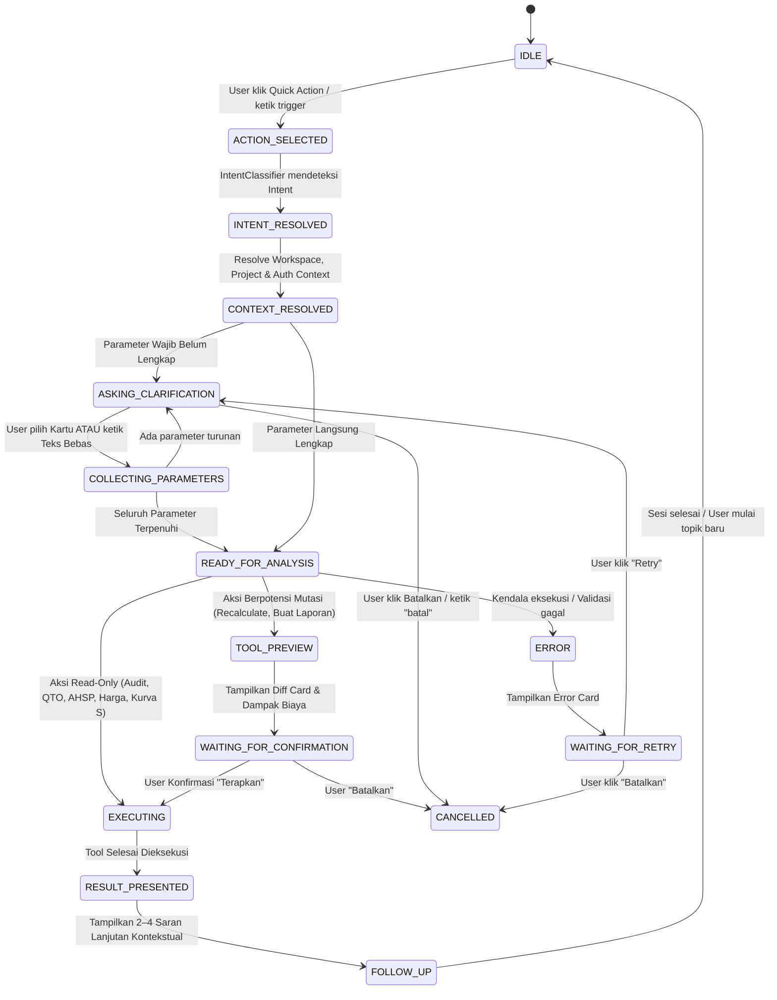

# ALUR PERCAKAPAN & STATE MACHINE: EZRAB AI COASSISTANT QUICK ACTIONS

Dokumen ini memetakan diagram alur transisi percakapan dua arah, model state session, siklus klarifikasi, dan aturan respon dual-input (klik kartu vs teks bebas).

---

## 1. Diagram State Machine Percakapan



---

## 2. Definisi State Session

Setiap sesi Quick Action dikelola dengan struktur session state stabil:

```typescript
export type QuickActionSessionState =
  | 'IDLE'
  | 'ACTION_SELECTED'
  | 'INTENT_RESOLVED'
  | 'CONTEXT_RESOLVED'
  | 'ASKING_CLARIFICATION'
  | 'COLLECTING_PARAMETERS'
  | 'READY_FOR_ANALYSIS'
  | 'TOOL_PREVIEW'
  | 'WAITING_FOR_CONFIRMATION'
  | 'EXECUTING'
  | 'RESULT_PRESENTED'
  | 'FOLLOW_UP'
  | 'COMPLETED'
  | 'CANCELLED'
  | 'ERROR';

export interface QuickActionSession {
  sessionId: string;
  conversationId: string;
  actionId: string;
  workspaceId: string;
  userId: string;
  projectId: string;
  currentState: QuickActionSessionState;
  collectedParameters: Record<string, any>;
  stepHistory: QuickActionSessionState[];
  previewData?: any;
  resultData?: any;
  followUpSuggestions: string[];
  createdAt: string;
  updatedAt: string;
}
```

---

## 3. Matriks Alur Percakapan Per Quick Action

### 1. `AUDIT_RAB`
1. **User**: Klik tombol *"Audit RAB"* -> Gelembung pesan: *"Bantu saya melakukan audit RAB"*
2. **AI**: *"Baik, saya bantu audit RAB. Anda ingin memeriksa RAB dari mana?"*  
   - Pilihan: `[RAB Proyek Saat Ini]` `[Upload File Excel]` `[Upload File PDF]` `[Pilih Proyek Lain]`
3. **User Action**: Memilih `[RAB Proyek Saat Ini]` atau mengetik *"pakai proyek ini"*
4. **AI**: *"Baik, saya akan memeriksa RAB proyek aktif. Apa fokus audit yang Anda inginkan?"*  
   - Pilihan: `[Volume & Satuan]` `[Harga & Total]` `[Kode AHSP]` `[Duplikasi Pekerjaan]` `[Audit Menyeluruh]`
5. **User Action**: Memilih `[Audit Menyeluruh]` atau mengetik *"audit semuanya"*
6. **AI**: Menjalankan tool `audit_rab` secara deterministik dan menyajikan kartu hasil audit (Status Anomali, Item Kosong, Duplikasi, Rekomendasi).
7. **Follow-Up Chips**: `[Tampilkan Item Bermasalah]` `[Periksa Kode AHSP]` `[Bandingkan Harga Pasar]` `[Buat Laporan Audit]`

### 2. `HITUNG_VOLUME`
1. **User**: Klik tombol *"Hitung Volume"* -> Gelembung pesan: *"Bantu saya menghitung volume pekerjaan"*
2. **AI**: *"Volume pekerjaan apa yang ingin dihitung?"*  
   - Pilihan: `[Beton Bertulang]` `[Galian Tanah]` `[Pasangan Bata]` `[Plesteran]` `[Pengecatan]` `[Lantai]` `[Atap]` `[Custom]`
3. **User Action**: Memilih `[Beton Bertulang]` atau mengetik *"hitung volume beton"*
4. **AI**: *"Untuk menghitung volume beton, masukkan dimensi elemen (panjang, lebar, tinggi, dan jumlah unit):"*  
   - Form Parameter: `Panjang (m)`, `Lebar (m)`, `Tinggi (m)`, `Jumlah (Unit)`
5. **User Action**: Mengisi form (P: 6m, L: 0.2m, T: 0.3m, Jml: 4) atau mengetik *"panjang 6 meter, lebar 20 cm, tinggi 30 cm, ada 4 balok"*
6. **AI**: Menghitung via `CalculationService` deterministik: `6 * 0.20 * 0.30 * 4 = 1.44 m³`.  
   Menyajikan kartu hasil perhitungan volume QTO lengkap dengan rumus geometri.
7. **Follow-Up Chips**: `[Hitung Item Lain]` `[Masukkan ke RAB]` `[Cari AHSP Terkait]` `[Ekspor Perhitungan]`

### 3. `CARI_AHSP`
1. **User**: Klik *"Cari AHSP"* -> Gelembung pesan: *"Saya bantu mencari AHSP yang sesuai"*
2. **AI**: *"Pekerjaan apa yang ingin Anda cari?"*  
   - Pilihan: `[Pekerjaan Tanah]` `[Beton]` `[Pasangan]` `[Plesteran]` `[Finishing]` `[Jalan]` `[Drainase]` `[Bangunan Air]`
3. **User Action**: Memilih `[Beton]` atau mengetik *"analisa beton k-250"*
4. **AI**: Menyajikan kartu hasil AHSP resmi (Kode PUPR, Uraian, Satuan, Koefisien Tenaga/Bahan, Status Validasi).
5. **Follow-Up Chips**: `[Cari Harga Satuan]` `[Tambahkan ke RAB]` `[Jelaskan Koefisien]` `[Cari AHSP Terkait]`

### 4. `CARI_HARGA`
1. **User**: Klik *"Cari Harga"* -> Gelembung pesan: *"Bantu saya mencari harga material, upah, atau alat"*
2. **AI**: *"Apa yang ingin Anda cari?"*  
   - Pilihan: `[Harga Material]` `[Upah Tenaga Kerja]` `[Sewa Peralatan]` `[Harga Satuan Pekerjaan]`
3. **User Action**: Memilih `[Harga Material]` atau mengetik *"harga semen per sak"*
4. **AI**: Menampilkan kartu referensi harga terverifikasi (Spesifikasi, Harga, Satuan, Wilayah, Sumber data).
5. **Follow-Up Chips**: `[Cari Material Lain]` `[Gunakan pada AHSP]` `[Cek Tren Harga]` `[Bandingkan Alternatif]`

### 5. `ANALISIS_DED`
1. **User**: Klik *"Analisis DED"* -> Gelembung pesan: *"Bantu saya menganalisis dokumen DED"*
2. **AI**: *"Dokumen DED mana yang ingin dianalisis?"*  
   - Pilihan: `[Upload PDF]` `[Upload Gambar JPG/PNG]` `[Gunakan Dokumen Proyek]`
3. **User Action**: Upload file atau pilih dokumen aktif.
4. **AI**: *"Disiplin gambar mana yang ingin difokuskan?"*  
   - Pilihan: `[Denah & Dimensi]` `[Struktur]` `[Arsitektur]` `[MEP]` `[Ekstraksi QTO]` `[Deteksi Konflik]`
5. **AI**: Menyajikan ringkasan analisis ekstraksi DED (Confidence, Halaman sumber, Rekomendasi review engineer).
6. **Follow-Up Chips**: `[Hitung QTO dari DED]` `[Periksa Konflik Dimensi]` `[Ekspor Hasil Analisis]`

### 6. `BUAT_LAPORAN`
1. **User**: Klik *"Buat Laporan"* -> Gelembung pesan: *"Bantu saya membuat laporan proyek"*
2. **AI**: *"Laporan apa yang ingin dibuat?"*  
   - Pilihan: `[Ringkasan Eksekutif RAB]` `[Laporan Mingguan Progres]` `[Laporan Realisasi Biaya]` `[Rekapitulasi Bahan & Alat]`
3. **User Action**: Memilih `[Ringkasan Eksekutif RAB]`
4. **AI**: Menyusun draft ringkasan dan menampilkan kartu preview laporan.
5. **User Action**: Klik `[Konfirmasi Ekspor PDF]` atau `[Simpan ke Proyek]`
6. **AI**: Menyimpan dokumen resmi dan mencatat audit log.
7. **Follow-Up Chips**: `[Unduh Dokumen]` `[Buat Laporan Lain]` `[Kirim ke Direksi]`

### 7. `PERIKSA_KURVA_S`
1. **User**: Klik *"Periksa Kurva S"* -> Gelembung pesan: *"Bantu saya memeriksa Kurva S proyek"*
2. **AI**: *"Fokus evaluasi Kurva S apa yang ingin diperiksa?"*  
   - Pilihan: `[Distribusi Bobot]` `[Rencana vs Realisasi]` `[Analisis Deviasi]` `[Jalur Kritis WBS]` `[Evaluasi Menyeluruh]`
3. **User Action**: Memilih `[Analisis Deviasi]`
4. **AI**: Menyajikan metrik deviasi progres (+/- %), anomali keterlambatan, dan rekomendasi percepatan jadwal.
5. **Follow-Up Chips**: `[Lihat Jalur Kritis]` `[Buat Laporan Kurva S]` `[Cek Item Kritis RAB]`

### 8. `JELASKAN_ITEM`
1. **User**: Klik *"Jelaskan Item"* -> Gelembung pesan: *"Item pekerjaan atau data apa yang ingin Anda jelaskan?"*
2. **AI**: Jika ada item aktif di spreadsheet, langsung menjelaskan rincian volume x harga satuan dan koefisien AHSP.  
   Jika tidak ada item aktif: *"Sebutkan nama item atau pilih pekerjaan yang ingin dijelaskan."*
3. **Follow-Up Chips**: `[Cek Rincian AHSP]` `[Bandingkan Harga]` `[Hitung Ulang Subtotal]`

### 9. `RECALCULATE`
1. **User**: Klik *"Recalculate"* -> Gelembung pesan: *"Bantu saya menghitung ulang RAB"*
2. **AI**: *"Bagian mana yang ingin dihitung ulang?"*  
   - Pilihan: `[Seluruh RAB]` `[Item yang Berubah]` `[Volume Saja]` `[Harga Satuan Saja]` `[Pajak PPN & Overhead]`
3. **User Action**: Memilih `[Seluruh RAB]`
4. **AI**: Melakukan rekalkulasi deterministik dan menampilkan **Diff Preview Card**:
   - Total Sebelum: Rp X
   - Total Sesudah: Rp Y
   - Selisih / Dampak Biaya: +/- Rp Z
   - Tombol: `[Terapkan ke Spreadsheet RAB]` `[Batalkan]`
5. **User Action**: Klik `[Terapkan ke Spreadsheet RAB]`
6. **AI**: Mengupdate database proyek via transaction boundary dan mencatat audit log resmi.
7. **Follow-Up Chips**: `[Periksa Rekapitulasi]` `[Ekspor Excel]` `[Periksa Kurva S]`

### 10. `BANTUAN_FITUR`
1. **User**: Klik *"Bantuan Fitur"* -> Gelembung pesan: *"Saya bisa membantu Anda menggunakan EZRAB. Fitur apa yang ingin Anda pelajari?"*
2. **AI**: Menampilkan kartu navigasi modul: `[Buat Proyek Baru]` `[RAB Otomatis]` `[Spreadsheet RAB]` `[AHSP PUPR 2026]` `[Hitung Volume]` `[Kurva S]` `[Ekspor Dokumen]`
3. **User Action**: Memilih topik -> AI memberikan panduan step-by-step dan menawarkan panduan lanjutan.
4. **Follow-Up Chips**: `[Buka Modul Terkait]` `[Pelajari Fitur Lain]` `[Tanya Seputar RAB]`
